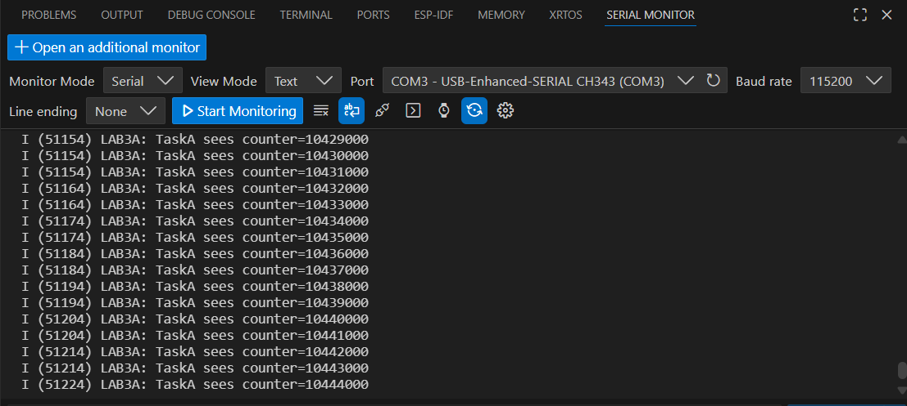

# Session 2 — RTOS Basics: Tasks, Queues, and Mutex

Implement basic FreeRTOS multitasking concepts in ESP-IDF using tasks, queues, and mutex protection.

---

## 1) Activity Goals

- Implement multiple FreeRTOS tasks running concurrently.
- Validate task scheduling using `vTaskDelay()`.
- Pass data between tasks using a queue (producer/consumer).
- Demonstrate a race condition and fix it using a mutex.
- Document evidence with console logs, screenshots, and videos.

---

## 2) Materials & Setup

### BOM (Bill of Materials)

| # | Item | Qty | Link/Source | Cost (MXN) | Notes |
|---|------|-----|------------|------------|------|
| 1 | ESP32 Board | 1 | Local Store / Amazon / MercadoLibre | 365 | Main development board |
| 2 | LED | 1 | Local electronics store | 3 | Status LED connected to GPIO 8 |

### Tools/Software

- **Framework:** ESP-IDF + FreeRTOS  

---

# Lab 1 — Two Tasks, Delays, and Priorities

Run two tasks at the same time: one blinking an LED and one printing a message.

---

## 3) Procedure (what you did)

1. Created two FreeRTOS tasks (`blink_task` and `hello_task`).
2. Verified LED blinking every 300 ms.
3. Verified console prints every 1 second.
4. Modified task priority.
5. Removed delay to observe starvation behavior.

---

## 4) Data, Tests & Evidence

### Evidence (Console Output)

### Evidence (LED Blinking)
<iframe width="560" height="315"
src="https://www.youtube.com/embed/tD9PnNb1_j4"
title="Lab 1 LED Blinking"
frameborder="0"
allowfullscreen></iframe>

---

## 6) Code

### Code (Lab 1)

~~~c
#include <stdio.h>
#include "freertos/FreeRTOS.h"
#include "freertos/task.h"
#include "driver/gpio.h"
#include "esp_log.h"

#define LED_GPIO GPIO_NUM_8   // CHANGE for your board

static const char *TAG = "LAB1";

static void blink_task(void *pvParameters)
{
    gpio_reset_pin(LED_GPIO);
    gpio_set_direction(LED_GPIO, GPIO_MODE_OUTPUT);

    while (1) {
        gpio_set_level(LED_GPIO, 1);
        vTaskDelay(pdMS_TO_TICKS(300));
        gpio_set_level(LED_GPIO, 0);
        vTaskDelay(pdMS_TO_TICKS(300));
    }
}

static void hello_task(void *pvParameters)
{
    int n = 0;
    while (1) {
        ESP_LOGI(TAG, "hello_task says hi, n=%d", n++);
        vTaskDelay(pdMS_TO_TICKS(1000));
    }
}

void app_main(void)
{
    ESP_LOGI(TAG, "Starting Lab 1 (two tasks)");

    xTaskCreate(blink_task, "blink_task", 2048, NULL, 5, NULL);
    xTaskCreate(hello_task, "hello_task", 2048, NULL, 5, NULL);
}
~~~

---

## 5) Analysis (Exercises)

### Exercise 1 — Priority Experiment

Change `hello_task` priority from **5** to **2**:

~~~c
xTaskCreate(hello_task, "hello_task", 2048, NULL, 2, NULL);
~~~

#### Does behavior change? Why might it (or might it not)?
NO, because it doesn’t affect the blink time of the LED. Both tasks use `vTaskDelay()`, so they block and allow the CPU to run other tasks.

### Evidence

---

### Exercise 2 — Starvation Demo

Temporarily remove this line from `hello_task`:

~~~c
vTaskDelay(pdMS_TO_TICKS(1000));
~~~

#### What happens to blinking?
The LED blinking looks almost the same or does not show a clear difference. This is because FreeRTOS still schedules `blink_task` even if `hello_task` has no delay. However, `hello_task` uses much more CPU and can reduce system responsiveness.

### Evidence
<iframe width="560" height="315"
src="https://www.youtube.com/embed/iBQAt2u0nZ4"
title="Lab 1 Starvation Evidence"
frameborder="0"
allowfullscreen></iframe>

---

### Exercise 3 — Put the delay back and explain in one sentence why blocking helps

Blocking helps because `vTaskDelay()` puts the task in a blocked state and frees the CPU so other tasks can run.

---

# Lab 2 — Queue (Producer / Consumer)

Send integers from a producer task to a consumer task using a FreeRTOS queue.

---

## 3) Procedure (what you did)

1. Created a queue using `xQueueCreate`.
2. Implemented a producer task to send integers to the queue.
3. Implemented a consumer task to receive integers from the queue.
4. Modified producer speed.
5. Increased queue length.
6. Made the consumer slower.

---

## 4) Data, Tests & Evidence

### Evidence

---

## 6) Code

### Code (Lab 2)

~~~c
#include <stdio.h>
#include "freertos/FreeRTOS.h"
#include "freertos/task.h"
#include "freertos/queue.h"
#include "esp_log.h"

static const char *TAG = "LAB2";
static QueueHandle_t q_numbers;

static void producer_task(void *pvParameters)
{
    int value = 0;

    while (1) {
        value++;

        // Send to queue; wait up to 50ms if full
        if (xQueueSend(q_numbers, &value, pdMS_TO_TICKS(50)) == pdPASS) {
            ESP_LOGI(TAG, "Produced %d", value);
        } else {
            ESP_LOGW(TAG, "Queue full, dropped %d", value);
        }

        vTaskDelay(pdMS_TO_TICKS(200));
    }
}

static void consumer_task(void *pvParameters)
{
    int rx = 0;

    while (1) {
        // Wait up to 1000ms for data
        if (xQueueReceive(q_numbers, &rx, pdMS_TO_TICKS(1000)) == pdPASS) {
            ESP_LOGI(TAG, "Consumed %d", rx);
        } else {
            ESP_LOGW(TAG, "No data in 1s");
        }
    }
}

void app_main(void)
{
    ESP_LOGI(TAG, "Starting Lab 2 (queue)");

    q_numbers = xQueueCreate(5, sizeof(int)); // length 5
    if (q_numbers == NULL) {
        ESP_LOGE(TAG, "Queue create failed");
        return;
    }

    xTaskCreate(producer_task, "producer_task", 2048, NULL, 5, NULL);
    xTaskCreate(consumer_task, "consumer_task", 2048, NULL, 5, NULL);
}
~~~

---

## 5) Analysis (Exercises)

### Exercise 1 — Make the producer faster: change producer delay 200ms → 20ms

~~~c
vTaskDelay(pdMS_TO_TICKS(20));
~~~

### Exercise 2 — When do you see “Queue full”?
Never. This happens because the consumer receives data fast enough to keep the queue from filling, so the producer is always able to send values successfully.

### Evidence
<iframe width="560" height="315"
src="https://www.youtube.com/embed/FkZIBW4R5EA"
title="Lab 2 Evidence - Fast Producer"
frameborder="0"
allowfullscreen></iframe>

---

### Exercise 3 — Increase the queue length 5 → 20

~~~c
q_numbers = xQueueCreate(20, sizeof(int));
~~~

### Exercise 4 — What changes?
The queue can store more values, so "Queue full" happens less often or takes longer to appear.

### Evidence
<iframe width="560" height="315"
src="https://www.youtube.com/embed/ZXhx-c1bIVk"
title="Lab 2 Evidence - Queue Length 20"
frameborder="0"
allowfullscreen></iframe>

---

### Exercise 5 — Make the consumer “slow”: after a successful receive, add:

~~~c
vTaskDelay(pdMS_TO_TICKS(300));
~~~

### Exercise 6 — What pattern is happening now (buffering / backlog)?
The queue stores values temporarily, then it fills up and the producer starts dropping values because there is no more space.

### Evidence
<iframe width="560" height="315"
src="https://www.youtube.com/embed/_d22Bcnq1Tc"
title="Lab 2 Evidence - Slow Consumer"
frameborder="0"
allowfullscreen></iframe>

---

# Lab 3 — Mutex: Protect a Shared Resource

Demonstrate a race condition with a shared counter and fix it using a mutex.

---

## 3) Procedure (what you did)

1. Implemented two tasks that increment a shared counter.
2. Ran the program without mutex to observe race conditions.
3. Added a mutex to protect the shared counter.
4. Removed the mutex again to confirm weird behavior.
5. Changed task priorities and observed scheduling effects.

---

## 6) Code

### Part A — Race demo (no mutex)

~~~c
#include <stdio.h>
#include "freertos/FreeRTOS.h"
#include "freertos/task.h"
#include "esp_log.h"

static const char *TAG = "LAB3A";

static volatile int shared_counter = 0;

static void increment_task(void *pvParameters)
{
    const char *name = (const char *)pvParameters;

    while (1) {
        // NOT safe: read-modify-write without protection
        int local = shared_counter;
        local++;
        shared_counter = local;

        if ((shared_counter % 1000) == 0) {
            ESP_LOGI(TAG, "%s sees counter=%d", name, shared_counter);
        }

        vTaskDelay(pdMS_TO_TICKS(1));
    }
}

void app_main(void)
{
    ESP_LOGI(TAG, "Starting Lab 3A (race demo)");

    xTaskCreate(increment_task, "incA", 2048, "TaskA", 5, NULL);
    xTaskCreate(increment_task, "incB", 2048, "TaskB", 5, NULL);
}
~~~

---

## 5) Analysis (Exercises)

### Part A — Race demo (no mutex)

#### Question
Why can the counter be wrong?

#### Answer
The counter may be faulty because both tasks read the same value and overwrite it, losing increments.

### Evidence

---

## 6) Code

### Part B — Fix with a mutex

~~~c
#include <stdio.h>
#include "freertos/FreeRTOS.h"
#include "freertos/task.h"
#include "freertos/semphr.h"
#include "esp_log.h"

static const char *TAG = "LAB3B";

static volatile int shared_counter = 0;
static SemaphoreHandle_t counter_mutex;

static void increment_task(void *pvParameters)
{
    const char *name = (const char *)pvParameters;

    while (1) {
        xSemaphoreTake(counter_mutex, portMAX_DELAY);

        int local = shared_counter;
        local++;
        shared_counter = local;

        xSemaphoreGive(counter_mutex);

        if ((shared_counter % 1000) == 0) {
            ESP_LOGI(TAG, "%s sees counter=%d", name, shared_counter);
        }

        vTaskDelay(pdMS_TO_TICKS(1));
    }
}

void app_main(void)
{
    ESP_LOGI(TAG, "Starting Lab 3B (mutex fix)");

    counter_mutex = xSemaphoreCreateMutex();
    if (counter_mutex == NULL) {
        ESP_LOGE(TAG, "Mutex create failed");
        return;
    }

    xTaskCreate(increment_task, "incA", 2048, "TaskA", 5, NULL);
    xTaskCreate(increment_task, "incB", 2048, "TaskB", 5, NULL);
}
~~~

---

### Exercise 1 — Remove the mutex again

#### Question
Do you ever see weird behavior?

#### Answer
Yes, sometimes the counter increases slower than expected or skips values.

### Evidence

---

### Exercise 2 — Change priorities (TaskA = 6, TaskB = 4)

#### Question
What do you expect and why?

#### Answer
TaskA (priority 6) will run more often than TaskB (priority 4). TaskA will usually print more messages because it gets CPU time first when both tasks are ready.

### Evidence

---

### Exercise 3 — One sentence

#### Question
In one sentence: what does a mutex “guarantee”?

#### Answer
A mutex guarantees that only one task at a time can access the shared resource, preventing race conditions.

---