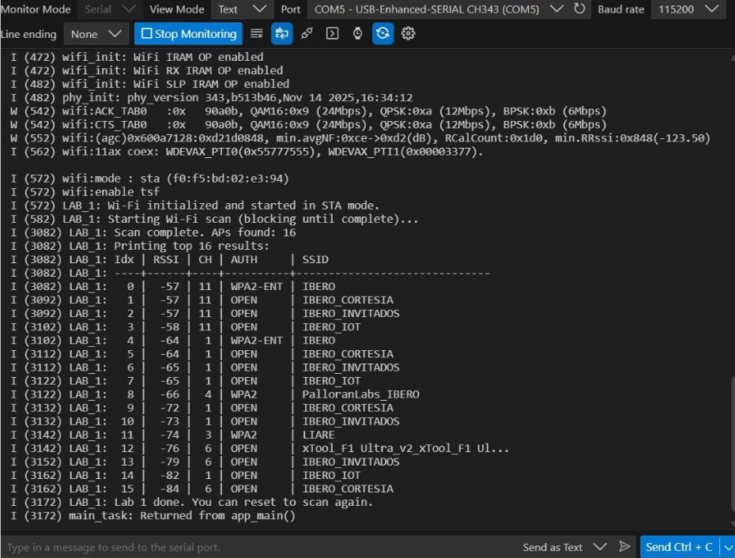
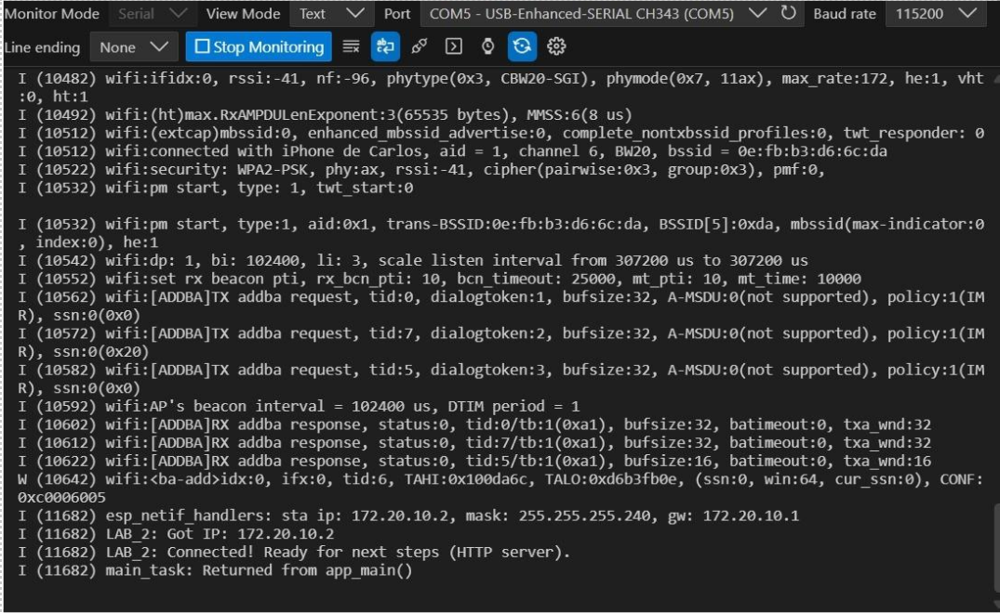
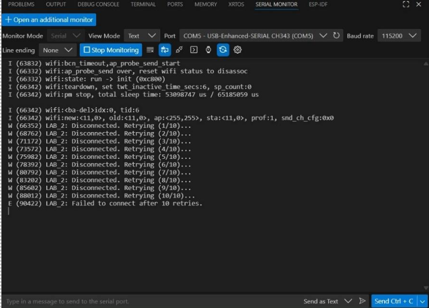

# Session — Wi-Fi + HTTP Server: 2 LEDs, Button, and Motor Slider
Implement an ESP32-C6 HTTP server (GET-only UI) to control two LEDs, read a button state, and control a DC motor speed/direction using a slider.

---

## 1) Activity Goals

- [ ] Turn **2 LEDs** ON/OFF from a browser (HTTP GET UI).
- [ ] Read a **physical button** and show its state on the browser page.
- [ ] Control **motor direction** (FWD/REV) and **speed** (0–100%) from the browser.
- [ ] Document evidence (serial logs + screenshots + video).

---

## 2) Materials & Setup

### BOM (Bill of Materials)

| # | Item | Qty | Link/Source | Cost (MXN) | Notes |
|---|------|-----|------------|------------|------|
| 1 | ESP32-C6 DevKit | 1 | Local Store / Amazon / MercadoLibre | 365 | Main development board |
| 2 | LED | 2 | Local electronics store | 3 c/u | LED1 → GPIO 8, LED2 → GPIO 2 |
| 3 | Resistor (recommended) | 2 | Local electronics store | ____ | 220–330 Ω in series with each LED |
| 4 | Push Button | 1 | Local electronics store / Amazon / MercadoLibre | ____ | Button → GPIO 10 (pull-up, active-low) |
| 5 | TB6612 motor driver | 1 | Local electronics store / Amazon / MercadoLibre | ____ | PWMA=GPIO 4, IN1=GPIO 5, IN2=GPIO 6, STBY=GPIO 1 |
| 6 | DC Motor | 1 | Local electronics store / Amazon / MercadoLibre | ____ | Controlled by TB6612 |

### Tools/Software

- **Framework:** ESP-IDF + FreeRTOS
- **Build/Flash/Monitor:** `idf.py build flash monitor`
- **Browser:** Chrome/Firefox (same network as ESP32)

### Wiring / Safety

- **Button wiring:** GPIO10 with internal pull-up; pressed = 0, released = 1.
- **Motor driver:** TB6612; verify motor power and GND common with ESP32.
- **PWM:** LEDC @ 5 kHz, 10-bit resolution (0–1023 duty).

---

## 3) Procedure (what you did)

1. Initialized NVS (`nvs_flash_init()`), network interface (`esp_netif_init()`), and event loop (`esp_event_loop_create_default()`).
2. Configured Wi-Fi in STA mode with SSID/PASS and started the driver.
3. Waited for `IP_EVENT_STA_GOT_IP` using an EventGroup bit (`WIFI_CONNECTED_BIT`).
4. Initialized peripherals:
   - LED1 (GPIO 8) and LED2 (GPIO 2) as outputs
   - Button (GPIO 10) as input with pull-up
   - TB6612 motor driver pins + LEDC PWM on PWMA
5. Started HTTP server and registered routes:
   - `GET /` → HTML UI (auto-refresh every 1s)
   - `GET /ledon1`, `GET /ledoff1`
   - `GET /ledon2`, `GET /ledoff2`
   - `GET /motor?speed=0..100`
   - `GET /motor?dir=fwd|rev`
6. Verified LED control, button state update, and motor speed/direction control from a browser.

---

## 4) Data, Tests & Evidence

### Wi-Fi Scan Results

**Figure 1.** Serial terminal showing the Wi-Fi scan results table with multiple access points detected. The strongest RSSI detected was **-57 dBm** on channel **11**, with networks including **IBERO**, **IBERO_CORTESIA**, and **IBERO_INVITADOS**.

---

### Successful Wi-Fi Connection

**Figure 2.** Serial terminal showing a successful Wi-Fi connection to the network **"iPhone de Carlos"**, including the assigned IP address **172.20.10.2** and confirmation that the device is ready to start the HTTP server.

---

### Failed Wi-Fi Connection Attempt

**Figure 3.** Serial terminal showing an intentional failed connection attempt with multiple retry attempts and the final message **"Failed to connect after 10 retries."**

## Videos (Evidence)

<iframe width="560" height="315"
src="https://www.youtube.com/embed/WE9whLGg0yE"
title="HTTP LED control demo"
frameborder="0"
allow="accelerometer; autoplay; clipboard-write; encrypted-media; gyroscope; picture-in-picture; web-share"
allowfullscreen></iframe>

**Video 1.** Demo: Control LED1 + LED2 from browser. 

---

<iframe width="560" height="315"
src="https://www.youtube.com/embed/0AvwC2oibjk"
title="HTTP button state demo"
frameborder="0"
allow="accelerometer; autoplay; clipboard-write; encrypted-media; gyroscope; picture-in-picture; web-share"
allowfullscreen></iframe>

**Video 2.** Demo: Button state changes shown on page (auto refresh).  

---

<iframe width="560" height="315"
src="https://www.youtube.com/embed/AEDkRwSyxA8"
title="HTTP motor slider demo"
frameborder="0"
allow="accelerometer; autoplay; clipboard-write; encrypted-media; gyroscope; picture-in-picture; web-share"
allowfullscreen></iframe>

**Video 3.** Demo: Motor speed slider + FWD/REV controls.  

---

# 5) Lab Questions and Answers

## Lab 1 — Wi-Fi Scan

**What is the SSID of the strongest AP detected in your scan?**

IBERO (tie with IBERO_CORTESIA and IBERO_INVITADOS)

**What is the RSSI value of that AP?**

-57 dBm

**What authentication mode does that AP use?**

WPA2-ENT

**What channel is that AP operating on?**

Channel 11

**Which channel had the most APs detected in your scan?**

Channel 1

---

## Lab 2 — Wi-Fi STA + Reconnect

**What event indicates “Wi-Fi driver started and is ready to connect”?**

WIFI_EVENT_STA_START

**What event indicates “network stack has an IP and the device is online”?**

IP_EVENT_STA_GOT_IP

**What is the assigned IP address?**

172.20.10.2

**How many retries occurred before success or failure?**

10 retries before failure.

**In your logs, which happened first: WIFI_EVENT_STA_START or IP_EVENT_STA_GOT_IP? Why?**

WIFI_EVENT_STA_START happened first because the Wi-Fi station must start before the device can connect and obtain an IP address.

---

## 6) Analysis

### How the system works (GET-only UI)
- The ESP32 firmware runs the HTTP server and GPIO/PWM logic.
- The browser loads `GET /` and the page refreshes automatically every 1 second using `<meta http-equiv='refresh' content='1'>`.
- LED endpoints update GPIO outputs, and `/motor` updates direction + PWM duty.

---

## 7) Code

### Full firmware (single file)
> `main/main.c`

~~~c
/*
 * LAB 3 — ESP32-C6 Wi-Fi + HTTP (GET-only UI)
 */

#include <string.h>
#include <stdio.h>
#include <stdlib.h>
#include <stdbool.h>

#include "freertos/FreeRTOS.h"
#include "freertos/event_groups.h"

#include "esp_log.h"
#include "esp_err.h"

#include "nvs_flash.h"
#include "esp_netif.h"
#include "esp_event.h"
#include "esp_wifi.h"

#include "driver/gpio.h"
#include "driver/ledc.h"
#include "esp_http_server.h"

#define WIFI_SSID "iPhone de Carlos"
#define WIFI_PASS "dogui123"

#define LED1_GPIO      8
#define LED2_GPIO      2
#define BUTTON_GPIO    10
#define MAX_RETRY      10

/* TB6612 */
#define MOTOR_PWM_GPIO   4   // PWMA
#define MOTOR_IN1_GPIO   5   // AIN1
#define MOTOR_IN2_GPIO   6   // AIN2
#define MOTOR_STBY_GPIO  1   // STBY

// LEDC
#define MOTOR_LEDC_TIMER     LEDC_TIMER_0
#define MOTOR_LEDC_MODE      LEDC_LOW_SPEED_MODE
#define MOTOR_LEDC_CHANNEL   LEDC_CHANNEL_0
#define MOTOR_LEDC_DUTY_RES  LEDC_TIMER_10_BIT   // 0..1023
#define MOTOR_LEDC_FREQUENCY 5000

/* Globals */
static const char *TAG = "LAB_3";

static EventGroupHandle_t s_wifi_event_group;
#define WIFI_CONNECTED_BIT BIT0

static int s_retry = 0;

static int s_led_state1 = 0;
static int s_led_state2 = 0;
static int s_button_state = 0;
static httpd_handle_t s_server = NULL;

// Motor state
static int s_motor_speed = 0;           // 0..100
static int s_motor_dir_fwd = 1;         // 1=fwd, 0=rev

/* ===================== LED ===================== */
static void led_init(void)
{
    gpio_reset_pin(LED1_GPIO);
    gpio_set_direction(LED1_GPIO, GPIO_MODE_OUTPUT);

    gpio_reset_pin(LED2_GPIO);
    gpio_set_direction(LED2_GPIO, GPIO_MODE_OUTPUT);

    s_led_state1 = 0;
    s_led_state2 = 0;

    gpio_set_level(LED1_GPIO, s_led_state1);
    gpio_set_level(LED2_GPIO, s_led_state2);

    ESP_LOGI(TAG, "LEDs initialized on GPIO %d and %d (state=%d)", LED1_GPIO, LED2_GPIO, s_led_state1);
}

static void led_set1(int on)
{
    s_led_state1 = (on != 0);
    gpio_set_level(LED1_GPIO, s_led_state1);
}

static void led_set2(int on)
{
    s_led_state2 = (on != 0);
    gpio_set_level(LED2_GPIO, s_led_state2);
}

/* ===================== Button ===================== */
static void button_init(void)
{
    gpio_reset_pin(BUTTON_GPIO);
    gpio_set_direction(BUTTON_GPIO, GPIO_MODE_INPUT);
    gpio_pullup_en(BUTTON_GPIO); // pull-up: pressed=0
}

static int button_read(void)
{
    return gpio_get_level(BUTTON_GPIO); // 1=released, 0=pressed
}

/* ===================== Motor ===================== */
static void motor_apply(void)
{
    if (s_motor_speed < 0) s_motor_speed = 0;
    if (s_motor_speed > 100) s_motor_speed = 100;

    // Enable driver only when speed > 0
    gpio_set_level(MOTOR_STBY_GPIO, (s_motor_speed > 0) ? 1 : 0);

    // Direction
    if (s_motor_dir_fwd) {
        gpio_set_level(MOTOR_IN1_GPIO, 1);
        gpio_set_level(MOTOR_IN2_GPIO, 0);
    } else {
        gpio_set_level(MOTOR_IN1_GPIO, 0);
        gpio_set_level(MOTOR_IN2_GPIO, 1);
    }

    // PWM duty (0..1023)
    uint32_t duty = (uint32_t)((s_motor_speed * 1023) / 100);

    ledc_set_duty(MOTOR_LEDC_MODE, MOTOR_LEDC_CHANNEL, duty);
    ledc_update_duty(MOTOR_LEDC_MODE, MOTOR_LEDC_CHANNEL);

    ESP_LOGI(TAG, "Motor: speed=%d%% dir=%s duty=%lu STBY=%d",
             s_motor_speed,
             s_motor_dir_fwd ? "fwd" : "rev",
             (unsigned long)duty,
             (s_motor_speed > 0) ? 1 : 0);
}

static void motor_init(void)
{
    // DIR pins
    gpio_reset_pin(MOTOR_IN1_GPIO);
    gpio_set_direction(MOTOR_IN1_GPIO, GPIO_MODE_OUTPUT);

    gpio_reset_pin(MOTOR_IN2_GPIO);
    gpio_set_direction(MOTOR_IN2_GPIO, GPIO_MODE_OUTPUT);

    // STBY pin
    gpio_reset_pin(MOTOR_STBY_GPIO);
    gpio_set_direction(MOTOR_STBY_GPIO, GPIO_MODE_OUTPUT);
    gpio_set_level(MOTOR_STBY_GPIO, 0);

    // LEDC timer
    ledc_timer_config_t timer = {
        .speed_mode = MOTOR_LEDC_MODE,
        .timer_num = MOTOR_LEDC_TIMER,
        .duty_resolution = MOTOR_LEDC_DUTY_RES,
        .freq_hz = MOTOR_LEDC_FREQUENCY,
        .clk_cfg = LEDC_AUTO_CLK
    };
    ESP_ERROR_CHECK(ledc_timer_config(&timer));

    // LEDC channel (PWMA)
    ledc_channel_config_t channel = {
        .speed_mode = MOTOR_LEDC_MODE,
        .channel = MOTOR_LEDC_CHANNEL,
        .timer_sel = MOTOR_LEDC_TIMER,
        .intr_type = LEDC_INTR_DISABLE,
        .gpio_num = MOTOR_PWM_GPIO,
        .duty = 0,
        .hpoint = 0
    };
    ESP_ERROR_CHECK(ledc_channel_config(&channel));

    s_motor_speed = 0;
    s_motor_dir_fwd = 1;
    motor_apply();

    ESP_LOGI(TAG, "Motor init: PWMA=%d IN1=%d IN2=%d STBY=%d",
             MOTOR_PWM_GPIO, MOTOR_IN1_GPIO, MOTOR_IN2_GPIO, MOTOR_STBY_GPIO);
}

/* ===================== HTTP Handlers ===================== */

static esp_err_t root_get_handler(httpd_req_t *req)
{
    static char response[4096];

    int level = button_read();
    const char *btn_str = (level == 0) ? "PRESSED" : "RELEASED";

    snprintf(response, sizeof(response),
        "<!doctype html>\n"
        "<html><head>\n"
        "  <meta charset='utf-8'>\n"
        "  <meta name='viewport' content='width=device-width, initial-scale=1'>\n"
        "  <meta http-equiv='refresh' content='1'>\n"
        "  <title>ESP32-C6 Control</title>\n"
        "</head><body>\n"
        "  <h2>ESP32-C6 LED Control (GET-only)</h2>\n"
        "  
Use the buttons below to send HTTP GET requests to the ESP32.
\n"

        "  
\n"
        "    <a href='/ledon1'><button>LED1 ON</button></a>\n"
        "    <a href='/ledoff1'><button>LED1 OFF</button></a>\n"
        "  
\n"
        "  
\n"
        "    <a href='/ledon2'><button>LED2 ON</button></a>\n"
        "    <a href='/ledoff2'><button>LED2 OFF</button></a>\n"
        "  
\n"

        "  
<strong>Button STATE:</strong> %s
\n"

        "  
\n"
        "  <h3>Motor (TB6612)</h3>\n"
        "  
<strong>Dir:</strong> %s
\n"
        "  
<strong>Speed:</strong> %d%%
\n"
        "  
\n"
        "    <a href='/motor?dir=fwd'><button>Forward</button></a>\n"
        "    <a href='/motor?dir=rev'><button>Reverse</button></a>\n"
        "    <a href='/motor?speed=0'><button>Stop</button></a>\n"
        "  
\n"
        "  
\n"
        "    <input type='range' min='0' max='100' value='%d' style='width:320px;' "
        "      oninput=\"document.getElementById('sp').innerText=this.value\" "
        "      onchange=\"location.href='/motor?speed='+this.value;\" />\n"
        "  
\n"
        "  
Selected speed: <b>%d%%</b>
\n"

        "  
\n"
        "  
Direct URLs:
\n"
        "  <ul>\n"
        "    <li><code>/ledon1</code></li>\n"
        "    <li><code>/ledoff1</code></li>\n"
        "    <li><code>/ledon2</code></li>\n"
        "    <li><code>/ledoff2</code></li>\n"
        "    <li><code>/motor?speed=0..100</code></li>\n"
        "    <li><code>/motor?dir=fwd|rev</code></li>\n"
        "  </ul>\n"
        "</body></html>\n",
        btn_str,
        s_motor_dir_fwd ? "fwd" : "rev",
        s_motor_speed,
        s_motor_speed,
        s_motor_speed
    );

    httpd_resp_set_type(req, "text/html");
    httpd_resp_send(req, response, HTTPD_RESP_USE_STRLEN);
    return ESP_OK;
}

static esp_err_t ledon_get_handler1(httpd_req_t *req)
{
    led_set1(1);

    static const char *RESP =
        "<!doctype html><html><body>"
        "<h3>LED1 is now: ON</h3>"
        "
<a href='/'><button>Back</button></a>
"
        "</body></html>";

    httpd_resp_set_type(req, "text/html");
    httpd_resp_send(req, RESP, HTTPD_RESP_USE_STRLEN);
    return ESP_OK;
}

static esp_err_t ledoff_get_handler1(httpd_req_t *req)
{
    led_set1(0);

    static const char *RESP =
        "<!doctype html><html><body>"
        "<h3>LED1 is now: OFF</h3>"
        "
<a href='/'><button>Back</button></a>
"
        "</body></html>";

    httpd_resp_set_type(req, "text/html");
    httpd_resp_send(req, RESP, HTTPD_RESP_USE_STRLEN);
    return ESP_OK;
}

static esp_err_t ledon_get_handler2(httpd_req_t *req)
{
    led_set2(1);

    static const char *RESP =
        "<!doctype html><html><body>"
        "<h3>LED2 is now: ON</h3>"
        "
<a href='/'><button>Back</button></a>
"
        "</body></html>";

    httpd_resp_set_type(req, "text/html");
    httpd_resp_send(req, RESP, HTTPD_RESP_USE_STRLEN);
    return ESP_OK;
}

static esp_err_t ledoff_get_handler2(httpd_req_t *req)
{
    led_set2(0);

    static const char *RESP =
        "<!doctype html><html><body>"
        "<h3>LED2 is now: OFF</h3>"
        "
<a href='/'><button>Back</button></a>
"
        "</body></html>";

    httpd_resp_set_type(req, "text/html");
    httpd_resp_send(req, RESP, HTTPD_RESP_USE_STRLEN);
    return ESP_OK;
}

/* Motor GET: /motor?speed=..  or  /motor?dir=fwd|rev */
static esp_err_t motor_get_handler(httpd_req_t *req)
{
    char q[128] = {0};
    char v[16]  = {0};

    if (httpd_req_get_url_query_str(req, q, sizeof(q)) == ESP_OK) {

        if (httpd_query_key_value(q, "dir", v, sizeof(v)) == ESP_OK) {
            s_motor_dir_fwd = (strcmp(v, "rev") == 0) ? 0 : 1;
        }

        if (httpd_query_key_value(q, "speed", v, sizeof(v)) == ESP_OK) {
            int sp = atoi(v);
            if (sp < 0) sp = 0;
            if (sp > 100) sp = 100;
            s_motor_speed = sp;
        }

        motor_apply();
    }

    static const char *RESP =
        "<!doctype html><html><body>"
        "<h3>Motor updated</h3>"
        "
<a href='/'><button>Back</button></a>
"
        "</body></html>";

    httpd_resp_set_type(req, "text/html");
    httpd_resp_send(req, RESP, HTTPD_RESP_USE_STRLEN);
    return ESP_OK;
}

/* ===================== HTTP Server Start ===================== */
static void http_server_start(void)
{
    httpd_config_t config = HTTPD_DEFAULT_CONFIG();
    ESP_ERROR_CHECK(httpd_start(&s_server, &config));
    ESP_LOGI(TAG, "HTTP server started (port %d)", config.server_port);

    httpd_uri_t root      = { .uri="/",         .method=HTTP_GET, .handler=root_get_handler,    .user_ctx=NULL };
    httpd_uri_t ledon1    = { .uri="/ledon1",   .method=HTTP_GET, .handler=ledon_get_handler1,  .user_ctx=NULL };
    httpd_uri_t ledoff1   = { .uri="/ledoff1",  .method=HTTP_GET, .handler=ledoff_get_handler1, .user_ctx=NULL };
    httpd_uri_t ledon2    = { .uri="/ledon2",   .method=HTTP_GET, .handler=ledon_get_handler2,  .user_ctx=NULL };
    httpd_uri_t ledoff2   = { .uri="/ledoff2",  .method=HTTP_GET, .handler=ledoff_get_handler2, .user_ctx=NULL };
    httpd_uri_t motor     = { .uri="/motor",    .method=HTTP_GET, .handler=motor_get_handler,   .user_ctx=NULL };

    ESP_ERROR_CHECK(httpd_register_uri_handler(s_server, &root));
    ESP_ERROR_CHECK(httpd_register_uri_handler(s_server, &ledon1));
    ESP_ERROR_CHECK(httpd_register_uri_handler(s_server, &ledoff1));
    ESP_ERROR_CHECK(httpd_register_uri_handler(s_server, &ledon2));
    ESP_ERROR_CHECK(httpd_register_uri_handler(s_server, &ledoff2));
    ESP_ERROR_CHECK(httpd_register_uri_handler(s_server, &motor));

    ESP_LOGI(TAG, "Routes: GET /, /ledon1, /ledoff1, /ledon2, /ledoff2, /motor");
}

/* ===================== Wi-Fi STA connect + events ===================== */
static void wifi_event_handler(void *arg,
                               esp_event_base_t event_base,
                               int32_t event_id,
                               void *event_data)
{
    if (event_base == WIFI_EVENT && event_id == WIFI_EVENT_STA_START) {
        ESP_LOGI(TAG, "WIFI_EVENT_STA_START -> connecting...");
        ESP_ERROR_CHECK(esp_wifi_connect());
        return;
    }

    if (event_base == WIFI_EVENT && event_id == WIFI_EVENT_STA_DISCONNECTED) {
        if (s_retry < MAX_RETRY) {
            s_retry++;
            ESP_LOGW(TAG, "Disconnected. Retrying (%d/%d)...", s_retry, MAX_RETRY);
            ESP_ERROR_CHECK(esp_wifi_connect());
        } else {
            ESP_LOGE(TAG, "Failed to connect after %d retries.", MAX_RETRY);
        }
        return;
    }

    if (event_base == IP_EVENT && event_id == IP_EVENT_STA_GOT_IP) {
        ip_event_got_ip_t *event = (ip_event_got_ip_t *)event_data;
        ESP_LOGI(TAG, "Got IP: " IPSTR, IP2STR(&event->ip_info.ip));

        s_retry = 0;
        xEventGroupSetBits(s_wifi_event_group, WIFI_CONNECTED_BIT);
        return;
    }
}

static void wifi_init_sta(void)
{
    s_wifi_event_group = xEventGroupCreate();

    ESP_ERROR_CHECK(esp_netif_init());
    ESP_ERROR_CHECK(esp_event_loop_create_default());
    esp_netif_create_default_wifi_sta();

    wifi_init_config_t cfg = WIFI_INIT_CONFIG_DEFAULT();
    ESP_ERROR_CHECK(esp_wifi_init(&cfg));

    ESP_ERROR_CHECK(esp_event_handler_register(WIFI_EVENT, ESP_EVENT_ANY_ID, &wifi_event_handler, NULL));
    ESP_ERROR_CHECK(esp_event_handler_register(IP_EVENT, IP_EVENT_STA_GOT_IP, &wifi_event_handler, NULL));

    wifi_config_t wifi_config = {0};
    strncpy((char *)wifi_config.sta.ssid, WIFI_SSID, sizeof(wifi_config.sta.ssid));
    strncpy((char *)wifi_config.sta.password, WIFI_PASS, sizeof(wifi_config.sta.password));

    ESP_LOGI(TAG, "Configuring Wi-Fi STA: SSID='%s'", WIFI_SSID);

    ESP_ERROR_CHECK(esp_wifi_set_mode(WIFI_MODE_STA));
    ESP_ERROR_CHECK(esp_wifi_set_config(WIFI_IF_STA, &wifi_config));
    ESP_ERROR_CHECK(esp_wifi_start());
}

/* ===================== app_main ===================== */
void app_main(void)
{
    ESP_LOGI(TAG, "Lab 3 start: Wi-Fi + HTTP.");

    // NVS init
    esp_err_t ret = nvs_flash_init();
    if (ret == ESP_ERR_NVS_NO_FREE_PAGES || ret == ESP_ERR_NVS_NEW_VERSION_FOUND) {
        ESP_ERROR_CHECK(nvs_flash_erase());
        ESP_ERROR_CHECK(nvs_flash_init());
    } else {
        ESP_ERROR_CHECK(ret);
    }

    wifi_init_sta();

    // Wait for IP
    EventBits_t bits = xEventGroupWaitBits(
        s_wifi_event_group,
        WIFI_CONNECTED_BIT,
        pdFALSE,
        pdTRUE,
        pdMS_TO_TICKS(30000)
    );

    if (!(bits & WIFI_CONNECTED_BIT)) {
        ESP_LOGE(TAG, "Timeout waiting for Wi-Fi connection. Check SSID/PASS and 2.4 GHz.");
        return;
    }

    led_init();
    button_init();
    motor_init();
    http_server_start();

    ESP_LOGI(TAG, "Open: http://<ESP_IP>/");
    ESP_LOGI(TAG, "Motor control: http://<ESP_IP>/motor?speed=50   or   /motor?dir=rev");
}
~~~

---

## 8) Files & Media

- Firmware: `main/main.c`
- Videos (YouTube):
  - LED demo: https://youtu.be/WE9whLGg0yE?si=s_i7rPqc8CkSHsCT
  - Button demo: https://youtu.be/0AvwC2oibjk?si=JjecRpnr4qWmavsA
  - Motor demo: https://youtu.be/AEDkRwSyxA8?si=GuRx5-D0Ki242r6H