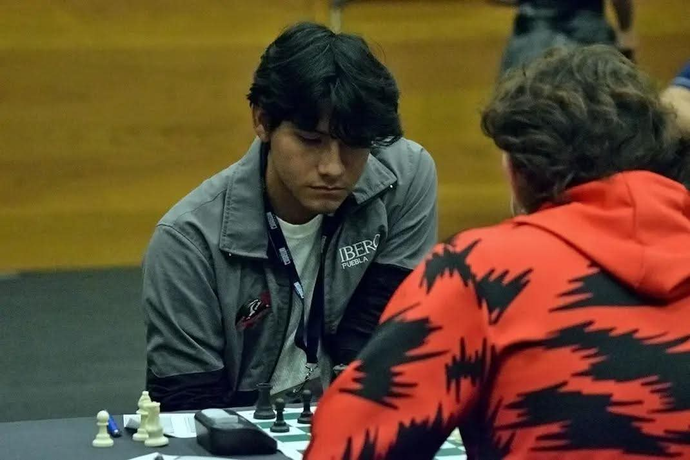

# Datos generales

¡Hola! Soy David, ingeniero mecatrónico, desarrollador y maestro de ajedrez. Disfruto entendiendo cómo funciona el mundo a través de la física y las matemáticas, aplicándolas en el diseño de circuitos, sistemas de control y campos electromagnéticos.

Mi lado como desarrollador es muy versátil: me encanta programar en múltiples niveles. Ya sea estructurando la lógica de un PLC, escribiendo código embebido para sistemas autónomos, o desarrollando la interfaz gráfica para proyectos y herramientas, siempre busco el equilibrio entre hardware y software. Cuando no estoy diseñando una nueva PCB o programando, me encontrarás frente a un tablero de ajedrez, un deporte que practico con gran pasión y que a menudo sirve de inspiración para mis desarrollos tecnológicos.

    

## Datos de contacto
- **Correo:** _davidlopezramirez2005@gmail.com_
- **Número de teléfono:** _971 190 0150_
