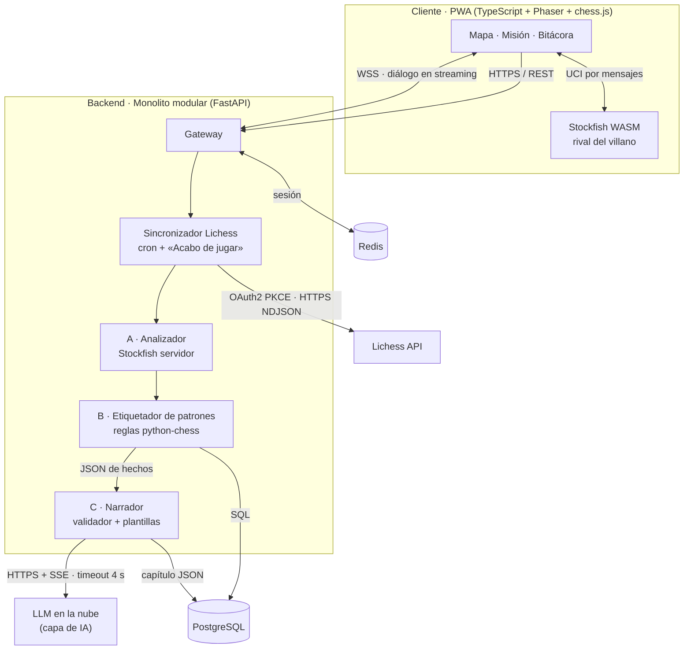

# Semana 5 — Diseño de producto: PDS y arquitectura del sistema

## 1) Resumen

- **Nombre de la actividad:** _Product Design Specification (PDS) y arquitectura del sistema_
- **Curso:** _Proyecto de Ingeniería IV_
- **Equipo:** _David López Ramírez_
- **Fecha:** _24/09/2026_
- **Descripción breve:** _Con el segmento, el mercado y la propuesta de valor de **Zaqora** definidos en la semana 4, esta semana se definió el **cómo**: dónde corre la IA, cómo se conectan cliente, servidor, motor de ajedrez y LLM, y qué requisitos técnicos debe cumplir la primera versión. Se trabajó en dos frentes con Claude, cada uno con dos prompts de autoría distinta —el del profesor y uno propio—: el diseño de la **arquitectura del sistema** y la **validación del PDS preliminar**. Al final se consolida el PDS entregable con el formato de la plantilla del curso._

---

## 2) Punto de partida

**Concepto base (Zaqora):** El aprendizaje de ajedrez se convierte en el diseño de niveles de un videojuego de un solo jugador: cada «capítulo» es una lección disfrazada de misión, protagonizada por un personaje-villano que encarna un patrón de error real y recurrente del jugador. No hay ranking, no hay rival humano, no hay partida en línea contra otros: solo el jugador contra el mapa de la campaña, a su propio ritmo. El coaching ocurre dentro de la ficción —lo que dice el personaje, la trampa que tiende—, nunca como corrección fría ni comparación social.

**Propuesta de valor (semana 4):** _«Cuando pierdes en Lichess y estás por cerrar la app, Zaqora valida tu frustración y la convierte en el próximo capítulo de tu historia.»_

**PDS preliminar (17 requerimientos):**

| Categoría | Requerimientos preliminares |
| :--- | :--- |
| **Funcionales (RF)** | RF-1 analizar las partidas del usuario · RF-2 crear historias personalizadas según sus partidas · RF-3 asesorar al usuario cuando su racha de derrotas sea alta · RF-4 explotar sus debilidades para crear enemigos que lo obliguen a mejorar. |
| **Desempeño (RD)** | RD-1 dificultad de enemigos: débiles (>500 Elo), fuertes (>1000), subjefes (>1500), jefes (>1800) · RD-2 precisión del módulo de análisis ≥ 90 % · RD-3 precisión de la IA al interpretar jugadas ≥ 70 % · RD-4 jugada de los enemigos en < 3 s. |
| **Interfaz (RI)** | RI-1 Stockfish ≥ 16 NNUE en cliente (WASM) y servidor · RI-2 WCAG 2.2 AA · RI-3 OAuth 2.0 + PKCE con Lichess (`preference:read`) e importación de 100 partidas · RI-4 *rate limiting* de Lichess · RI-5 base de puzzles CC0 de Lichess. |
| **Restricción (RC)** | RC-1 costo de IA e infraestructura ≤ $30 MXN por usuario activo al mes · RC-2 licencia GPLv3 de Stockfish · RC-3 ≥ 60 % de narrativa precompuesta · RC-4 derechos ARCO con supresión en ≤ 20 días hábiles. |

**Decisión de arquitectura de IA (tomada antes de abrir Claude):** **Cloud**, con tres puntos de justificación:

1. Generación dinámica de narrativa y diálogos adaptativos sin saturar el hardware.
2. Procesamiento centralizado del motor de análisis de ajedrez y perfilado del jugador.
3. Iteración continua del contenido pedagógico y ajuste de modelos sin actualizar la app.

- **Objetivo de la semana:** Convertir la propuesta de valor en requisitos técnicos verificables y en una arquitectura justificada, antes de escribir una sola línea de código.

---

## 3) Proceso — Arquitectura y PDS con IA

Igual que en la semana 4, cada paso se trabajó en **dos rondas con prompts de autoría distinta**: primero el prompt del profesor y después uno propio. Al final de cada paso se comparan ambos.

### Paso 1 — Arquitectura del sistema

**Herramienta:** Claude.

??? quote "Prompt completo — Prompt del profesor (Claude, arquitectura del sistema)"
    Actúa como un arquitecto de sistemas con experiencia en productos con inteligencia artificial para mercados latinoamericanos. Tu especialidad es diseñar arquitecturas de sistema que equilibran capacidad técnica, y viabilidad económica para equipos de desarrollo universitario con presupuesto limitado. No propones la arquitectura más sofisticada — propones la más adecuada para las capacidades del equipo y los requerimientos del producto. Cuando hay una decisión de arquitectura sin justificación técnica, la señalas directamente.

    Somos un equipo de ingeniería en México desarrollando un producto mecatrónico con dos componentes: una aplicación móvil/web, y una página de venta.
    Tenemos 8 semanas de desarrollo efectivo para llegar a una primera versión funcional que un usuario real pueda usar sin que nosotros estemos presentes.

    Nuestras capacidades técnicas:

    - Software: Python, C/C++, JavaScript/React, React Native
    - IA: TensorFlow Lite, PyTorch, APIs de modelos (OpenAI, Anthropic, Google), bases de datos vectoriales básicas
    - Presupuesto de materiales: máximo $3,000 MXN para prototipo

    Nuestro producto:
    Nombre: Zaqora
    Descripción: El aprendizaje de ajedrez se convierte en el diseño de niveles de un videojuego de un solo jugador: cada «capítulo» es una lección disfrazada de misión, protagonizada por un personaje-villano que encarna un patrón de error real y recurrente del jugador. No hay ranking, no hay rival humano, no hay partida en línea contra otros: solo el jugador contra el mapa de la campaña, a su propio ritmo. El coaching ocurre dentro de la ficción —lo que dice el personaje, la trampa que tiende—, nunca como corrección fría ni comparación social.
    Propuesta de valor: Cuando pierdes en Lichess y estás por cerrar la app, Zaqora valida tu frustración y la convierte en el próximo capítulo de tu historia.

    Requerimientos técnicos clave (del PDS preliminar):

    - El sistema debe crear historias personalizadas de acuerdo a las partidas del usuario
    - El sistema debe asesorar al usuario cuando su racha de derrotas sea alta
    - El sistema debe explotar las debilidades del usuario para crear enemigos que lo obliguen a mejorar
    - La dificultad de los enemigos variara entre debiles (>500 Elo), enemigos fuertes (>1000 ELO), subjefes (>1500), jefes (>1800)
    - La precisión del módulo de análisis debe ser de un mínimo de 90%
    - La precisión de la IA interpretar jugadas debe ser de un mínimo de 70%

    Nuestra decisión de arquitectura de IA: Cloud
    Justificación (3 puntos):

    1. Generación dinámica de narrativa y diálogos adaptativos sin saturar el hardware
    2. Procesamiento centralizado del motor de análisis de ajedrez y perfilado del jugador
    3. Iteración continua del contenido pedagógico y ajuste de modelos sin actualizar la app

    Con esta información, diseña la arquitectura del sistema completo y entrega exactamente lo que se indica:

    **PASO 1 — VALIDACIÓN DE LA DECISIÓN DE IA:** ¿La decisión de edge/cloud/híbrido está bien justificada dados los requerimientos del producto y las capacidades del equipo? Si hay un problema con la decisión, señálalo antes de continuar. Si está bien justificada, confírmalo y explica por qué.

    **PASO 2 — ARQUITECTURA DEL SISTEMA:** Diseña la arquitectura completa en dos capas:

    - Capa de datos (Backend/Cloud): dónde viven los datos (servicio específico, no genérico); cómo fluyen los datos desde el sensor hasta el almacenamiento; el modelo de IA: qué hace exactamente, dónde corre, qué input recibe y qué output produce; protocolo de comunicación entre hardware y backend.
    - Capa de presentación (App/Web): tipo de app y por qué (nativa / React Native / PWA); las 3 pantallas o vistas más importantes que necesita el usuario; cómo recibe datos del backend (polling / WebSocket / push); integración de notificaciones (push / WhatsApp / SMS).

    **PASO 3 — FLUJO DE DATOS COMPLETO:** Describe el flujo de datos de extremo a extremo para el caso de uso principal — desde el momento en que el se leen las partidas hasta que el usuario recibe información accionable en la app. Incluir: cada paso del flujo con el componente responsable; el protocolo o mecanismo de cada transferencia; la latencia estimada de cada paso; qué pasa si algún paso falla (fallback o degradación).

    **PASO 4 — VIABILIDAD DE PROTOTIPO Y PRIMERA TIRADA:** El equipo necesita entre 5 y 10 unidades para una prueba de mercado real. Evalúa la arquitectura propuesta desde esa perspectiva — no desde 1 unidad sino desde 5–10. Costo por unidad: ¿Cuál es el BOM estimado por unidad a volumen de 10? ¿Ese costo permite un precio de venta que el segmento pagaría? (regla: costo de materiales ≤ 30% del precio de venta con software incluido). Si hay componentes que violan estas restricciones a escala de 5–10 unidades, proponer alternativa viable que sí funcione.

    **FORMATO DE SALIDA:** ARQUITECTURA DEL SISTEMA (Producto · Decisión de IA) → VALIDACIÓN DE DECISIÓN DE IA → CAPA DE DATOS (servicio, modelo de IA, protocolo) → CAPA DE PRESENTACIÓN (tipo, 3 vistas, actualización, notificaciones) → FLUJO DE DATOS (5 pasos con latencia, latencia total, funcionamiento sin conexión) → VIABILIDAD DE PROTOTIPO Y PRIMERA TIRADA (volumen, BOM, precio mínimo viable, ¿el segmento pagaría?).

??? abstract "Respuesta completa — Prompt del profesor (Claude)"
    **ARQUITECTURA DEL SISTEMA**
    Producto: Zaqora · Decisión de IA: **Cloud, con el motor de juego corriendo en el cliente**

    ---

    **✅ ⚠️ VALIDACIÓN DE DECISIÓN DE IA**

    **Veredicto: Confirmada, con un problema en la premisa del producto.**

    Primero el problema. Zaqora, tal como está descrito, no es un producto mecatrónico. No tiene sensores, actuadores ni hardware. Las partidas no llegan de un sensor: llegan de la API pública de Lichess. Por eso «protocolo hardware → backend», «BOM» y «unidades» no aplican. En este documento se traducen a su equivalente real: integración de APIs, costo variable por usuario y usuarios beta. Si la materia exige un componente físico (por ejemplo, un tablero con sensores *reed*), hay que diseñarlo de forma explícita.

    Sobre la decisión Cloud: es correcta, pero por razones distintas a las que se dieron.

    - **Punto 1, mal argumentado.** El problema no es «saturar el hardware». Un LLM que genera narrativa de calidad no corre en un celular; solo existe como API.
    - **Punto 2, correcto a medias.** El perfilado por lotes sí debe ser centralizado. Pero el motor contra el que juega el villano debe correr en el cliente (Stockfish WASM): necesita respuesta inmediata y así no se paga servidor por cada jugada.
    - **Punto 3, correcto.** Es el mejor de los tres argumentos.

    ---

    **CAPA DE DATOS — Backend/Cloud**

    **Servicio de datos:** Supabase (Postgres + Auth + Edge Functions + pg_cron + Realtime), más un *worker* en Python con Stockfish en Railway o Fly.io.

    **Por qué este:**

    - Los datos son relacionales: usuario → partidas → errores etiquetados → perfil → capítulos. SQL encaja mejor que Firestore.
    - El plan gratuito alcanza para 10–20 usuarios.
    - pg_cron resuelve la sincronización periódica sin infraestructura extra.
    - No se necesita base de datos vectorial. Nada en los requerimientos pide búsqueda semántica.

    **Modelo de IA:** son tres componentes. Separarlos es la decisión de arquitectura más importante.

    | Componente | Qué hace | Dónde corre | Input → Output | Tecnología |
    | :--- | :--- | :--- | :--- | :--- |
    | **A. Analizador** | Evalúa cada jugada y la clasifica como imprecisión, error o *blunder* | Worker en la nube | PGN → evaluación y pérdida en centipeones por jugada | Stockfish 17 + python-chess; reutiliza el análisis de Lichess (`evals=true`) cuando existe |
    | **B. Etiquetador de patrones** | Detecta el tipo de error: pieza colgada, horquilla no vista, mate de pasillo, apuros de tiempo | Worker en la nube | Jugadas malas + posición + reloj → vector de debilidades del jugador | Reglas en python-chess; sin ML en 8 semanas |
    | **C. Narrador** | Convierte el perfil en capítulo: villano, diálogos y posiciones-misión | API en la nube | JSON del perfil + posiciones candidatas → JSON del capítulo | Claude Haiku o Gemini Flash, con salida JSON estructurada |

    **Regla crítica:** el LLM nunca analiza ajedrez. Solo narra sobre lo que calcularon A y B. Si se le pide al LLM que «interprete jugadas», el requisito del 70 % va a fallar.

    **Posiciones de las misiones:** salen de las propias partidas del usuario y de la base de puzzles de Lichess (licencia CC0, etiquetada por tema y rating). Esa base también sirve como conjunto de prueba ya etiquetado para medir el etiquetador B.

    **Protocolo «hardware» → backend:** no aplica. En su lugar: Lichess API vía HTTPS REST con respuesta NDJSON (`/api/games/user/{username}`) y login con Lichess OAuth2 PKCE. Latencia: ~1–3 s por lote de 50 partidas.

    ---

    **CAPA DE PRESENTACIÓN — App**

    **Tipo:** React Native con Expo, más un *build* web desde el mismo código. Por qué:

    - El equipo ya domina React Native.
    - Expo resuelve las notificaciones push sin configurar FCM/APNs a mano.
    - El *build* web cubre a usuarios de iPhone sin pagar la cuenta de Apple durante el piloto.
    - Pantalla de juego: stockfish.js (WASM) para el villano y el tablero en un WebView (chessground).
    - Página de venta: *landing* estática aparte (Astro o Next.js en Vercel), separada de la app.

    **Vistas principales:**

    1. **Mapa de campaña.** Capítulos desbloqueados y pendientes, el villano actual y lo que representa («El Carterista: te roba piezas que dejas sin defender»). Marca cuándo hay un capítulo nuevo.
    2. **Misión.** Tablero con la posición-trampa, diálogo del villano, el villano jugando contra el usuario (Stockfish local) y retroalimentación dentro de la ficción.
    3. **Bitácora.** Las últimas partidas de Lichess convertidas en «eventos de la historia», la racha actual y, si la racha de derrotas es alta, el mensaje de acompañamiento. Esta vista cumple la propuesta de valor.

    **Actualización de datos:** Supabase Realtime (WebSocket) con la app abierta para el estado «capítulo listo», y una consulta a la API al abrir la app. No hace falta *polling* continuo.

    **Notificaciones:** push vía Expo Push Notifications (FCM/APNs). WhatsApp queda fuera del MVP: la API de Meta Business requiere plantillas aprobadas, cobra por conversación y no aporta nada que push no dé.

    ---

    **FLUJO DE DATOS — Caso de uso principal**

    De una partida perdida en Lichess a un capítulo nuevo en la app pasan ~15–60 s de procesamiento, más hasta 30 min de espera del cron.

    ```mermaid
    flowchart LR
        L[Lichess API] -->|NDJSON| E[Edge Function<br/>Supabase]
        E -->|cola en Postgres| W[Worker Python]
        W --> AB[Analizador +<br/>Etiquetador]
        AB -->|perfil JSON| C[LLM Narrador]
        C -->|capítulo JSON| DB[(Postgres)]
        DB -->|Realtime + push| APP[App Expo]
    ```

    El disparador es un problema: Lichess no ofrece *webhooks* de «partida terminada» para apps de terceros, y mantener un *stream* abierto por usuario es caro. Solución: pg_cron consulta cada 20–30 minutos a los usuarios activos, la app sincroniza al abrirse y hay un botón visible de «Acabo de jugar».

    | Paso | Qué ocurre | Mecanismo | Latencia | Si falla |
    | :---: | :--- | :--- | :--- | :--- |
    | 1 | pg_cron o apertura de app → Edge Function pide partidas nuevas desde la última sincronización | HTTPS a Lichess API (NDJSON) | ~1–3 s | 429 o caída de Lichess → reintento con *backoff*; la app muestra el último capítulo guardado |
    | 2 | Edge Function → cola en Postgres → worker: PGN de las partidas nuevas | Tabla de trabajos + *polling* del worker | ~1–5 s | Worker caído → el trabajo queda en cola, no se pierde |
    | 3 | Worker → Analizador (A) y Etiquetador (B) | Proceso local del worker | ~2–4 s por partida sin análisis; ~0.1 s con análisis de Lichess | Partida inválida → se marca y se salta |
    | 4 | Perfil actualizado → Narrador (C, LLM) | HTTPS a la API del LLM, salida JSON | ~3–8 s | Timeout o JSON inválido → reintento; después, plantilla pre-escrita por villano |
    | 5 | Capítulo guardado en Postgres → app | Realtime (WebSocket) + push de Expo | ~1–3 s | Push falla → el capítulo aparece al abrir la app |

    **Latencia total:** ~15–60 s para 5–10 partidas nuevas. Es asíncrono: la app muestra «Tu próximo capítulo se está escribiendo…», lo cual encaja con la ficción.

    **Sin conexión: parcial.**

    - Funciona: jugar los capítulos ya descargados (villano con Stockfish local; posiciones y diálogos en caché).
    - No funciona: generar capítulos nuevos ni sincronizar partidas, porque dependen de Lichess y del LLM.

    ---

    **VIABILIDAD DE PROTOTIPO Y PRIMERA TIRADA**

    La economía unitaria pasa con holgura (~$5–10 MXN por usuario al mes); el riesgo real es la disposición a pagar.

    **Volumen objetivo:** 15–20 usuarios beta en lugar de 5–10 «unidades». Cada usuario adicional cuesta casi $0, y en una prueba de retención la mitad suele abandonar la primera semana.

    **«BOM» por unidad → costo variable por usuario activo al mes (aproximado):**

    - LLM: ~20 capítulos × ~3k tokens de entrada y ~1k de salida con un modelo tipo Haiku ≈ $0.15–0.30 USD.
    - Worker compartido: ~$5 USD al mes entre todos.
    - Total: ≈ $5–10 MXN por usuario al mes con 15–20 usuarios.

    **Costo fijo del piloto (dentro de los $3,000 MXN):**

    | Concepto | Costo aprox. (MXN) |
    | :--- | ---: |
    | Cuenta de Google Play (pago único, $25 USD) | ~$460 |
    | Dominio para la *landing* | ~$250 |
    | Créditos de API del LLM ($20 USD) | ~$370 |
    | Worker durante 2 meses | ~$185 |
    | **Total** | **~$1,300** |

    La cuenta de Apple ($99 USD, ~$1,800 MXN) llevaría el gasto al límite. Para el piloto: Android y web; iOS después.

    **⚠️ Precio de venta mínimo viable (costo ÷ 30 %):** ≈ $17–33 MXN al mes.

    **¿El segmento pagaría ese precio?** La regla de costos se cumple, pero el usuario objetivo usa Lichess precisamente porque es gratis. Propuesta: que el piloto pruebe una hipótesis de ~$49–79 MXN al mes (o un pago único por «temporada») y mida el uso en la semana 2 antes de cobrar.

    ---

    **Problemas en el PDS a corregir antes de programar**

    Cuatro requerimientos del PDS no se pueden implementar o medir tal como están escritos.

    1. **Los rangos de Elo están mal escritos.** Con «>500, >1000, >1500, >1800», un jugador de 1900 califica en todos. Usar rangos (500–999, 1000–1499…) y hacerlos relativos al jugador (por ejemplo, jefe = rating del usuario + 300).
    2. **Stockfish no puede jugar a 500 ni a 1000 Elo con `UCI_Elo`.** Su mínimo es ~1320. Para los niveles bajos usar `Skill Level` con errores inyectados y calibrar midiendo resultados.
    3. **«90 % de precisión del análisis» y «70 % al interpretar jugadas» no son medibles tal como están.** Propuesta de redacción: *Análisis:* coincidencia ≥ 90 % en la clasificación de errores contra Stockfish a profundidad 22. *Interpretación:* el etiquetador B acierta el tema en ≥ 70 % de 200 puzzles etiquetados de Lichess.
    4. **«Asesorar cuando la racha de derrotas es alta» no necesita IA.** Es una regla (por ejemplo, 3 o más derrotas en menos de 2 horas → mensaje de pausa).

[Descargar la respuesta completa (PDF)](recursos/archivos/PI4_S5/Arquitectura_Prompt_Profesor.pdf)

#### Segunda ronda — prompt de autoría propia

El prompt del profesor está pensado para un producto mecatrónico (sensores, BOM, unidades). Para la segunda ronda escribí uno centrado en lo que Zaqora sí es: un videojuego con un motor de ajedrez y un LLM que tienen que responder dentro de una partida.

??? quote "Prompt completo — Segunda ronda, prompt propio (Claude, arquitectura del juego)"
    Actúa como un Arquitecto de Software Senior especializado en desarrollo de videojuegos con mecánicas pedagógicas, integración de Motores de Ajedrez e Inteligencia Artificial Generativa.
    Tu objetivo es diseñar la arquitectura técnica completa, paso a paso (Backend, Frontend, Protocolos y Flujos de Datos), para una plataforma de aprendizaje de ajedrez gamificada de un solo jugador.

    **CONCEPTO DEL PRODUCTO**

    - Formato: Videojuego de aventura / campaña de un solo jugador.
    - Core Loop: El jugador avanza por un mapa de niveles. Cada "capítulo" o "misión" presenta un personaje-villano que encarna un patrón de error recurrente del jugador (ej. "El Rey Codicioso" que siempre captura material ignorando el desarrollo, o "La Torre Acelerada" que ataca sin coordinar).
    - Coaching In-Game: El coaching ocurre dentro de la ficción. El villano interactúa mediante diálogos y trampas en el tablero que reflejan la falla táctica o estratégica del jugador. No hay correcciones frías, puntajes ELO públicos, ni partidas en línea.
    - Sin presión social: Sin rankings, sin multijugador, sin límites de tiempo agresivos. Avance a su propio ritmo.

    **REQUERIMIENTOS DE ARQUITECTURA QUE DEBES DISEÑAR**
    Por favor, desarrolla la arquitectura siguiendo estos PASOS ESTRUCTURADOS de forma lógica y detallada:

    **PASO 1: MODELADO DE DOMINIO Y CAPA DE BACKEND**

    1. Módulos / Microservicios (o Monolito Modular según recomiendes para agilidad):
        - Motor de Ajedrez (Stockfish / Lichess API / Motor propio en C++/WASM/Python) y cómo se integra.
        - Analizador de Patrones de Error (Profilado del Jugador): ¿Cómo se persisten y clasifican los errores tácticos/estratégicos en la base de datos?
        - Generador Narrativo / Orquestador de IA (LLMs): Cómo transforma la evaluación de la posición en un diálogo o trampa temática del villano.
        - Motor de Campaña y Progresión: Gestión de niveles, misiones desveladas y estado del mapa.
    2. Base de Datos: Esquema conceptual (relacional vs no relacional) para guardar:
        - Historial de partidas y notaciones FEN/PGN.
        - Arquetipo de errores del jugador (matriz de debilidades).
        - Estado de avance de la campaña.

    **PASO 2: CAPA DE FRONTEND (CLIENTE DEL JUEGO)**

    1. Selección de Stack Tecnológico (ej. Unity, Godot, React Native + Chessboard, WebGL/Phaser) con justificación según la experiencia de juego requerida.
    2. Arquitectura del Cliente:
        - Gestión de estado del tablero y renderizado de piezas (soporte para FEN/PGN local).
        - Sistema de Diálogos y Narrativa (UI overlays, retrato del villano, caja de texto).
        - Renderizado del Mapa de Campaña (Niveles y Misiones).
    3. Procesamiento Local vs Servidor: ¿Qué validaciones ocurren en el cliente (movimientos legales) y cuáles requieren viaje al backend (evaluación de la jugada, diálogo del villano)?

    **PASO 3: PROTOCOLOS DE COMUNICACIÓN Y APIS**

    1. Definición de Protocolos: ¿HTTP/REST, WebSockets o gRPC? Justifica según la necesidad de latencia para los diálogos del villano y las jugadas.
    2. Especificación de Endpoints / Mensajes Principales:
        - Definir los esquemas/payloads de datos (JSON) para los 3 eventos más importantes:
            - a) Iniciar_Mision: Carga del tablero inicial, FEN, personalidad del villano y objetivo pedagógico.
            - b) Realizar_Movimiento: Envío de la jugada del usuario, recepción de la respuesta del motor/villano, evaluación y diálogo generado.
            - c) Analizar_Perfil: Sincronización de errores detectados para ajustar la siguiente misión del mapa.

    **PASO 4: FLUJO DE DATOS EXTREMO A EXTREMO (SEQUENCE FLOW)**
    Describe la secuencia exacta desde que el usuario realiza un movimiento en el tablero hasta que el villano responde con una jugada y un diálogo temático:
    1. Cliente detecta movimiento -> 2. Validación local -> 3. Envío a Backend -> 4. Evaluación Stockfish/Motor -> 5. Extracción de contexto narrativo -> 6. Inferencia del LLM/Inyección de Prompt -> 7. Respuesta JSON al Cliente -> 8. Animación y Render de Diálogo.
    (Incluir manejo de fallas y latencia: ¿qué pasa si la API del LLM tarda o falla durante la partida?)

    **PASO 5: DIAGRAMA EN MERMAID.JS**
    Proporciona un bloque de código ejecutable en sintaxis Mermaid.js (graph TD o sequenceDiagram) que ilustre visualmente los componentes del Frontend, Backend, Motor de Ajedrez, Servicio de IA/LLM y Base de Datos con sus conexiones y protocolos.

    **INSTRUCCIONES DE ESTILO Y TONO**

    - Sé directo, estructurado y técnicamente preciso.
    - Prioriza una arquitectura pragmática, modular y con baja latencia en la interacción del tablero.
    - Asegúrate de que las decisiones técnicas (como la integración del LLM y del motor de ajedrez) respeten siempre el concepto central: la ficción y el aprendizaje no punitivo.

??? abstract "Respuesta completa — Segunda ronda, prompt propio (Claude)"
    **Arquitectura: plataforma de ajedrez narrativa**

    Arquitectura técnica para un juego de aventura de ajedrez para un jugador. Cada villano encarna un error recurrente del jugador y el coaching ocurre dentro de la ficción, sin ELO público, rankings ni presión de tiempo.

    **Principios de diseño**

    - **El motor decide los hechos y el LLM solo los cuenta.** La IA generativa nunca evalúa posiciones ni inventa amenazas. Recibe datos ya calculados por Stockfish y el analizador, y los convierte en la voz del villano.
    - **La jugada del villano no espera al diálogo.** La jugada llega rápido. El diálogo se transmite aparte por *streaming* y, si falla, se usa una frase escrita de antemano. La partida nunca se bloquea por el LLM.
    - **El aprendizaje no castiga.** Un error se registra como oportunidad no aprovechada, nunca como fallo público. Perder una misión es una «retirada» narrativa, no un *Game Over*.

    ---

    **Paso 1: Dominio y backend**

    **1.1 Recomendación: monolito modular.** Un equipo pequeño itera más rápido con un solo despliegue. Solo el motor, que consume mucha CPU, se aísla como *pool* de *workers*. Los módulos se comunican por interfaces internas, así que cualquiera puede extraerse después como servicio.

    **Stack:** Python 3.12 + FastAPI (asíncrono, WebSockets nativos) + python-chess + Stockfish 17 por UCI + PostgreSQL + Redis.

    ```text
    /app
      /gateway        → REST + WebSocket, auth, sesiones
      /engine         → pool de Stockfish (UCI), cache de evaluaciones
      /analysis       → clasificador de jugadas + detectores de patrones
      /profile        → matriz de debilidades
      /narrative      → orquestador del LLM, plantillas, validador
      /campaign       → mapa, misiones, desbloqueos, selección adaptativa
      /content        → villanos, misiones y trampas (datos, no código)
    ```

    **1.2 Motor de ajedrez**

    | Aspecto | Decisión |
    | :--- | :--- |
    | Motor | Stockfish nativo en el servidor, por UCI mediante `python-chess.engine` (asíncrono) |
    | Pool | N procesos (uno por núcleo), Hash=64MB, Threads=1, con una cola que asigna los pedidos |
    | Análisis | MultiPV=5, profundidad 14–16 o límite de 150–300 ms |
    | Cache | Redis con clave hash(FEN)+depth; las aperturas y posiciones de trampa se repiten mucho |
    | Respaldo | Stockfish WASM (lite) en el cliente, solo si el servidor no está disponible |

    El villano no juega la mejor jugada, sino la que mejor encarna su personalidad:

    ```text
    candidatas = MultiPV(5)
    filtradas  = [c for c in candidatas if delta_eval(c, best) <= tolerancia_mision]
    score(c)   = w1*eval + w2*afinidad_patron(c, villano) + w3*trampa_activa(c)
    jugada     = argmax(score)   # con aleatoriedad controlada
    ```

    - **afinidad_patron:** El Rey Codicioso prefiere ofrecer material envenenado; La Torre Acelerada prefiere presionar el flanco del rey.
    - **trampa_activa:** bono si la jugada lleva a una trampa diseñada para la misión (tabla `mission_traps`).
    - **tolerancia_mision:** regula la dificultad sin mostrar ELO; se complementa con `UCI_LimitStrength`.

    **1.3 Analizador de patrones de error**

    *Etapa A — gravedad (numérica, del motor).* Se convierte la evaluación a probabilidad de ganar y se mide la caída (ΔWP) desde el punto de vista del jugador:

    $$
    WP = \frac{1}{1 + e^{-0.00368 \cdot cp}}
    $$

    Umbrales: menos de 5 % ninguna, 5–10 % imprecisión, 10–20 % error, más de 20 % error grave. Usar ΔWP evita penalizar errores en posiciones ya decididas.

    *Etapa B — qué tipo de error (detectores deterministas sobre python-chess).* Reciben `(board_before, move, board_after, pv_best)` y devuelven etiquetas con confianza:

    | pattern_code | Heurística | Villano |
    | :--- | :--- | :--- |
    | `GREED_UNDEVELOPED` | Capturó en la apertura con 2+ piezas menores sin desarrollar y la mejor línea desarrollaba | El Rey Codicioso |
    | `POISONED_CAPTURE` | Capturó y la PV muestra pérdida de material o mate en 3 o menos | El Rey Codicioso |
    | `UNCOORDINATED_ATTACK` | Movió una pieza atacante con menos de 2 piezas propias apuntando a la zona | La Torre Acelerada |
    | `HANGING_PIECE` | Dejó una pieza con más atacantes que defensores | El Ladrón de Sombras |
    | `KING_SAFETY_NEGLECT` | Sin enrocar después de la jugada 12 con columnas centrales abiertas | La Reina Imprudente |
    | `MISSED_TACTIC` | La mejor jugada era táctica (horquilla, clavada, jaque doble) y no la vio | El Espejo Ciego |

    - **Se registran oportunidades, no solo fallos.** Cada vez que una posición presenta el patrón se anota una oportunidad, aunque el jugador acierte. Sin ese denominador la matriz no mide nada.
    - **Detectores versionados** (`detector_version`) para reprocesar partidas cuando mejoren.

    **1.4 Orquestador narrativo (LLM)**

    ```mermaid
    flowchart TD
      A["Hechos del motor + etiquetas<br/>+ villano + momento"] --> B["NarrativeContextBuilder<br/>JSON de ~300 tokens"]
      B --> C["PromptAssembler"]
      C --> D["LLM rápido<br/>JSON, streaming, timeout"]
      D --> E{"OutputValidator"}
      E -->|válido| F["Diálogo al cliente"]
      E -->|falla| G["TemplateFallback"]
      G --> F
    ```

    El validador rechaza casillas o piezas inexistentes, tono punitivo y exceso de longitud.

    **Reglas del *system prompt* del villano:**

    - Hablas como {villano}. Tu defecto es {patrón}: lo encarnas, no lo corriges.
    - Solo mencionas casillas y piezas que aparezcan en *facts*. Nunca inventas amenazas.
    - Nunca dices «error», «mal», «fallaste» ni usas números de evaluación.
    - Si el jugador cayó en tu trampa, te burlas con cariño y dejas una pista velada.
    - Si la evitó, reconoces su astucia a regañadientes.
    - Máximo 2 frases. Salida JSON: `{line, emotion, hint_level}`.

    | Evento | Cuándo | Fuente |
    | :--- | :--- | :--- |
    | `TRAP_SET` | El villano juega una jugada de trampa | LLM con plantilla de respaldo |
    | `TRAP_SPRUNG` | El jugador cae en la trampa | LLM |
    | `TRAP_AVOIDED` | El jugador tenía la oportunidad y la esquivó (momento pedagógico clave) | LLM |
    | `IDLE_BARK` | Jugada neutral (~30 % de probabilidad) | Solo plantillas |
    | `DEBRIEF` | Fin de la misión, voz del mentor | LLM, sin prisa |

    **Nivel de pista** que sube con los intentos: 0 = burla pura; 1 = el villano señala una pieza; 2 = la casilla se ilumina en el tablero.

    **1.5 Campaña y progresión**

    - **Mapa = DAG de nodos** (capítulos → misiones): nodos fijos de historia y nodos adaptativos cuyo villano se elige según la matriz de debilidades.
    - **Misión = plantilla parametrizada:** villano, patrón, FEN o apertura, trampas, tolerancia y objetivo.
    - **Dominio ≠ victoria:** un patrón queda «derrotado» con evitados/oportunidades ≥ 0.75 en las últimas 6 oportunidades.
    - **Si el jugador pierde,** el villano «se escapa» y reaparece en una variante con otra FEN y la misma lección.

    **1.6 Base de datos.** PostgreSQL (relacional + JSONB) y Redis para el estado en vivo. La consulta central es analítica (tasa de fallo por patrón y fase en las últimas N oportunidades), y eso es trabajo relacional; JSONB da flexibilidad para el contenido narrativo.

    ```text
    players(id PK, created_at, settings JSONB)

    games(id PK, player_id FK, mission_id FK, start_fen, pgn TEXT,
          result, outcome_narrative, started_at, ended_at, client_version)

    moves(id PK, game_id FK, ply INT, side, uci, san, fen_before, fen_after,
          phase ENUM(opening,middlegame,endgame), eval_before_cp, eval_after_cp,
          wp_loss REAL, severity ENUM, best_uci, engine_depth, time_spent_ms)

    patterns(code PK, name, category ENUM(tactical,strategic), description)
    move_tags(move_id FK, pattern_code FK, kind ENUM(opportunity,failure,success),
              confidence REAL, detector_version)

    weakness_matrix(player_id FK, pattern_code FK, phase,
                    opportunities INT, failures INT, ewma_fail_rate REAL,
                    confidence REAL,
                    mastery_state ENUM(unknown,struggling,improving,mastered),
                    last_seen_at, PRIMARY KEY(player_id, pattern_code, phase))

    villains(id PK, name, pattern_code FK, persona JSONB, portrait_asset, voice_rules JSONB)
    missions(id PK, chapter_id FK, villain_id FK, template JSONB, is_adaptive BOOL)
    mission_traps(id PK, mission_id FK, trigger_fen_pattern, trap_line_uci[], pattern_code)
    dialogue_templates(id PK, villain_id FK, event_type, pattern_code, lines JSONB)

    campaign_nodes(id PK, chapter_id, mission_id NULL, position JSONB, unlock_rule JSONB)
    player_node_state(player_id, node_id,
                      state ENUM(locked,available,in_progress,completed,escaped),
                      attempts INT, best_outcome, PRIMARY KEY(player_id, node_id))

    dialogue_log(id PK, game_id, ply, event_type, source ENUM(llm,template,cache),
                 latency_ms, prompt_hash, output JSONB, validator_flags JSONB)
    ```

    En Redis vive la sesión activa (`session:{id}` con FEN, historial UCI, trampas activas y contador de pistas), la cache de evaluaciones y la cache de diálogos.

    ---

    **Paso 2: Frontend (cliente del juego)**

    **2.1 Stack recomendado:** TypeScript + Phaser 3 (mapa, cinemáticas, efectos) + chess.js (reglas) + tablero propio en Phaser, distribuido como web, con Tauri para escritorio y Capacitor para móvil.

    | Opción | A favor | En contra | Veredicto |
    | :--- | :--- | :--- | :--- |
    | Phaser + TS | chess.js y Stockfish WASM listos, distribución web inmediata, iteración rápida | Menos herramientas visuales que un motor completo | **Recomendado** |
    | Godot 4 | Editor de escenas, animación y UI de diálogos excelentes | Sin librería de ajedrez madura; export web con C# limitado | Alternativa si domina el arte |
    | Unity | Ecosistema enorme | Build web pesado, excesivo para 2D de tablero | Descartado |
    | React Native + chessboard | Buena UI de apps | Se siente app, no juego; mapa y animaciones pobres | Descartado |

    **2.2 Arquitectura del cliente**

    ```text
    /client
      /core
        GameStore        → estado global (event bus o Zustand)
        NetClient        → REST + WebSocket con reconexión y cola de salida
      /chess
        BoardModel       → chess.js: FEN, legalidad, historial, deshacer local
        BoardView        → escena Phaser: sprites, arrastrar, animaciones, flechas
        LocalEngine      → Stockfish WASM en un Web Worker (solo respaldo)
      /narrative
        DialogueQueue    → cola con prioridades; máquina de escribir; streaming
        DialogueOverlay  → retrato con emoción, caja de texto, botón continuar
        HintPresenter    → traduce hint_level a efectos en BoardView
      /campaign
        MapScene         → nodos, caminos, niebla de guerra, estados
        MissionBriefing  → presentación del villano antes de la partida
      /content-cache     → retratos, frases de respaldo, audio (precarga por capítulo)
    ```

    - **Tablero:** `BoardModel` es la fuente de verdad local en FEN/UCI; el PGN se arma al final. El servidor es la autoridad: si su FEN no coincide, el cliente se resincroniza.
    - **Diálogos:** `DialogueQueue` muestra los fragmentos del *streaming* con efecto de escritura; si llega una línea final distinta, la reemplaza con transición suave. El retrato cambia según `emotion`.
    - **Mapa:** escena Phaser con los nodos del DAG desde `/campaign/state`; los nodos adaptativos se ven como silueta hasta que el servidor asigna villano.

    **2.3 Cliente vs servidor**

    | Validación o tarea | Cliente | Servidor | Motivo |
    | :--- | :--- | :--- | :--- |
    | Legalidad, jaque, mate, ahogado, coronación | Sí, inmediato | Revalida | UI sin latencia; el servidor es la autoridad |
    | Resaltar jugadas legales y arrastrar | Sí | — | Pura UI |
    | Evaluación de la jugada del jugador | — | Sí | Stockfish a profundidad y detectores versionados |
    | Jugada del villano | Solo respaldo | Sí | Selector pedagógico y trampas |
    | Diálogo | Plantillas de respaldo | Sí (LLM) | El prompt y las claves no viven en el cliente |
    | Matriz de debilidades | — | Sí | Persistente y no manipulable |
    | Deshacer (modo práctica) | Sí | Se registra | Se anota sin penalizar |

    ---

    **Paso 3: Protocolos y APIs**

    **3.1 Qué protocolo para qué**

    | Canal | Protocolo | Justificación |
    | :--- | :--- | :--- |
    | Menús, mapa, perfil, inicio de misión | HTTPS/REST | Petición-respuesta simple, cacheable, fácil de depurar |
    | Partida en curso | WebSocket (WSS) | Bidireccional y de baja latencia: primero la jugada del villano, luego el diálogo en *streaming*, sin *polling* |
    | Entre módulos | Llamadas en proceso | Es un monolito; si el pool del motor se separa, gRPC |
    | Backend → LLM | HTTPS + SSE | Lo que ofrecen los proveedores |

    gRPC no conviene para el cliente: gRPC-web exige un proxy y no gana nada frente a WSS.

    **3.2 a) Iniciar_Mision — `POST /api/v1/missions/{missionId}/start`**

    ```json
    // Request
    { "player_id": "p_8f2c", "node_id": "ch2_n4", "client_version": "0.9.3" }

    // Response 200
    {
      "session_id": "s_71ab",
      "ws_url": "wss://api.juego.dev/v1/play/s_71ab",
      "mission": {
        "id": "m_greedy_king_02",
        "title": "El banquete envenenado",
        "objective": {
          "narrative": "Cruza el salón del Rey sin tocar sus manjares.",
          "pedagogical_code": "GREED_UNDEVELOPED",
          "success_criteria": { "type": "avoid_pattern", "min_opportunities": 3, "min_avoid_rate": 0.66 }
        },
        "player_color": "white",
        "start_fen": "rnbqkb1r/pppp1ppp/5n2/4p3/2B1P3/8/PPPP1PPP/RNBQK1NR w KQkq - 2 3",
        "time_control": null
      },
      "villain": {
        "id": "v_greedy_king",
        "name": "El Rey Codicioso",
        "portrait_set": "greedy_king_v2",
        "emotions": ["smug", "tempting", "irritated", "impressed"],
        "intro_dialogue": [
          { "line": "¿Hambre, viajero? Mi mesa siempre tiene un peón de sobra...", "emotion": "tempting" }
        ]
      },
      "fallback_pack": {
        "templates_version": 14,
        "lines": {
          "TRAP_SET": ["Toma, toma... es gratis.", "¿Resistirás este bocado?"],
          "TRAP_SPRUNG": ["¡Ja! Todo banquete tiene su precio."],
          "TRAP_AVOIDED": ["Hmph. Tienes más disciplina de la que aparentas."]
        }
      },
      "hint_policy": { "max_level": 2, "escalate_after_attempts": 2 }
    }
    ```

    **3.2 b) Realizar_Movimiento — WebSocket**

    Cliente → servidor:

    ```json
    {
      "type": "move.submit",
      "msg_id": "c_0042",
      "session_id": "s_71ab",
      "ply": 7,
      "uci": "c4f7",
      "fen_before": "r1bqkb1r/pppp1ppp/2n2n2/4p3/2B1P3/5N2/PPPP1PPP/RNBQK2R w KQkq - 4 4",
      "client_ts": 1790000000123,
      "think_time_ms": 8400
    }
    ```

    Servidor → cliente, mensaje 1 (~150–400 ms, sin esperar al LLM):

    ```json
    {
      "type": "move.result",
      "reply_to": "c_0042",
      "accepted": true,
      "player_move": { "uci": "c4f7", "san": "Bxf7+" },
      "villain_move": { "uci": "e8f7", "san": "Kxf7", "animation": "capture_slow" },
      "fen_after": "r1bq1b1r/pppp1kpp/2n2n2/4p3/4P3/5N2/PPPP1PPP/RNBQK2R w KQ - 0 5",
      "assessment": {
        "event": "TRAP_SPRUNG",
        "pattern_code": "POISONED_CAPTURE",
        "hint_level": 1,
        "board_fx": [{ "kind": "glow", "square": "f7", "tone": "warning" }]
      },
      "dialogue": { "status": "pending", "dialogue_id": "d_9921",
                    "provisional": { "line": "¡Ja!", "emotion": "smug" } },
      "game_state": { "status": "ongoing", "mission_progress": { "opportunities": 2, "avoided": 1 } }
    }
    ```

    Mensajes 2..n (*streaming* del diálogo):

    ```json
    { "type": "dialogue.delta", "dialogue_id": "d_9921", "text": "Un alfil a cambio de un peón... " }

    {
      "type": "dialogue.final",
      "dialogue_id": "d_9921",
      "line": "Un alfil a cambio de un peón... ¡qué apetito tan caro! Mi rey ni siquiera sudó.",
      "emotion": "smug",
      "source": "llm",
      "hint": { "level": 1, "text_hint": null }
    }
    ```

    El `assessment` que ve el cliente no expone centipeones ni gravedad: solo el evento narrativo.

    **3.2 c) Analizar_Perfil — `POST /api/v1/profile/sync`**

    ```json
    // Request
    { "player_id": "p_8f2c", "session_id": "s_71ab", "game_id": "g_5530", "reason": "mission_end" }

    // Response 200
    {
      "profile_delta": [
        { "pattern_code": "POISONED_CAPTURE", "phase": "opening",
          "opportunities_added": 3, "failures_added": 1,
          "ewma_fail_rate": { "before": 0.62, "after": 0.51 },
          "mastery_state": { "before": "struggling", "after": "improving" } },
        { "pattern_code": "KING_SAFETY_NEGLECT", "phase": "middlegame",
          "opportunities_added": 1, "failures_added": 1,
          "ewma_fail_rate": { "before": null, "after": 1.0 },
          "mastery_state": { "before": "unknown", "after": "unknown" } }
      ],
      "narrative_outcome": {
        "result": "villain_escaped",
        "debrief": {
          "speaker": "mentor",
          "lines": [
            "El Rey huyó, pero lo viste venir dos veces de tres.",
            "La próxima vez, ¿qué tal si sacas tus caballos antes de sentarte a su mesa?"
          ]
        }
      },
      "campaign_update": {
        "nodes_changed": [
          { "node_id": "ch2_n4", "state": "escaped" },
          { "node_id": "ch2_n5a", "state": "available",
            "assigned_villain": "v_greedy_king", "variant": "m_greedy_king_03",
            "teaser": "El Rey Codicioso ha abierto una nueva taberna en el puerto..." }
        ]
      }
    }
    ```

    Con una sola oportunidad, `mastery_state` sigue en `unknown`: un patrón no se marca como debilidad sin datos suficientes.

    ---

    **Paso 4: Flujo de extremo a extremo**

    **Presupuesto de latencia:** jugada del villano en menos de 500 ms (p95) y diálogo empezando en menos de 1.5 s. La animación de la jugada (~400 ms) y una pausa intencional de «pensamiento» del villano (400–900 ms, parte de la ficción) ocultan la latencia del LLM.

    1. **El cliente detecta el movimiento.** `BoardView` suelta la pieza y `BoardModel.move()` la prueba.
    2. **Validación local.** Si es ilegal, la pieza vuelve (0 ms, sin red). Si es legal, se aplica de forma optimista, el villano aparece «pensando» y se envía `move.submit`.
    3. **Backend.** El gateway revalida con python-chess contra la FEN de la sesión en Redis. Si no coincide, responde `move.rejected` con la FEN autoritativa. El `msg_id` idempotente evita procesar dos veces un reintento.
    4. **Motor**, dos pedidos en paralelo (~250 ms en total): (4a) analizar la jugada del jugador: FEN antes y después (a menudo en cache), ΔWP y mejor jugada; (4b) MultiPV=5 sobre la posición nueva y selector pedagógico para la jugada del villano.
    5. **Contexto narrativo.** Los detectores etiquetan la jugada, se decide `event` y `hint_level` y se arma `NarrativeContext`: villano, evento, patrón, hechos (pieza, casillas, material, línea de amenaza), `attempt_n` y líneas recientes.
    6. **Envío inmediato de `move.result`** con la jugada del villano y una línea provisional. Luego, en paralelo, la inferencia: primero cache; si no, LLM en *streaming* con *timeout* de 2.5 s, filtro ligero por fragmento y `OutputValidator` al final. `IDLE_BARK` no llama al LLM.
    7. **Diálogo al cliente:** `dialogue.delta` por fragmento y luego `dialogue.final`. La persistencia (`moves`, `move_tags`, `dialogue_log`) va a una cola, fuera del camino crítico.
    8. **Animación y render.** Primero se anima la jugada del villano y después se abre el *overlay*. Si el *streaming* llegó, la frase se escribe en vivo; si no, se muestra la provisional y se reemplaza. Los `board_fx` se aplican al cerrar el diálogo.

    **Manejo de fallas**

    | Falla | Detección | Comportamiento (sin romper la ficción) |
    | :--- | :--- | :--- |
    | LLM lento (más de 2.5 s) | Timeout | `dialogue.final` con plantilla (`source: template`). La respuesta tardía se guarda en cache para la próxima |
    | LLM caído | *Circuit breaker*: 3 fallos en 30 s lo abren 60 s | Solo plantillas; menos variedad, ningún error visible |
    | Salida inválida | `OutputValidator` | Se descarta, se usa plantilla y se marca en `validator_flags` |
    | Pool del motor saturado | Espera en cola mayor a X ms | Profundidad reducida (10) para el villano; análisis profundo asíncrono después |
    | WebSocket caído | *Heartbeat* y reconexión con *backoff* | Jugadas en cola local; `session.resume` con el último ply al reconectar |
    | Servidor inalcanzable | N reintentos fallidos | Modo sin conexión: Stockfish WASM con límite de fuerza y plantillas; análisis al volver |
    | FEN desincronizada | Revalidación en el paso 3 | Manda el servidor; se redibuja con transición narrativa («una niebla cubre el tablero…») |

    ---

    **Paso 5: Diagramas**

    *Componentes y protocolos:*

    ```mermaid
    graph TD
        subgraph CLIENT["Cliente - TypeScript + Phaser"]
            MAP["MapScene<br/>Mapa de campaña"]
            BOARD["BoardView + BoardModel<br/>chess.js"]
            DLG["DialogueQueue + Overlay"]
            NET["NetClient<br/>REST + WebSocket"]
            WASM["LocalEngine<br/>Stockfish WASM"]
            MAP --> NET
            BOARD --> NET
            NET --> DLG
            BOARD -.->|"sin conexión"| WASM
        end

        subgraph BACKEND["Backend - Monolito modular FastAPI"]
            GW["Gateway<br/>REST + WSS"]
            CAMP["Campaign Engine"]
            ANA["Pattern Analyzer"]
            PROF["Profile Service"]
            SEL["Villain Move Selector"]
            NAR["Narrative Orchestrator"]
            GW --> CAMP
            GW --> ANA
            GW --> SEL
            ANA --> PROF
            ANA --> NAR
            PROF --> CAMP
        end

        SF["Stockfish x N<br/>UCI"]
        LLM["LLM API<br/>JSON streaming"]
        PG[("PostgreSQL")]
        RD[("Redis")]

        NET -->|"HTTPS / REST"| GW
        NET <-->|"WSS"| GW
        SEL -->|"UCI"| SF
        ANA -->|"UCI"| SF
        NAR -->|"HTTPS + SSE, timeout"| LLM
        GW <-->|"sesión"| RD
        NAR -.->|"cache"| RD
        PROF <-->|"SQL"| PG
        CAMP <-->|"SQL"| PG
        GW -->|"cola asíncrona"| PG
    ```

    El cliente habla con un solo gateway; el motor, el LLM y los datos quedan detrás del backend.

    *Secuencia de una jugada:*

    ```mermaid
    sequenceDiagram
        autonumber
        actor J as Jugador
        participant C as Cliente
        participant G as Gateway WSS
        participant R as Redis
        participant E as Stockfish
        participant A as Analyzer + Selector
        participant N as Narrativa
        participant L as LLM
        participant P as PostgreSQL

        J->>C: Suelta pieza
        C->>C: Validación local
        C->>G: move.submit
        G->>R: FEN autoritativa
        G->>G: Revalida
        par Análisis del jugador
            G->>E: Eval antes y después
        and Jugada del villano
            G->>E: MultiPV=5
        end
        E-->>A: Evaluaciones
        A-->>G: Jugada, evento, pista
        G-->>C: move.result
        C->>J: Anima jugada del villano
        G->>N: NarrativeContext
        alt LLM a tiempo
            N->>L: Prompt en streaming
            L-->>N: Fragmentos
            N-->>C: dialogue.delta
        else Timeout o error
            N->>N: Plantilla
        end
        N-->>C: dialogue.final
        C->>J: Overlay y pista
        G--)P: Persistencia asíncrona
    ```

    La jugada del villano llega al cliente en el paso de `move.result`, antes de que empiece la inferencia del LLM.

    **Resumen de decisiones**

    | Área | Decisión | Por qué respeta el concepto |
    | :--- | :--- | :--- |
    | Arquitectura | Monolito modular + pool de Stockfish | Agilidad para un equipo pequeño |
    | Motor | Stockfish + selector pedagógico | El villano juega su personalidad y tiende trampas |
    | Errores | ΔWP + detectores + matriz con oportunidades | Mide el patrón real, no solo resultados |
    | LLM | Narrador con hechos verificados, validador y plantillas | No inventa amenazas ni bloquea la partida |
    | Latencia | Jugada primero, diálogo en *streaming* | El tablero siempre responde rápido |
    | Progresión | Dominio ≠ victoria; derrota = el villano escapa | Aprendizaje no punitivo |
    | Cliente | Phaser + chess.js, Stockfish WASM de respaldo | Web primero, funciona sin conexión |

[Descargar la respuesta completa (DOCX)](recursos/archivos/PI4_S5/Arquitectura_Prompt_Propio.docx)

#### Comparación de los dos prompts

| | **Prompt del profesor** | **Prompt propio** |
| :--- | :--- | :--- |
| **Rol asignado** | Arquitecto de sistemas para productos con IA en LATAM, con presupuesto universitario. | Arquitecto de software senior en videojuegos pedagógicos, motores de ajedrez e IA generativa. |
| **Marco del encargo** | Plantilla para producto mecatrónico: sensores, protocolo hardware → backend, BOM y 5–10 unidades. | Concepto de juego: *core loop*, coaching dentro de la ficción, sin presión social. |
| **Caso de uso central** | De una partida perdida **en Lichess** a un capítulo nuevo en la app (asíncrono, ~15–60 s). | De una jugada **en el tablero de Zaqora** a la respuesta del villano (síncrono, < 500 ms). |
| **Backend** | Supabase (Postgres, Auth, Edge Functions, pg_cron, Realtime) + *worker* Python con Stockfish. | Monolito modular FastAPI + *pool* de Stockfish + PostgreSQL + Redis. |
| **Cliente** | React Native con Expo + *build* web; tablero chessground en WebView. | TypeScript + Phaser 3 + chess.js; web, con Tauri y Capacitor. React Native, descartado. |
| **Dónde juega el villano** | Stockfish WASM en el cliente: respuesta inmediata y sin costo de servidor por jugada. | Stockfish en el servidor con selector pedagógico; WASM solo como respaldo sin conexión. |
| **Nivel de detalle** | Decisiones y justificación; tabla de flujo con latencia y falla por paso. | Esquema de base de datos, *payloads* JSON de los 3 eventos, algoritmo del villano, diagramas Mermaid. |
| **Costos** | Costo por usuario (~$5–10 MXN/mes) y piloto (~$1,300 MXN). | No los evalúa. |

**Qué aportó cada uno**

- **El del profesor cuestionó la premisa.** Al pedir sensores, BOM y unidades, la respuesta señaló que Zaqora no es mecatrónico y tradujo cada concepto a su equivalente de software: integración de APIs en lugar de protocolo de hardware, costo por usuario en lugar de BOM, usuarios beta en lugar de unidades. Si la materia exige un componente físico, esa decisión hay que tomarla ahora, no en la semana 10.
- **Mi prompt olvidó de dónde vienen los datos.** La propuesta de valor empieza «cuando pierdes en Lichess», pero mi arquitectura solo analiza las jugadas hechas dentro de Zaqora: no importa ni sincroniza partidas de Lichess. El prompt del profesor, al pedir el flujo «desde que se leen las partidas», puso esa integración en el centro, y encontró su mayor problema: Lichess no avisa cuando termina una partida, así que hace falta un cron y un botón de «Acabo de jugar».
- **Mi prompt gana en profundidad dentro de la partida.** El selector de jugada del villano (MultiPV + afinidad con su patrón + trampas), la medición por oportunidades y no solo por fallos, y los tres *payloads* completos están listos para implementarse. La respuesta del profesor no baja a ese nivel porque su plantilla no lo pide.
- **Chocan en dónde corre el rival.** El profesor lo pone en el cliente para ahorrar servidor y latencia; mi arquitectura lo pone en el servidor para que el villano pueda elegir jugadas con intención. Mi propio PDS (RI-1) dice «WASM en el cliente para el rival IA», así que mi arquitectura contradice mi PDS. Es la decisión que queda por cerrar (ver el entregable).
- **Chocan también en el stack del cliente.** El profesor eligió React Native porque es lo que el equipo ya domina; el mío lo descartó porque «se siente app, no juego». Es el mismo dilema de la semana 4: capacidad del equipo frente a experiencia del usuario.
- **Coinciden en la regla más importante:** el LLM nunca analiza ajedrez, solo narra sobre hechos que calculó el motor, y siempre hay una plantilla de respaldo si falla o tarda. Dos marcos distintos llegaron a la misma regla, así que es la decisión de arquitectura más firme de la semana.

---

### Paso 2 — Validación del PDS

**Herramienta:** Claude.

Con la arquitectura esbozada, el PDS preliminar de 17 requerimientos se sometió a revisión, de nuevo con dos prompts.

??? quote "Prompt completo — Prompt del profesor (Claude, revisión del PDS)"
    Actúa como un ingeniero de producto senior con experiencia en redactar Product Design Specifications para productos de hardware + software en etapa de prototipo avanzado. Tu especialidad es identificar requerimientos mal redactados — demasiado vagos para verificarse, demasiado restrictivos para ser alcanzables, o que faltan y harán falta en el desarrollo. No eres condescendiente: señalas el problema y propones la corrección específica.

    Somos un equipo de ingeniería en México desarrollando:
    Zaqora: El aprendizaje de ajedrez se convierte en el diseño de niveles de un videojuego de un solo jugador: cada «capítulo» es una lección disfrazada de misión, protagonizada por un personaje-villano que encarna un patrón de error real y recurrente del jugador. No hay ranking, no hay rival humano, no hay partida en línea contra otros: solo el jugador contra el mapa de la campaña, a su propio ritmo. El coaching ocurre dentro de la ficción —lo que dice el personaje, la trampa que tiende—, nunca como corrección fría ni comparación social.
    Usuario final: Jugadores de ajedrez con una racha de derrotas
    First-iteration product: Un videojuego de ajedrez que crea historias y enemigos a partir de tus debilidades.

    Este es nuestro PDS preliminar:

    **REQUERIMIENTOS FUNCIONALES:**

    - El sistema debe analizar las partidas del usuario
    - El sistema debe crear historias personalizadas de acuerdo a las partidas del usuario
    - El sistema debe asesorar al usuario cuando su racha de derrotas sea alta
    - El sistema debe explotar las debilidades del usuario para crear enemigos que lo obliguen a mejorar

    **REQUERIMIENTOS DE DESEMPEÑO:**

    - La dificultad de los enemigos variara entre debiles (>500 Elo), enemigos fuertes (>1000 ELO), subjefes (>1500), jefes (>1800)
    - La precisión del módulo de análisis debe ser de un mínimo de 90%
    - La precisión de la IA interpretar jugadas debe ser de un mínimo de 70%
    - La velocidad de jugada de los enemigos debe ser menor a 3 segundos

    **REQUERIMIENTOS DE INTERFAZ:**

    - El sistema debe integrar Stockfish (versión ≥ 16, NNUE) así: en el cliente como WASM para el rival IA y en el servidor para el análisis profundo. El nivel de juego se limita con los parámetros Skill Level / UCI_Elo.
    - La interfaz debe cumplir WCAG 2.2 nivel AA: contraste ≥ 4.5:1, piezas distinguibles en modos de daltonismo (protanopia, deuteranopia y tritanopia) y la opción "Reducir movimiento", que desactiva todos los efectos de partículas y screen shake.
    - El sistema debe autenticar con Lichess mediante OAuth 2.0 con PKCE, con permisos de solo lectura (preference:read, sin permisos de juego), y debe importar las últimas 100 partidas del usuario desde el endpoint de exportación de partidas.
    - El cliente de la API de Lichess debe respetar sus límites de uso: una sola petición concurrente por usuario y una espera de ≥ 60 s al recibir HTTP 429.
    - El sistema debe usar la base de puzzles abierta de Lichess (licencia CC0), filtrada por tema, para alimentar las rutas de aprendizaje.

    **REQUERIMIENTOS DE RESTRICCIÓN:**

    - El costo de APIs de IA generativa y de infraestructura de análisis no debe superar $30 MXN por usuario activo al mes, es decir, el 10 % del precio de $300 MXN. Si se alcanza ese límite, el sistema debe pasar a narrativa precompuesta.
    - Stockfish se distribuye bajo GPLv3. El componente que lo incorpora debe cumplir con esa licencia (código fuente disponible) o ejecutarse como proceso separado que se comunica por UCI.
    - Al menos el 60 % de los fragmentos narrativos debe estar precompuesto (plantillas con variables). La IA generativa solo se usa para personalizar, lo que controla el costo y la latencia.
    - El usuario debe poder ejercer sus derechos ARCO (Acceso, Rectificación, Cancelación y Oposición) desde la aplicación. La eliminación total de datos debe completarse en ≤ 20 días hábiles.

    Revisa el PDS completo y entrega:

    - **DIAGNÓSTICO POR CATEGORÍA:** Para cada categoría: ¿qué requerimientos están bien redactados (verificables, específicos, alcanzables), cuáles tienen problemas y cuáles faltan para un producto como este?
    - **CORRECCIONES:** Para cada requerimiento con problema, la versión corregida con el criterio de verificación explícito.
    - **REQUERIMIENTOS FALTANTES:** Los requerimientos que no están en el PDS pero que un producto como este necesita para llegar a first-iteration product. Mínimo 2 por categoría.

??? abstract "Respuesta completa — Prompt del profesor (Claude)"
    **Revisión de PDS — Producto: Zaqora**

    **Nota general:** el requerimiento funcional «El sistema debe asesorar al usuario cuando su racha de derrotas sea alta» contradice el pilar de producto declarado («el coaching ocurre dentro de la ficción, nunca como corrección fría»). Tal como está escrito, describe exactamente lo que el equipo dice que no hará. Se corrige más abajo.

    ---

    **REQUERIMIENTOS FUNCIONALES**

    **✅ Bien redactados:** Ninguno tal como está redactado. Los cuatro son intenciones de diseño, no requerimientos verificables: sin sujeto medible, sin criterio de verificación, sin umbral.

    **⚠️ Con problema**

    1. *«El sistema debe analizar las partidas del usuario»* — no define método ni umbral.
        - **Corrección:** El sistema debe analizar cada partida importada mediante el motor (Stockfish, profundidad ≥ 18 o ≥ 1 s/jugada) y clasificar cada jugada en: *blunder* (≥ 300 cp), error (100–299 cp), imprecisión (50–99 cp), correcta (< 50 cp), generando un reporte de patrones recurrentes por partida.
        - **Criterio de verificación:** Sobre un corpus de prueba de 500 jugadas con clasificación humana de referencia (ajedrecista ≥ 1800 Elo), el sistema debe coincidir en la categoría en ≥ 90 % de los casos.
    2. *«El sistema debe crear historias personalizadas de acuerdo a las partidas del usuario»* — no especifica el vínculo entre dato y narrativa.
        - **Corrección:** Para cada capítulo, el sistema debe generar una narrativa donde el patrón de error dominante detectado en las últimas 5 partidas del usuario se traduzca en el comportamiento táctico explícito del villano de ese capítulo.
        - **Criterio de verificación:** Cada capítulo debe declarar en metadata qué patrón de la taxonomía de errores representa, auditable contra el registro de detección que lo generó.
    3. *«El sistema debe asesorar al usuario cuando su racha de derrotas sea alta»* — problema doble: «racha alta» no tiene umbral, y «asesorar» es exactamente la corrección fría fuera de ficción que el producto promete no hacer.
        - **Corrección:** Cuando el sistema detecte N derrotas consecutivas (sugerido N = 3) asociadas al mismo patrón de error, debe activar un evento o capítulo narrativo diseñado específicamente para ese patrón. El sistema no debe presentar mensajes de consejo directo, tutoriales modales, ni estadísticas comparativas fuera de la ficción del juego.
    4. *«El sistema debe explotar las debilidades del usuario para crear enemigos que lo obliguen a mejorar»* — no define criterio de selección.
        - **Corrección:** El sistema debe seleccionar, para el siguiente capítulo a desbloquear, el patrón de error con mayor frecuencia normalizada en las últimas 10 partidas (ponderado por recencia) e instanciar un villano de la biblioteca de arquetipos correspondiente a ese patrón.
        - **Criterio de verificación:** Trazabilidad completa: todo capítulo jugado debe poder auditarse contra los datos que motivaron su selección.

    **❌ Faltantes**

    - **Taxonomía de patrones de error:** lista cerrada (8–12 categorías) mapeada 1:1 a arquetipos de villano — sin esto, «explotar debilidades» no es implementable.
    - **Cold start:** diagnóstico para usuarios nuevos con < 5 partidas importadas o sin historial en Lichess (serie de puzzles calibrados).
    - **Criterio de «debilidad resuelta»:** condición para considerar superado un patrón y reglas de reaparición de un villano en variante.
    - **Persistencia de progreso:** qué se guarda entre sesiones, dónde y con qué frecuencia.

    ---

    **REQUERIMIENTOS DE DESEMPEÑO**

    **✅ Bien redactados:** Ninguno tal cual está, aunque todos apuntan en la dirección correcta — falta el «medido cómo» o hay un error lógico de rango.

    **⚠️ Con problema**

    1. *Bandas de Elo con «mayor que» en las cuatro (> 500, > 1000, > 1500, > 1800):* un enemigo de 1900 Elo satisface las cuatro etiquetas a la vez. No es verificable, es contradictorio.
        - **Corrección:** Rangos exclusivos: débiles 500–999, fuertes 1000–1499, subjefes 1500–1799, jefes ≥ 1800.
        - **Criterio de verificación:** Parametrizado vía `UCI_Elo`/`Skill Level` de Stockfish; 20 partidas de prueba por banda, Elo de desempeño observado dentro de ± 50 del rango declarado.
    2. *«Precisión del módulo de análisis ≥ 90 %»* — no dice contra qué se mide (queda duplicado sin contexto respecto al funcional).
        - **Corrección:** Mismo requisito que el funcional de análisis de partidas — no debe existir por duplicado sin contexto; enlazar ambos.
    3. *«Precisión de la IA al interpretar jugadas ≥ 70 %»* — «interpretar» no está definido (¿elegir jugada o etiquetar temáticamente una posición?).
        - **Corrección:** El módulo que traduce una posición a una etiqueta temática narrativa (ej. «pieza colgada», «debilidad de rey», «final de peones») debe coincidir con la etiqueta de un revisor humano (≥ 1800 Elo) en ≥ 70 % de una muestra de 200 posiciones.
    4. *«Velocidad de jugada < 3 s»* — falta hardware de referencia y percentil.
        - **Corrección:** El motor rival (WASM local) debe responder en ≤ 3 s en el percentil 95, medido en el dispositivo mínimo soportado (definir gama, ej. Android gama media 2021+/4 GB RAM), para todas las bandas de dificultad.

    **❌ Faltantes**

    - **Latencia de generación narrativa por IA generativa:** ej. ≤ 5 s p95 por evento — lo que el jugador siente como «carga», no la jugada del motor.
    - **Tiempo de carga inicial / tamaño del *bundle* WASM de Stockfish:** crítico en móvil con datos limitados.

    ---

    **REQUERIMIENTOS DE INTERFAZ**

    **✅ Bien redactados:** Los cinco requerimientos originales están bien redactados: integración de Stockfish (versión, modo cliente/servidor, mecanismo de limitación de nivel), WCAG 2.2 AA con criterios concretos, OAuth 2.0 PKCE con *scope* de solo lectura explícito, manejo de *rate limit* de Lichess con *backoff* numérico, y uso de la base de puzzles CC0 filtrada por tema. Es el bloque mejor escrito del PDS.

    **⚠️ Con problema:** Stockfish WASM en cliente con NNUE multi-hilo típicamente requiere `SharedArrayBuffer`, que exige *headers* COOP/COEP del servidor. El PDS no lo menciona; sin esto el rival WASM puede no funcionar en varios navegadores/CDNs.

    - **Corrección:** Agregar al mismo requisito: el servidor debe enviar los *headers* `Cross-Origin-Opener-Policy` y `Cross-Origin-Embedder-Policy` necesarios para habilitar `SharedArrayBuffer`; definir una ruta de degradación (Stockfish *single-thread* o análisis 100 % *server-side*) para navegadores sin soporte de aislamiento *cross-origin*.

    **❌ Faltantes**

    - **Ruta sin cuenta de Lichess:** el producto depende de OAuth con Lichess, pero muchos jugadores con racha de derrotas juegan en chess.com o presencial. Definir alcance v1 restringido a Lichess, o una ruta de importación manual de PGN.
    - **Interacción de tablero accesible:** *click-to-move* como alternativa a *drag-and-drop*, y zona táctil mínima ≥ 44×44 px para motricidad reducida.

    ---

    **REQUERIMIENTOS DE RESTRICCIÓN**

    **✅ Bien redactados:** El tope de costo por usuario, el manejo de licencia GPLv3 de Stockfish, y el requisito de derechos ARCO con plazo de 20 días hábiles están bien redactados: mecanismo, umbral y *fallback* definidos. Es el segundo bloque más sólido del documento.

    **⚠️ Con problema**

    1. *«$30 MXN por usuario activo al mes»* — «usuario activo» no está definido; sin definición nadie puede auditar si se cumplió el tope.
        - **Corrección:** …no debe superar $30 MXN por usuario activo mensual (definido como todo usuario que completó ≥ 1 capítulo o importó ≥ 1 partida en los últimos 30 días)…
    2. *«Al menos 60 % de los fragmentos narrativos debe estar precompuesto»* — «fragmentos» no tiene unidad de medida.
        - **Corrección:** Al menos el 60 % de las palabras mostradas en diálogos de villano/narrador, medido por conteo de palabras por capítulo, debe provenir de plantillas precompuestas con variables.

    **❌ Faltantes**

    - **Aviso de Privacidad (LFPDPPP):** el PDS cubre el ejercicio de derechos ARCO pero no la obligación previa de publicar un Aviso de Privacidad, requisito legal separado y obligatorio en México.
    - **Datos de menores de edad:** verificación de edad y/o consentimiento de tutor para el tratamiento de datos si el usuario es menor — el ajedrez tiene una base de jugadores menores significativa.
    - *(Opcional)* **Transferencia internacional de datos:** si el *hosting* de IA generativa/análisis está fuera de México, la LFPDPPP exige base legal para transferencia transfronteriza.

    ---

    **PDS COMPLETO CORREGIDO**

    *Requerimientos funcionales*

    1. El sistema debe analizar cada partida importada del usuario mediante el motor de análisis (Stockfish, profundidad ≥ 18 o ≥ 1 s/jugada) y clasificar cada jugada en: *blunder* (≥ 300 cp), error (100–299 cp), imprecisión (50–99 cp), correcta (< 50 cp). Verificación: ≥ 90 % de coincidencia con clasificación humana de referencia sobre corpus de 500 jugadas.
    2. El sistema debe mantener una taxonomía cerrada de patrones de error (8–12 categorías) mapeada 1:1 a arquetipos de villano.
    3. El sistema debe generar, por capítulo, una narrativa donde el patrón de error dominante en las últimas 5 partidas se traduzca en el comportamiento táctico explícito del villano. Verificación: metadata auditable del capítulo vs. registro de detección.
    4. Cuando se detecten N = 3 derrotas consecutivas asociadas al mismo patrón, el sistema debe activar un evento/capítulo narrativo específico — nunca un mensaje de consejo directo ni comparación fuera de ficción.
    5. El sistema debe seleccionar el siguiente capítulo según el patrón de error de mayor frecuencia normalizada (últimas 10 partidas, ponderado por recencia) e instanciar el villano correspondiente. Verificación: trazabilidad completa capítulo ↔ datos de origen.
    6. Para usuarios con menos de 5 partidas importadas, el sistema debe ofrecer un diagnóstico inicial vía puzzles calibrados antes de asignar el primer capítulo.
    7. El sistema debe definir criterio de «debilidad resuelta» y condiciones de reaparición variante de un villano.
    8. El sistema debe persistir el progreso del usuario entre sesiones (capítulos completados, debilidades detectadas, configuración).

    *Requerimientos de desempeño*

    1. Bandas de dificultad por Elo: débiles 500–999, fuertes 1000–1499, subjefes 1500–1799, jefes ≥ 1800, parametrizadas vía `UCI_Elo`/`Skill Level`. Verificación: 20 partidas de prueba por banda, Elo observado dentro de ± 50.
    2. Precisión del módulo de análisis (Req. Funcional 1): ≥ 90 % sobre corpus de 500 jugadas etiquetadas.
    3. Precisión del módulo de etiquetado temático (posición → tema narrativo): ≥ 70 % de coincidencia con revisor humano (≥ 1800 Elo) sobre muestra de 200 posiciones.
    4. Tiempo de respuesta del motor rival (WASM local): ≤ 3 s p95 en dispositivo mínimo soportado (a definir, ej. gama media 2021+/4 GB RAM).
    5. Latencia de generación narrativa (IA generativa): ≤ 5 s p95 por evento.
    6. Tiempo de carga inicial de la app / tamaño de *bundle* WASM: presupuesto máximo a definir (ej. ≤ 15 MB inicial).

    *Requerimientos de interfaz*

    1. Integración de Stockfish (≥ 16, NNUE): WASM en cliente para rival IA, servidor para análisis profundo; nivel limitado vía `Skill Level`/`UCI_Elo`. El servidor debe enviar *headers* COOP/COEP para habilitar `SharedArrayBuffer`, con ruta de degradación *single-thread* para navegadores sin soporte.
    2. WCAG 2.2 AA: contraste ≥ 4.5:1, piezas distinguibles en protanopia/deuteranopia/tritanopia, opción «Reducir movimiento» que desactiva partículas y *screen shake*.
    3. Interacción de tablero: *click-to-move* como alternativa a *drag-and-drop*; zona táctil mínima ≥ 44×44 px.
    4. Autenticación Lichess vía OAuth 2.0 + PKCE, *scope* `preference:read` (solo lectura, sin permisos de juego), importación de últimas 100 partidas vía endpoint de exportación.
    5. Ruta alterna sin cuenta Lichess: importación manual de PGN, o declarar explícitamente alcance v1 restringido a usuarios con cuenta Lichess.
    6. Cliente de API Lichess: máximo 1 petición concurrente por usuario, espera ≥ 60 s ante HTTP 429.
    7. Uso de la base de puzzles abierta de Lichess (CC0), filtrada por tema, para rutas de aprendizaje.

    *Requerimientos de restricción*

    1. Costo de IA generativa + infraestructura de análisis ≤ $30 MXN por usuario activo mensual (usuario que completó ≥ 1 capítulo o importó ≥ 1 partida en 30 días). Al alcanzar el límite, el sistema pasa a narrativa precompuesta.
    2. Stockfish (GPLv3): el componente que lo incorpora debe cumplir la licencia (código fuente disponible) o ejecutarse como proceso separado vía UCI.
    3. ≥ 60 % de las palabras de diálogo de villano/narrador, medido por conteo de palabras por capítulo, debe provenir de plantillas precompuestas con variables.
    4. El usuario debe poder ejercer derechos ARCO desde la aplicación; eliminación total de datos en ≤ 20 días hábiles.
    5. El sistema debe presentar un Aviso de Privacidad conforme a la LFPDPPP, distinto y previo al ejercicio de derechos ARCO.
    6. El sistema debe verificar la edad del usuario y, si es menor de edad, requerir consentimiento de tutor para el tratamiento de datos, conforme a la LFPDPPP.

[Descargar la respuesta completa (DOCX)](recursos/archivos/PI4_S5/Revision_PDS_Prompt_Profesor.docx)

#### Segunda ronda — prompt de autoría propia

Para la segunda ronda escribí un prompt que no solo corrigiera los requerimientos, sino que los convirtiera en una matriz cuantificada con el método de verificación de cada uno, el control de alcance y un protocolo de pruebas con criterio *Pass/Fail*.

??? quote "Prompt completo — Segunda ronda, prompt propio (Claude, PDS cuantificado)"
    Actúa como un Gerente de Producto Senior y Líder de Ingeniería de Sistemas especializado en EdTech, motores de ajedrez e IA generativa. Tu especialidad es transformar conceptos pedagógicos y requerimientos preliminares en especificaciones cuantitativas, medibles y auditables (PDS / Product Design Specification según BS 7000 / Método Pugh).
    Tu objetivo es auditar, validar y completar la Especificación de Diseño de Producto (PDS) para "Zaqora", identificando métricas faltantes o no medibles, estructurando una matriz técnica rigurosa y definiendo criterios de aceptación claros.

    **INFORMACIÓN DEL PROYECTO (ZAQORA)**

    Concepto base:
    El aprendizaje de ajedrez se convierte en el diseño de niveles de un videojuego de un solo jugador: cada "capítulo" es una lección disfrazada de misión, protagonizada por un personaje-villano que encarna un patrón de error real y recurrente del jugador. No hay ranking, no hay rival humano, no hay partida en línea contra otros: solo el jugador contra el mapa de la campaña, a su propio ritmo. El coaching ocurre dentro de la ficción —lo que dice el personaje, la trampa que tiende—, nunca como corrección fría ni comparación social.

    Datos de mercado y modelo de negocio:

    - Precio de venta objetivo: $300 MXN / mes por usuario activo.
    - Límite de costo de APIs e infraestructura (10% del precio): ≤ $30 MXN / mes por usuario activo.
    - Stack principal: Stockfish (WASM cliente + Servidor), OAuth 2.0 Lichess, DB Puzzles Lichess (CC0), LLMs en Nube + Plantillas narrativas precompuestas (≥ 60%).

    **REQUERIMIENTOS Y RESTRICCIONES REUNIDOS HASTA AHORA**

    Requerimientos Funcionales:

    - RF-1: Análisis continuo de partidas del usuario.
    - RF-2: Creación de historias personalizadas según las partidas.
    - RF-3: Asesoría/Coaching narrativo in-game cuando la racha de derrotas sea alta.
    - RF-4: Explotación táctica de debilidades del usuario mediante enemigos/villanos temáticos.

    Requerimientos de Desempeño:

    - RD-1: Dificultad escalonada de enemigos: Débiles (>500 Elo), Fuertes (>1000 Elo), Subjefes (>1500 Elo), Jefes (>1800 Elo).
    - RD-2: Precisión del módulo de análisis de partidas: ≥ 90%.
    - RD-3: Precisión de la IA al interpretar jugadas tácticas: ≥ 70%.
    - RD-4: Velocidad de respuesta/jugada de los enemigos: < 3 segundos.

    Requerimientos de Interfaz e Integración:

    - RI-1: Stockfish (≥ v16, NNUE) integrado en cliente vía WASM (rival IA) y en servidor (análisis profundo) limitado por `Skill Level` / `UCI_Elo`.
    - RI-2: Accesibilidad WCAG 2.2 Nivel AA: contraste ≥ 4.5:1, paletas para daltonismo (protanopia, deuteranopia, tritanopia) y conmutador "Reducir movimiento" (desactiva partículas y screen shake).
    - RI-3: Autenticación OAuth 2.0 con PKCE en Lichess (solo lectura: `preference:read`), importación de hasta 100 últimas partidas.
    - RI-4: Cliente API Lichess con Rate Limiting: 1 petición concurrente/usuario, retardo obligatorio ≥ 60 s ante HTTP 429.
    - RI-5: Uso de base de puzzles abierta de Lichess (CC0) filtrada por temas tácticos para rutas de aprendizaje.

    Requerimientos de Restricción y Cumplimiento:

    - RC-1: Límite de costo en Nube e IA de $30 MXN/mes por usuario activo. Fallback a narrativa precompuesta si se rebasa.
    - RC-2: Cumplimiento de licencia GPLv3 para Stockfish (aislamiento del módulo por proceso UCI o liberación de componentes requeridos).
    - RC-3: Al menos el 60 % de los fragmentos narrativos debe ser precompuesto (plantillas con variables).
    - RC-4: Cumplimiento normativo de Derechos ARCO (LFPDPPP MX / GDPR) con eliminación total de datos en ≤ 20 días hábiles.

    **INSTRUCCIONES Y PASOS DE EVALUACIÓN**
    Analiza la información previa y genera el PDS definitivo ejecutando exactamente los siguientes 4 PASOS:

    **PASO 1 — AUDITORÍA Y VALIDACIÓN CRÍTICA:**

    1. Revisa los requerimientos proporcionados e identifica:
        - Ambigüedades técnicas (ej. ¿cómo se define formalmente la "precisión del 90% en análisis" o la "precisión del 70% de la IA"?).
        - Inconsistencias o riesgos de ejecución (ej. latencia de la API del LLM frente a la regla de jugadas < 3s).
        - Vacíos de especificación (mantenibilidad, manejo de estado offline, almacenamiento de BD, etc.).
    2. Muestra un diagnóstico directo (Señales de alerta ⚠️, Puntos consolidados ✅, Puntos faltantes ❌).

    **PASO 2 — MATRIZ PDS COMPLETA Y CUANTIFICADA:**
    Organiza y refina los requerimientos en una tabla estructurada con las columnas: ID | Categoría (Desempeño, UI/UX, Integración, Costo/BOM, Seguridad/Normativa, Arquitectura) | Requerimiento / Descripción | Tipo: Demanda (D) o Deseo (W) | Métrica / Parámetro | Valor Objetivo (Target Value con unidades) | Método de Verificación (Inspección / Prueba / Simulación).
    *Asegúrate de corregir o precisar las métricas ambiguas (como definir cómo se mide el 90% de precisión o el fallback de costos).*

    **PASO 3 — LÍMITES DEL SISTEMA Y ALCANCE (SCOPE CONTROL):**
    Define de forma explícita qué entra en esta primera versión del sistema y qué queda descartado para evitar "scope creep":

    - Scope In (Versión 1.0): Funcionalidades core obligatorias.
    - Scope Out (Versiones futuras): Lo que explícitamente NO se construirá ahora (multijugador, modos de juego descartados, etc.).
    - Interfaces del sistema: Entradas/Salidas entre Cliente, Servidor, Stockfish WASM, API Lichess y LLM Cloud.

    **PASO 4 — PROTOCOLO DE PRUEBAS Y CRITERIOS DE ACEPTACIÓN (PASS/FAIL):**
    Diseña 4 pruebas integrales cuantitativas que el sistema debe aprobar antes del lanzamiento:

    1. Prueba de Latencia y Desempeño (Jugada de enemigo < 3s + Fallback de LLM).
    2. Prueba de Control de Costos (Simulación de consumo de Tokens ≤ $30 MXN/usuario).
    3. Prueba de Accesibilidad e Interfaz (Cumplimiento WCAG 2.2 AA).
    4. Prueba de Integración y Rate Limiting (Lichess OAuth + Manejo de HTTP 429).

    **FORMATO DE SALIDA REQUERIDO:** ESPECIFICACIÓN DE DISEÑO DE PRODUCTO (PDS) — ZAQORA → DIAGNÓSTICO Y AUDITORÍA DEL PDS PRELIMINAR → MATRIZ DE ESPECIFICACIONES TÉCNICAS (PDS) con la tabla `| ID | Categoría | Requerimiento / Descripción | D/W | Métrica / Parámetro | Valor Objetivo (Target) | Método de Verificación |` → LÍMITES DEL SISTEMA Y ALCANCE (dentro, fuera, interfaces) → CRITERIOS DE ACEPTACIÓN Y PROTOCOLO DE PRUEBAS (4 pruebas con procedimiento y criterio Pass/Fail).

??? abstract "Respuesta completa — Segunda ronda, prompt propio (Claude)"
    **ZAQORA — Especificación de Diseño de Producto (PDS)**
    *Auditoría, matriz cuantificada, control de alcance y protocolo de pruebas · BS 7000 / Método Pugh*

    ---

    **1. DIAGNÓSTICO Y AUDITORÍA DEL PDS PRELIMINAR**

    **Veredicto general:** el concepto y el modelo de costos se pueden llevar a cabo. Pero 5 de los 17 requerimientos no se pueden verificar como están redactados. Además, uno contradice lo que Stockfish permite hacer (RD-1) y otro pide un permiso de Lichess que no sirve para esta tarea (RI-3).

    **⚠️ Señales de alerta**

    - **RD-1: `UCI_Elo` no llega a 500 ni a 1000.** En Stockfish 16, `UCI_Elo` solo acepta valores entre 1320 y 3190. Esa escala está calibrada contra motores (CCRL, control de tiempo rápido), no contra el rating de jugadores en Lichess. Los enemigos Débiles y Fuertes necesitan otro mecanismo: `Skill Level` 0–10, un límite de nodos o profundidad, y errores inyectados a propósito, con calibración propia. Además, poner solo un piso («> 500») deja la banda abierta. Se necesitan rangos cerrados.
    - **RD-2 (90 %) y RD-3 (70 %) no dicen qué se mide.** No indican la métrica (¿*precision*?, ¿*recall*?, ¿F1?), contra qué verdad de referencia se compara ni con qué conjunto de prueba. Así no se pueden auditar. En la matriz se separan en métricas medibles (REQ-05 a REQ-09).
    - **Riesgo de que el LLM «alucine ajedrez».** Si el LLM interpreta las posiciones por su cuenta, va a inventar jugadas ilegales y amenazas que no existen. El motor debe calcular y el LLM solo narrar, a partir de un JSON de hechos ya verificados. Todo texto debe pasar un validador de legalidad antes de mostrarse.
    - **RD-4 frente al LLM.** El diálogo del villano no puede bloquear la jugada. El LLM corre en paralelo y, si pasa su tiempo máximo, se muestra una plantilla. Tampoco se define qué percentil debe cumplir los < 3 s ni en qué dispositivo de referencia.
    - **RI-3: el permiso `preference:read` no sirve para importar partidas.** Las partidas públicas se exportan sin permisos especiales, y la identidad se obtiene con un token sin permisos. Por mínimo privilegio, conviene pedir el conjunto mínimo de permisos (vacío si se puede). Verifíquenlo contra la documentación vigente de Lichess.
    - **RC-1: la base del 10 % está incompleta.** No dice si los $300 incluyen IVA; neto serían ≈ $258.62. Tampoco si la comisión de la pasarela de pago cuenta dentro del límite, ni qué tipo de cambio MXN/USD se usa. Los proveedores de LLM y de nube cobran en USD.
    - **RC-2: el WASM en el cliente sí es distribución.** Enviar `stockfish.wasm` al navegador cuenta como distribuir el programa, así que hay que ofrecer el código fuente de ese *build* y mantenerlo como archivo separado (*worker* UCI). En el servidor no hay obligación, porque GPLv3 no es AGPL.
    - **RC-4: falta contemplar a los menores de edad.** Muchos jugadores de ajedrez son menores. No hay control de edad ni consentimiento parental. Las partidas importadas también contienen datos de terceros (los nombres de usuario de los rivales), y no se dice cómo se purgan los respaldos.
    - **Cold start: un usuario sin Lichess o con < 20 partidas deja RF-2 y RF-4 sin datos.** Se necesita una ruta alterna, como partidas de diagnóstico dentro del juego.

    **✅ Puntos consolidados**

    - La arquitectura híbrida (WASM en el cliente para jugar, servidor para análisis profundo) es correcta en costo y latencia.
    - El piso de 60 % de plantillas combinado con un respaldo por costo es un buen control de gasto variable.
    - El *rate limiting* de RI-4 coincide con la guía de Lichess (una petición a la vez y esperar ≥ 60 s ante un HTTP 429).
    - La base de puzzles CC0 no tiene fricción de licencia y ya viene etiquetada por tema, lo que da una verdad de referencia gratuita para RD-3.
    - Los requisitos de accesibilidad están bien acotados a WCAG 2.2 AA.

    **❌ Puntos faltantes**

    - Plataforma y dispositivo mínimo (¿PWA web? ¿móvil?), navegadores soportados y memoria para el WASM.
    - Definición operativa de «análisis continuo» (frecuencia de sincronización) y de «racha de derrotas alta».
    - Taxonomía cerrada de patrones de error para asignar villanos.
    - Disponibilidad (SLA), respaldos (RPO/RTO), observabilidad y cobertura de pruebas (mantenibilidad).
    - Comportamiento sin conexión: la campaña debería poder jugarse con el motor local.
    - Seguridad: dónde se guardan los tokens, cifrado y moderación del contenido generado.
    - Idioma, tiempo de carga y consumo de datos.

    **Supuestos de trabajo (por confirmar)**

    - $300 MXN con IVA incluido (neto ≈ $258.62 MXN).
    - La comisión de la pasarela de pago queda fuera del límite de $30 (es costo comercial, no infraestructura).
    - Tipo de cambio de referencia fijo por trimestre (supuesto: 18.5 MXN/USD).
    - Plataforma de la versión 1.0: PWA web.

    ---

    **2. MATRIZ DE ESPECIFICACIONES TÉCNICAS (PDS)**

    D = Demanda (obligatorio) · W = Deseo · p95 = percentil 95. Los identificadores «antes RF/RD/RI/RC» remiten al requerimiento preliminar que cada fila corrige o precisa.

    | ID | Categoría | Requerimiento / Descripción | D/W | Métrica / Parámetro | Valor Objetivo (Target) | Método de Verificación |
    | :--- | :--- | :--- | :---: | :--- | :--- | :--- |
    | **REQ-01** | Desempeño | Sincronización incremental de partidas (antes RF-1) | D | Frecuencia; latencia de ingesta a análisis | Al iniciar sesión + cada 24 h; partida analizada ≤ 10 min tras sincronizar (p95) | Prueba |
    | **REQ-02** | Desempeño | Importación inicial | D | Nº de partidas; tiempo total | Hasta 100 partidas (rapid/blitz/clásico); ≤ 5 min hasta el perfil inicial (p95) | Prueba |
    | **REQ-03** | Desempeño | Análisis profundo en servidor | D | Profundidad / nodos por posición | Stockfish ≥ 16 NNUE, profundidad ≥ 18 o ≥ 1 M nodos por jugada del usuario; se reutiliza el análisis de Lichess si ya existe | Inspección + Prueba |
    | **REQ-04** | Desempeño | Clasificación de errores con umbrales de caída de probabilidad de victoria (Win%) | D | Caída de Win% | Imprecisión ≥ 10 pp, error ≥ 20 pp, error grave ≥ 30 pp (equivalente Lichess) | Inspección |
    | **REQ-05** | Desempeño | Exactitud del módulo de análisis (antes RD-2, parte A) | D | F1 de errores + errores graves frente a la referencia (SF 16, profundidad ≥ 24, MultiPV 3) | F1 ≥ 0.90 en un conjunto dorado de 500 partidas | Prueba |
    | **REQ-06** | Desempeño | Detección de patrones de error del jugador (antes RD-2, parte B) | D | *Precision* del patrón asignado frente a un panel experto (2 evaluadores ≥ 1800, κ ≥ 0.70) | *Precision* ≥ 0.85; *recall* ≥ 0.75 en 100 perfiles | Prueba |
    | **REQ-07** | Desempeño | Interpretación táctica (antes RD-3) | D | Macro-F1 del motivo detectado frente a las etiquetas de tema de los puzzles de Lichess | ≥ 0.70 en 1 000 puzzles estratificados en 10 temas | Prueba |
    | **REQ-08** | Desempeño | Veracidad del texto generado | D | % de textos del LLM que pasan el validador (jugadas SAN legales en la FEN, casillas y piezas correctas) | ≥ 98 % pasan; el 100 % de los rechazados se sustituye por plantilla (0 textos inválidos mostrados) | Prueba automatizada |
    | **REQ-09** | Arquitectura | El LLM no calcula ajedrez: recibe un JSON de hechos del motor (jugada, motivo, eval, patrón) | D | Nº de llamadas LLM con FEN sin hechos del motor | 0 | Inspección de código |
    | **REQ-10** | Desempeño | Bandas de dificultad de enemigos (antes RD-1) | D | Rating medido en simulación contra bots calibrados, escala Lichess rapid | Débil 500–999 · Fuerte 1000–1499 · Subjefe 1500–1799 · Jefe 1800–2200 (± 100) | Simulación (≥ 200 partidas por banda) |
    | **REQ-11** | Desempeño | Mecanismo de degradación del motor por banda | D | Parámetros UCI | < 1320: `Skill Level` + límite de nodos + ruido de jugada; ≥ 1320: `UCI_LimitStrength` + `UCI_Elo` | Inspección |
    | **REQ-12** | Desempeño | Dificultad adaptativa relativa al jugador | W | Tasa de victoria del jugador por tipo de enemigo | Débil 70–85 % · Fuerte 50–65 % · Subjefe 35–50 % · Jefe 20–40 % | Simulación + telemetría |
    | **REQ-13** | Desempeño | Latencia de jugada enemiga (antes RD-4) | D | Tiempo desde la jugada del usuario hasta el render de la respuesta, en el dispositivo de referencia | p95 ≤ 3.0 s; p99 ≤ 4.0 s; pausa mínima ≥ 0.4 s (naturalidad) | Prueba |
    | **REQ-14** | Desempeño | Diálogo del villano sin bloquear el juego | D | Tiempo máximo LLM; latencia de plantilla | Tiempo máximo 4.0 s y luego plantilla; plantilla p95 ≤ 300 ms | Prueba |
    | **REQ-15** | Desempeño | Generación de capítulo personalizado (antes RF-2) | D | Tiempo de generación; estructura | ≤ 20 s (asíncrono, antes de abrir el capítulo); 1 villano + ≥ 3 encuentros + 1 jefe | Prueba |
    | **REQ-16** | Desempeño | Explotación de debilidades (antes RF-4) | D | % de encuentros que parten de o llegan a posiciones con el motivo débil del jugador | ≥ 70 % de los encuentros del capítulo | Prueba + telemetría |
    | **REQ-17** | UI/UX | Coaching narrativo por racha (antes RF-3) | D | Disparador | ≥ 3 derrotas consecutivas en el mismo encuentro, o ≤ 30 % de victorias en las últimas 10 partidas; ≤ 1 intervención por encuentro | Prueba |
    | **REQ-18** | UI/UX | Tono no punitivo | D | % de textos con comparación social o lenguaje de «error» explícito | 0 % (lista de términos vetados + revisión) | Inspección + prueba automatizada |
    | **REQ-19** | UI/UX | Contraste (antes RI-2) | D | Ratio de contraste | Texto ≥ 4.5:1; texto grande y componentes de UI ≥ 3:1 | Prueba (axe-core + manual) |
    | **REQ-20** | UI/UX | Paletas para daltonismo | D | Distinción de piezas, casillas resaltadas y flechas | 3 modos (protanopia, deuteranopia, tritanopia); ΔE2000 ≥ 20 entre pares críticos en la simulación | Simulación |
    | **REQ-21** | UI/UX | Reducir movimiento | D | Animaciones activas con el interruptor encendido | 0 partículas y 0 *screen shake*; respeta `prefers-reduced-motion` por defecto | Prueba |
    | **REQ-22** | UI/UX | Operable con teclado y lector de pantalla | D | Criterios WCAG 2.2 A/AA (2.1.1, 2.4.7, 2.4.11, 2.5.8 destino ≥ 24×24 px) | 0 fallos críticos; jugadas en notación por teclado | Prueba |
    | **REQ-23** | UI/UX | Tiempo de carga | D | LCP con 4G simulado; descarga del WASM | LCP ≤ 2.5 s; motor listo ≤ 5 s en la primera visita, ≤ 1 s con caché | Prueba (Lighthouse) |
    | **REQ-24** | Arquitectura | Plataforma y dispositivo mínimo | D | Navegador; RAM | PWA en Chrome/Edge/Firefox/Safari (2 últimas versiones mayores); dispositivo de 4 GB de RAM | Prueba |
    | **REQ-25** | Arquitectura | Modo sin conexión | W | Funciones sin red | Encuentros ya descargados jugables con el motor local + narrativa de plantilla; sincroniza al reconectar | Prueba |
    | **REQ-26** | Arquitectura | *Cold start* sin historial | D | Ruta alterna con < 20 partidas o sin Lichess | 5 partidas de diagnóstico dentro del juego generan el perfil inicial | Prueba |
    | **REQ-27** | Arquitectura | Disponibilidad y recuperación | D | SLA mensual; RPO/RTO | ≥ 99.5 %; RPO ≤ 24 h; RTO ≤ 4 h | Inspección + simulacro |
    | **REQ-28** | Arquitectura | Mantenibilidad | D | Cobertura de pruebas; versiones fijadas | Cobertura ≥ 70 % en el núcleo (análisis, validador, costos); versión de Stockfish y red NNUE fijadas en config | Inspección |
    | **REQ-29** | Integración | OAuth 2.0 + PKCE con Lichess (antes RI-3) | D | Permisos solicitados | Conjunto mínimo (sin permisos de escritura); verificar que `preference:read` sea necesario, si no, eliminarlo | Inspección |
    | **REQ-30** | Integración | *Rate limiting* de Lichess (antes RI-4) | D | Concurrencia; espera tras HTTP 429 | 1 petición por usuario y ≤ N globales configurable; ≥ 60 s tras un 429 con *backoff* exponencial (máx. 15 min); 0 peticiones durante la espera | Prueba |
    | **REQ-31** | Integración | Base de puzzles CC0 (antes RI-5) | D | Cobertura temática; actualización | ≥ 10 temas con ≥ 500 puzzles por banda de rating; actualización ≤ trimestral | Inspección |
    | **REQ-32** | Costo/BOM | Límite de costo variable por usuario activo mensual (antes RC-1) | D | Costo total (LLM + cómputo + BD + CDN) por usuario activo mensual | ≤ $30.00 MXN; presupuesto: LLM ≤ $15, cómputo ≤ $6, BD/almac./CDN ≤ $4, otros ≤ $2, reserva $3 | Simulación + inspección de facturas |
    | **REQ-33** | Costo/BOM | Respaldo escalonado por consumo | D | Umbrales por usuario / mes | 80 % ($24): modelo LLM más barato + 80 % plantillas · 100 % ($30): 100 % plantillas hasta el siguiente ciclo | Prueba |
    | **REQ-34** | Costo/BOM | Piso de plantillas (antes RC-3) | D | % de fragmentos narrativos mostrados provenientes de plantillas (por conteo, mensual) | ≥ 60 % por usuario; biblioteca ≥ 300 plantillas en v1.0 | Inspección + telemetría |
    | **REQ-35** | Seguridad/Normativa | Licencia GPLv3 de Stockfish (antes RC-2) | D | Fuente disponible; aislamiento | Enlace a la fuente exacta del *build* WASM y del servidor; motor como *worker*/proceso UCI separado; aviso de licencia en la app | Inspección legal |
    | **REQ-36** | Seguridad/Normativa | Derechos ARCO / GDPR (antes RC-4) | D | Plazo de supresión | Producción ≤ 20 días hábiles; respaldos ≤ 35 días naturales; constancia al titular | Prueba (solicitud simulada) |
    | **REQ-37** | Seguridad/Normativa | Menores de edad | D | Control de edad; consentimiento | Declaración de edad obligatoria; < 16 (UE) / < 18 (MX): consentimiento parental verificable | Inspección |
    | **REQ-38** | Seguridad/Normativa | Seguridad de tokens y datos | D | Almacenamiento; cifrado | Tokens solo en servidor, cifrados (AES-256); TLS 1.2+; nombres de rivales seudonimizados en el LLM | Inspección + *pentest* |
    | **REQ-39** | Seguridad/Normativa | Moderación de contenido del LLM | D | % de salidas con contenido inapropiado mostradas | 0 % (filtro de moderación + clasificación apta para ≥ 12 años) | Prueba |
    | **REQ-40** | UI/UX | Idioma | D / W | Idiomas | es-MX (D); en (W) | Inspección |

    ---

    **3. LÍMITES DEL SISTEMA Y ALCANCE (SCOPE CONTROL)**

    *Dentro del alcance (MVP / Versión 1.0):*

    - Una PWA web de un solo jugador: mapa de campaña con capítulos (encuentros → subjefe → jefe).
    - Importación y sincronización de partidas de Lichess, más la ruta de diagnóstico para quien no tiene historial.
    - Análisis en servidor, clasificación de errores y perfil de patrones con una taxonomía cerrada de ≤ 12 patrones (p. ej. pieza colgada, horquilla no vista, clavada, mate de pasillo, descubierta, finales de peones).
    - Un villano por patrón, con plantillas y diálogo generado por LLM validado; generación de capítulos a partir de puzzles CC0 y posiciones propias del jugador.
    - Rival con Stockfish WASM en 4 bandas, coaching narrativo por racha de derrotas y control de costos con respaldo escalonado.
    - Accesibilidad WCAG 2.2 AA, flujo ARCO de autoservicio y suscripción mensual.

    *Fuera del alcance (postergado a versiones futuras):*

    - Multijugador, partidas en línea, rankings, tablas de posiciones, chat o cualquier comparación social (excluidos por diseño, no solo pospuestos).
    - Apps nativas iOS/Android (v1.0 es solo PWA).
    - Importación desde Chess.com, PGN manual masivo o tableros físicos/cámara.
    - Voz y TTS del villano, arte generado por IA en tiempo de ejecución y afinamiento (*fine-tuning*) de LLM propio.
    - Contenido generado por usuarios, editor de niveles y modo «crear tu villano».
    - Permisos de escritura en Lichess (retos, publicar estudios).
    - Estrategia profunda de aperturas y repertorio (v1.0 se enfoca en táctica y errores recurrentes).
    - Idiomas distintos de es-MX (inglés queda como deseo).

    *Interfaces del sistema:*

    - **Cliente (PWA) ↔ Stockfish WASM (Web Worker):** entra FEN + parámetros UCI (`Skill Level`, `nodes`, `movetime` ≤ 2000 ms, `UCI_Elo`); sale `bestmove` e info de eval. El protocolo UCI por mensajes es el límite GPL.
    - **Cliente ↔ Servidor (API REST/JSON sobre HTTPS):** entran jugadas, resultados de encuentros, telemetría y solicitudes ARCO; salen capítulos (JSON con FEN, villano, plantillas y diálogo precomputado), perfil y estado de la suscripción.
    - **Servidor ↔ Lichess:** OAuth 2.0 PKCE (*auth code* → *token*); exportación de partidas NDJSON (`since` incremental, máx. 100) en una cola de 1 petición por usuario con espera ante un 429.
    - **Servidor ↔ Stockfish servidor (proceso UCI):** entra PGN/FEN; sale eval por jugada, MultiPV y motivo detectado.
    - **Servidor ↔ LLM en la nube:** entra un JSON de hechos + ID de plantilla + personaje (sin FEN crudo ni datos personales); sale texto ≤ 80 palabras, que pasa por validador y moderación. Tiempo máximo 4 s y respaldo con plantilla.
    - **Servidor ↔ BD de puzzles (importación local del CSV CC0 de Lichess):** consulta por tema + rating; sale FEN + solución.
    - **Servidor ↔ Medidor de costos:** entran tokens, CPU-s y GB por usuario; sale el nivel de respaldo activo (0/1/2).

    ---

    **4. CRITERIOS DE ACEPTACIÓN Y PROTOCOLO DE PRUEBAS (PASS/FAIL)**

    **Prueba 1: Latencia de jugada enemiga y respaldo del LLM**

    - *Procedimiento:* usar el dispositivo de referencia (Android de gama baja con 4 GB de RAM y Chrome estable, más una laptop x86 de 8 GB) con red 4G simulada (≈ 9 Mbps, 170 ms RTT). Jugar con un *script* automatizado 50 partidas por banda (200 en total, ≈ 6 000 jugadas enemigas) y medir el tiempo desde la jugada del usuario hasta el render con `performance.now()`. En paralelo, inyectar fallas del LLM: 30 % de respuestas con 10 s de latencia, 10 % con HTTP 500 y 5 % de textos con jugadas ilegales.
    - *Criterio de aceptación (PASS solo si se cumplen todas):* jugada enemiga p95 ≤ 3.0 s y p99 ≤ 4.0 s en ambos dispositivos; 0 jugadas bloqueadas por el LLM; 100 % de las fallas inyectadas resueltas con plantilla en ≤ 4.3 s; 0 textos inválidos mostrados; 0 caídas del *worker* WASM.

    **Prueba 2: Control de costos (simulación de consumo)**

    - *Procedimiento:* simular 1 000 usuarios activos mensuales durante 30 días con tres perfiles de uso: ligero 50 %, medio 35 % y pesado 15 % (pesado = ≥ 4 h/semana, 100 partidas importadas y 60 partidas nuevas al mes). Registrar tokens de entrada y salida por modelo, CPU-s de Stockfish, GB almacenados y GB servidos, y valorarlos con las tarifas vigentes al tipo de cambio de referencia. Forzar a 50 usuarios a superar el umbral del 80 % y a 20 usuarios el del 100 %.
    - *Criterio de aceptación (PASS si se cumplen todas):* costo medio ≤ $30.00 MXN por usuario activo al mes y p95 por usuario ≤ $30.00 MXN; cada rubro dentro de su presupuesto (REQ-32); cambio de nivel en ≤ 60 s tras cruzar el umbral en el 100 % de los usuarios forzados; fragmentos de plantilla ≥ 60 % para todo usuario; con una alza del 20 % en tarifas y del 10 % en el tipo de cambio, el costo medio sigue ≤ $30.

    **Prueba 3: Accesibilidad e interfaz (WCAG 2.2 AA)**

    - *Procedimiento:* escaneo automatizado con axe-core y Lighthouse de las 12 pantallas (mapa, tablero, diálogo, capítulo, ajustes, ARCO, etc.); auditoría manual de los criterios WCAG 2.2 AA aplicables con NVDA + Firefox y VoiceOver + Safari, y navegación solo con teclado de una partida completa; simular las 3 formas de daltonismo sobre capturas del tablero y medir ΔE2000; con «Reducir movimiento» encendido, grabar 5 minutos de juego y revisarlos cuadro por cuadro.
    - *Criterio de aceptación (PASS si se cumplen todas):* 0 violaciones críticas o serias en axe y Lighthouse Accessibility ≥ 95; 100 % de los criterios AA aplicables cumplidos; contraste de texto ≥ 4.5:1 y de componentes ≥ 3:1 en todos los temas; ΔE2000 ≥ 20 en pares críticos en los 3 modos; 0 cuadros con partículas o *screen shake*; partida completa jugable solo con teclado y lector de pantalla.

    **Prueba 4: Integración con Lichess y *rate limiting***

    - *Procedimiento:* contra un *mock* de Lichess y además con 5 cuentas reales de prueba, ejecutar el flujo OAuth PKCE completo (incluye `code_verifier` inválido, denegación del usuario y *token* revocado); importar 100 partidas por cuenta; lanzar 50 usuarios concurrentes mientras el *mock* responde HTTP 429 en el 20 % de las peticiones y corta la conexión a mitad del *stream* NDJSON; registrar marcas de tiempo por petición.
    - *Criterio de aceptación (PASS si se cumplen todas):* nunca más de 1 petición simultánea por usuario; 0 peticiones antes de 60 s tras un 429 para el mismo cliente; 100 % de las importaciones completas y sin duplicados tras reintentos (reanudación con `since`); permisos solicitados = conjunto mínimo aprobado; errores de OAuth manejados sin exponer *tokens* (0 *tokens* en logs o en el cliente); importación de 100 partidas ≤ 5 min (p95) sin 429 inyectados.

    **Pendientes antes de cerrar la matriz:** confirmar si los $300 incluyen IVA y si el permiso `preference:read` es realmente necesario. Las dos cambian valores de REQ-32 y REQ-29.

[Descargar la respuesta completa (DOCX)](recursos/archivos/PI4_S5/PDS_Prompt_Propio.docx)

#### Comparación de los dos prompts

| | **Prompt del profesor** | **Prompt propio** |
| :--- | :--- | :--- |
| **Rol asignado** | Ingeniero de producto senior en PDS de hardware + software. | Gerente de producto senior y líder de ingeniería de sistemas en EdTech, con BS 7000 / método Pugh. |
| **Insumos extra** | Usuario final y *first-iteration product*. | Precio ($300 MXN/mes), tope de costo del 10 % y *stack* principal. |
| **Salida** | Diagnóstico por categoría, correcciones con verificación, faltantes y PDS corregido: **17 → 27 requerimientos**. | Auditoría ⚠️/✅/❌, matriz de **40 requerimientos** con D/W, métrica, valor objetivo y método; alcance dentro/fuera; interfaces; 4 pruebas *Pass/Fail*. |
| **Referencia del 90 %** | Clasificación humana (≥ 1800 Elo) sobre 500 jugadas. | F1 frente a Stockfish a profundidad ≥ 24 sobre 500 partidas. |
| **Umbrales de error** | Centipeones: *blunder* ≥ 300, error 100–299, imprecisión 50–99. | Caída de Win%: 10 / 20 / 30 puntos porcentuales. |
| **Bandas de Elo** | Jefes ≥ 1800; ± 50 con 20 partidas por banda, vía `UCI_Elo`/`Skill Level`. | Jefes 1800–2200; ± 100 con ≥ 200 partidas por banda; `Skill Level` + ruido debajo de 1320. |
| **Permiso `preference:read`** | Lo da por bueno («bloque mejor escrito»). | Lo marca como innecesario para importar partidas. |

**Qué aportó cada uno**

- **El del profesor encontró la contradicción de fondo.** «Asesorar cuando la racha de derrotas sea alta» describe justo la corrección fría que el concepto promete no hacer. Mi prompt lo trató como un disparador que había que cuantificar (REQ-17) y no vio el choque con el pilar del producto. Es un error de concepto, no de redacción, y solo lo detectó el prompt que pedía revisar requerimientos contra lo que el equipo dice que es.
- **El mío produce un documento que se puede probar.** Cada requerimiento tiene métrica, valor objetivo y método de verificación, y los cuatro protocolos definen inyección de fallas y criterios *Pass/Fail* concretos. El PDS del profesor corrige bien la redacción, pero varias correcciones siguen abiertas («presupuesto máximo a definir», «definir gama»).
- **Mi prompt detectó dos errores técnicos que el otro dejó pasar.** `UCI_Elo` no baja de 1320, así que los enemigos de 500 y 1000 Elo no se pueden configurar como pide la revisión del profesor. Y el permiso `preference:read`, que la revisión llama «bien redactado», no sirve para importar partidas. La respuesta de arquitectura del profesor (Paso 1) también señaló lo de `UCI_Elo`, así que dos de los tres análisis coinciden.
- **El del profesor aportó faltantes que el mío no tiene:** *headers* COOP/COEP para que Stockfish WASM multihilo funcione, Aviso de Privacidad como obligación separada de los derechos ARCO, *click-to-move* para el tablero, ruta para quien no usa Lichess, definición de «usuario activo» y la unidad de medida del 60 % de plantillas (palabras, no «fragmentos»).
- **Ninguno coincide en los números, y eso es lo que más me enseñó.** Para clasificar errores hay tres criterios distintos en tres documentos: centipeones (revisión del profesor), Win% 10/20/30 (mi PDS) y ΔWP 5/10/20 (mi arquitectura). Lo mismo pasa con la referencia del 90 % y con el tiempo máximo del LLM (2.5 s, 4 s y 5 s). Justo para esto sirve el PDS: en el entregable elegí un solo valor para cada uno.
- **Coinciden en lo esencial:** las métricas de 90 % y 70 % no eran medibles, las bandas de Elo estaban abiertas, faltaban el *cold start*, la taxonomía cerrada de patrones y la protección de menores de edad.

---

## 4) Entregable — PDS de Zaqora

**Equipo:** _David López Ramírez_ · **Producto:** _Zaqora_ · **Versión:** _1.0_ · **Fecha:** _24/09/2026_

El PDS consolida las dos validaciones en el formato de la plantilla del curso. Cuando los documentos se contradecían, elegí un solo valor y lo anoto en la columna de origen.

**First-iteration product:** una PWA web en la que el jugador conecta su cuenta de Lichess, recibe un capítulo cuyo villano encarna su patrón de error más frecuente y lo juega contra Stockfish, sin que el equipo esté presente.

### Requerimientos funcionales

| ID | Requerimiento | Verificación | Origen |
| :--- | :--- | :--- | :--- |
| **RF-01** | El sistema debe analizar cada partida importada con Stockfish ≥ 16 NNUE (profundidad ≥ 18) y clasificar cada jugada por caída de Win%: imprecisión ≥ 10 pp, error ≥ 20 pp, error grave ≥ 30 pp. | F1 ≥ 0.90 frente a Stockfish a profundidad ≥ 24 en un conjunto de 500 partidas. | REQ-03/04/05 (propio); se descartan los umbrales en centipeones de la revisión. |
| **RF-02** | El sistema debe mantener una taxonomía cerrada de 8–12 patrones de error, cada uno asociado a un solo villano, y elegir el siguiente capítulo con el patrón de mayor frecuencia normalizada en las últimas 10 partidas (ponderado por recencia). | Auditoría de 20 capítulos: el 100 % declara en su metadata el patrón y los registros de detección que lo originaron. | Revisión del profesor (RF 2 y 5). |
| **RF-03** | El sistema debe generar cada capítulo con 1 villano, ≥ 3 encuentros y 1 jefe, en ≤ 20 s y de forma asíncrona; ≥ 70 % de los encuentros parten de o llegan a posiciones con el patrón débil del jugador. | Prueba con 30 perfiles sintéticos + telemetría del piloto. | REQ-15/16 (propio). |
| **RF-04** | Ante ≥ 3 derrotas consecutivas asociadas al mismo patrón, el sistema debe abrir un evento o capítulo narrativo de ese patrón, sin mensajes de consejo directo, tutoriales modales ni estadísticas comparativas fuera de la ficción; máximo 1 intervención por encuentro. | Secuencias de derrotas simuladas + revisión de los textos mostrados contra la lista de términos vetados (0 coincidencias). | Revisión del profesor (RF 4) + REQ-17/18 (propio). |
| **RF-05** | Para un usuario sin Lichess o con < 5 partidas, el sistema debe generar el perfil inicial con 5 partidas o puzzles de diagnóstico dentro del juego. | Prueba con 5 cuentas nuevas: todas reciben un primer capítulo sin importar partidas. | REQ-26 (propio) + revisión (RF 6). |

### Requerimientos de desempeño

| ID | Requerimiento | Verificación | Origen |
| :--- | :--- | :--- | :--- |
| **RD-01** | Bandas cerradas de dificultad: débil 500–999, fuerte 1000–1499, subjefe 1500–1799, jefe 1800–2200. Debajo de 1320 se usa `Skill Level` + límite de nodos + ruido de jugada; desde 1320, `UCI_LimitStrength` + `UCI_Elo`. | ≥ 200 partidas simuladas por banda contra bots calibrados; rating medido dentro de ± 100 del rango. | REQ-10/11 (propio); se corrige la revisión, que pedía `UCI_Elo` para 500 y 1000. |
| **RD-02** | El etiquetador de patrones debe acertar el tema táctico de una posición. | Macro-F1 ≥ 0.70 en 1 000 puzzles de Lichess estratificados en 10 temas. | REQ-07 (propio); la arquitectura del profesor propone 200 puzzles. |
| **RD-03** | La jugada del villano debe mostrarse en p95 ≤ 3.0 s y p99 ≤ 4.0 s, con una pausa mínima de 0.4 s. | Prueba 1: 200 partidas automatizadas en Android de 4 GB con Chrome y 4G simulada, medidas con `performance.now()`. | REQ-13 (propio). |
| **RD-04** | El diálogo del LLM nunca bloquea la jugada: tiempo máximo de 4.0 s y después plantilla (p95 ≤ 300 ms); ≥ 98 % de los textos del LLM pasan el validador y 0 textos inválidos se muestran. | Prueba 1 con fallas inyectadas: 30 % lentas, 10 % HTTP 500, 5 % con jugadas ilegales. | REQ-08/14 (propio). |

### Requerimientos de interfaz

| ID | Requerimiento | Verificación | Origen |
| :--- | :--- | :--- | :--- |
| **RI-01** | Stockfish ≥ 16 NNUE como *worker* UCI en el cliente (WASM) y como proceso UCI en el servidor. El servidor envía *headers* COOP/COEP y hay ruta *single-thread* para navegadores sin `SharedArrayBuffer`. | Partida completa en las 2 últimas versiones de Chrome, Edge, Firefox y Safari, con y sin aislamiento *cross-origin*. | RI-1 original + revisión del profesor. |
| **RI-02** | Login con Lichess por OAuth 2.0 + PKCE con el conjunto mínimo de permisos; importación de hasta 100 partidas en NDJSON con `since` incremental; 1 petición simultánea por usuario y ≥ 60 s de espera tras un HTTP 429. | Prueba 4: *mock* con 20 % de respuestas 429 y cortes de *stream*, más 5 cuentas reales. | REQ-29/30 (propio). |
| **RI-03** | Accesibilidad WCAG 2.2 AA: contraste ≥ 4.5:1 (≥ 3:1 en componentes), 3 modos para daltonismo, «Reducir movimiento», *click-to-move* y destinos táctiles ≥ 24×24 px. | Prueba 3: axe-core y Lighthouse ≥ 95, auditoría manual con NVDA y VoiceOver, ΔE2000 ≥ 20. | REQ-19 a 22 (propio) + revisión (*click-to-move*). |
| **RI-04** | El LLM recibe solo un JSON de hechos calculados por el motor (sin FEN crudo ni datos personales) y devuelve JSON `{line, emotion, hint_level}` de ≤ 2 frases. | Inspección de código: 0 llamadas al LLM sin hechos del motor; validador sobre 1 000 salidas. | REQ-09 (propio) + arquitectura propia. |

### Requerimientos de restricción

| ID | Requerimiento | Verificación | Origen |
| :--- | :--- | :--- | :--- |
| **RR-01** | Costo de LLM + cómputo + BD ≤ $30 MXN por usuario activo al mes (activo = completó ≥ 1 capítulo o importó ≥ 1 partida en 30 días). Al 80 % se cambia a un modelo más barato; al 100 %, solo plantillas. | Prueba 2: simulación de 1 000 usuarios durante 30 días, con sensibilidad de +20 % en tarifas y +10 % en tipo de cambio. | REQ-32/33 (propio) + revisión (definición de usuario activo). |
| **RR-02** | ≥ 60 % de las palabras mostradas en diálogos de villano y narrador provienen de plantillas; biblioteca ≥ 300 plantillas en v1.0. | Telemetría: conteo de palabras por capítulo y por usuario. | Revisión (unidad: palabras) + REQ-34 (propio). |
| **RR-03** | Stockfish (GPLv3) corre como *worker*/proceso UCI separado; la app enlaza la fuente exacta del *build* WASM y muestra el aviso de licencia. | Inspección legal antes del piloto. | REQ-35 (propio). |
| **RR-04** | Aviso de Privacidad (LFPDPPP) previo al registro; derechos ARCO desde la app con supresión ≤ 20 días hábiles (respaldos ≤ 35 días); declaración de edad y consentimiento de tutor para menores de 18 años. | Solicitud ARCO simulada + inspección del flujo de registro. | Revisión del profesor + REQ-36/37 (propio). |

### Diagrama de arquitectura

El diagrama del entregable toma la arquitectura propia (Paso 1) y le agrega lo que le faltaba según la del profesor: la sincronización con Lichess y el disparador por cron. El rival queda en el cliente, como pide RI-01.



**Flujo de datos:** partida perdida en Lichess → el sincronizador la importa → A la evalúa → B etiqueta el patrón → C convierte el perfil en capítulo → Postgres → la app lo muestra por WSS al abrirse.

### BOM preliminar (costo por usuario y del piloto)

Zaqora no tiene hardware, así que el BOM se traduce a costo variable por usuario y costo fijo del piloto (cifras de la respuesta del profesor):

| Concepto | Proveedor | Costo aprox. (MXN) | Tipo |
| :--- | :--- | ---: | :--- |
| LLM (~20 capítulos/mes, modelo tipo Haiku) | Anthropic o Google | $3–6 por usuario/mes | Variable |
| *Worker* con Stockfish (compartido) | Railway o Fly.io | ~$5 USD/mes entre todos | Variable |
| **Costo variable total** | | **≈ $5–10 por usuario/mes** | Tope RR-01: $30 |
| Cuenta de Google Play (pago único) | Google | ~$460 | Fijo |
| Dominio para la *landing* | Registrador | ~$250 | Fijo |
| Créditos de API del LLM ($20 USD) | Proveedor LLM | ~$370 | Fijo |
| *Worker* durante 2 meses | Railway o Fly.io | ~$185 | Fijo |
| **Total del piloto** | | **~$1,300** | Tope del curso: $3,000 |

### Decisiones pendientes

- **Dónde juega el villano.** Mi arquitectura lo pone en el servidor para tender trampas; el PDS y la del profesor, en el cliente. El PDS manda (RI-01): falta comprobar si el selector pedagógico cabe en el cliente con MultiPV del WASM.
- **Stack del cliente.** Phaser (experiencia de juego) frente a React Native con Expo (lo que el equipo domina y resuelve las notificaciones push).
- **Precio.** La semana 4 usó $300 MXN; el precio mínimo viable es ≈ $17–33 MXN/mes y el profesor propone probar $49–79 MXN en el piloto. Tampoco está definido si incluye IVA.
- **Permiso `preference:read`.** Verificar en la documentación de Lichess si hace falta.
- **Componente físico.** Confirmar con el profesor si el curso exige hardware; si sí, hay que diseñarlo desde ahora.

---

## 5) Reflexión

- **La plantilla del curso me obligó a admitir que Zaqora no es mecatrónico.** Sensores, BOM y unidades no aplicaban, y la respuesta lo dijo antes de seguir. En lugar de forzar la plantilla, tradujo cada concepto a su equivalente real. Lo que queda pendiente es confirmar con el profesor si el proyecto necesita un componente físico, porque cambia toda la arquitectura.
- **Mi arquitectura contradecía mi propio PDS.** Diseñé al villano en el servidor y, en paralelo, escribí en el PDS que el rival corre en el cliente. Sin el PDS no lo habría notado hasta programar. Esa es la razón de escribir los requisitos antes del código.
- **Tres documentos, tres umbrales para lo mismo.** Clasificar un error tenía tres criterios distintos, y la referencia del 90 % y el tiempo máximo del LLM también variaban. Cada IA dio un número razonable; el problema era que nadie había elegido uno. El PDS es el lugar donde se elige.
- **La regla más firme es que el LLM no juega ajedrez.** Los cuatro documentos llegaron a la misma conclusión por caminos distintos: el motor calcula, el LLM narra y siempre hay una plantilla de respaldo. Es la decisión que menos voy a tener que defender.
- **El costo no es el riesgo; el precio sí.** Cada usuario cuesta entre $5 y $10 MXN al mes, muy por debajo del tope. Lo que no cuadra es cobrar $300 MXN a quien usa Lichess porque es gratis. Es el mismo pendiente de la semana 4 (modelo de ingresos), ahora con un número al lado.

### Preguntas de cierre

| Pregunta | Respuesta |
| :--- | :--- |
| ¿Dónde corre el modelo de IA y qué lo justifica? | El LLM narrador, en la nube: un modelo que escribe narrativa de calidad no corre en un celular. El análisis corre en el servidor (Stockfish + reglas) y el rival en el cliente (WASM), para responder rápido sin pagar servidor por jugada. |
| ¿Qué protocolo conecta el dispositivo con el backend y por qué? | HTTPS/REST para menús y capítulos, y WebSocket (WSS) para la partida y el diálogo en *streaming*. Con Lichess, HTTPS con respuesta NDJSON, porque es lo que expone su API. |
| ¿Cuál es el componente más difícil de conseguir y el plan B? | No hay piezas físicas; la dependencia crítica es la API de Lichess, que no avisa cuando termina una partida y limita las peticiones. Plan B: cron + botón «Acabo de jugar», y partidas de diagnóstico dentro del juego si no hay Lichess. |
| ¿En qué se diferencia la entrega de la semana 13 de un prototipo de exploración? | Un usuario real conecta su Lichess y juega un capítulo generado a partir de sus propias partidas, sin que el equipo le explique nada. Un prototipo de exploración sería un capítulo armado a mano para probar la idea. |
