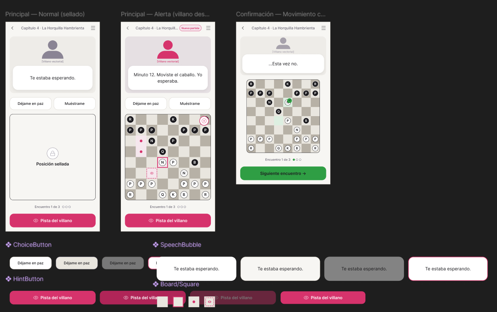
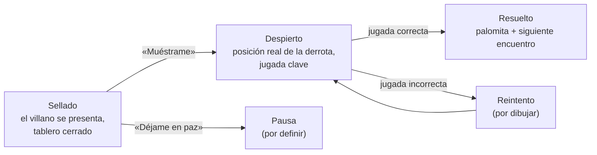
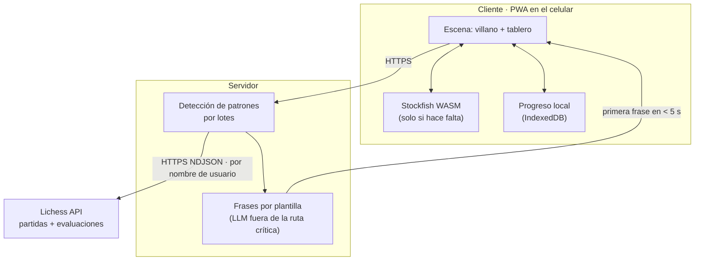
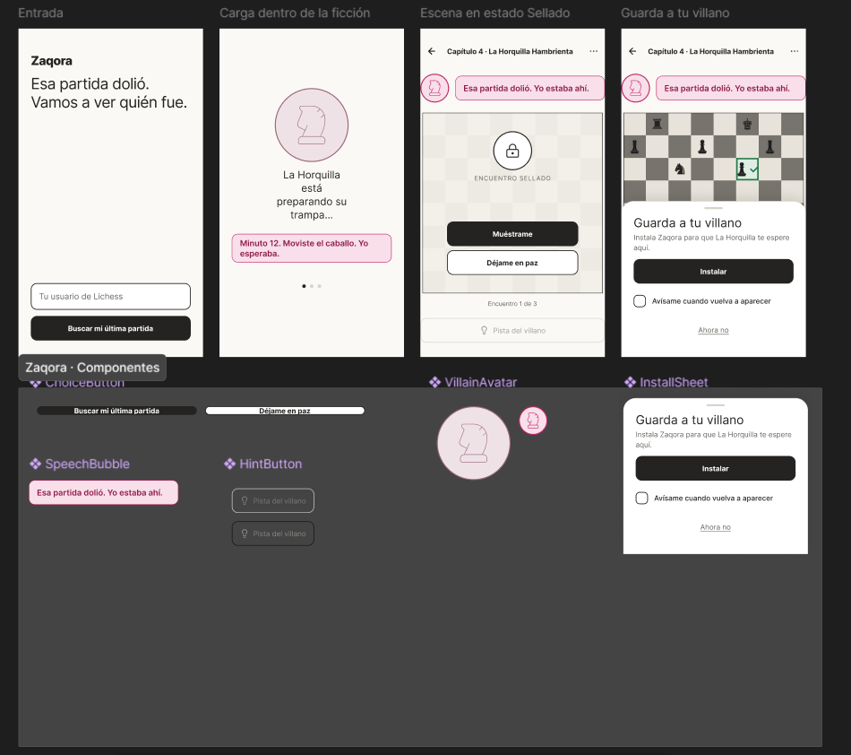

# Semana 6 — Generación y selección de concepto de diseño

## 1) Resumen

- **Nombre de la actividad:** _Generación y selección de concepto de diseño: tabla morfológica, analogías tecnológicas, 3 conceptos, Matriz de Pugh y crítica del boceto_
- **Curso:** _Proyecto de Ingeniería IV_
- **Equipo:** _David López Ramírez_
- **Fecha:** _01/10/2026_
- **Descripción breve:** _Con la propuesta de valor (semana 4) y la arquitectura y el PDS (semana 5) definidos, esta semana se trabajó el **concepto de diseño** de **Zaqora**: cómo se ve, cómo se toca y cómo se usa. Se siguió la secuencia del taller —tabla morfológica → analogías tecnológicas → 3 conceptos de diseño— con Claude, y en cada paso se usaron dos prompts de autoría distinta: el del profesor y uno propio. Después, los tres conceptos se evaluaron en una **Matriz de Pugh** —ganó **Ghost Engine** en las dos rondas— y el primer boceto técnico del concepto elegido se sometió a crítica antes de programar._

---

## 2) Punto de partida

**Concepto base (Zaqora):** El aprendizaje de ajedrez se convierte en el diseño de niveles de un videojuego de un solo jugador: cada «capítulo» es una lección disfrazada de misión, protagonizada por un personaje-villano que encarna un patrón de error real y recurrente del jugador. No hay ranking, no hay rival humano, no hay partida en línea contra otros: solo el jugador contra el mapa de la campaña, a su propio ritmo. El coaching ocurre dentro de la ficción —lo que dice el personaje, la trampa que tiende—, nunca como corrección fría ni comparación social.

**Propuesta de valor (semana 4):** _«Cuando pierdes en Lichess y estás por cerrar la app, Zaqora valida tu frustración y la convierte en el próximo capítulo de tu historia.»_

**Lo que ya fijó el PDS (semana 5):** PWA web como plataforma de la versión 1.0, integración con Lichess por OAuth 2.0 + PKCE, rival con Stockfish WASM en el cliente, análisis en servidor, costo ≤ $30 MXN por usuario activo al mes y cero comparación social.

**Concepto de producto vs. concepto de diseño:** el concepto de producto (semanas 2–4) dice qué problema resuelve Zaqora y para quién. El concepto de diseño (esta semana) dice cómo se experimenta: cómo se instala, cómo avisa sin abrir la app, qué lenguaje visual tiene, cómo se toca y qué hace el usuario en los primeros 30 segundos.

- **Objetivo de la semana:** Generar al menos 3 conceptos de diseño que difieran en al menos 3 parámetros de la tabla morfológica, elegir uno con criterios explícitos en la Matriz de Pugh y dejar su boceto técnico listo para implementarse.

!!! note "Adaptación a un producto de software"
    La plantilla del curso está pensada para un producto físico (carcasa, material, fuente de energía). Como en la semana 5, Zaqora no tiene hardware, así que esos parámetros se tradujeron a su equivalente de software: la **forma** es la estructura de la experiencia, el **material** es el lenguaje visual y la **energía** es dónde se procesa el análisis.

---

## 3) Proceso — Conceptos de diseño con IA

### Paso 1 — Tabla morfológica

**Herramienta:** Claude.

??? quote "Prompt completo — Prompt del profesor (Claude, tabla morfológica)"
    Actúa como diseñador industrial especializado en productos de software conectado para mercados latinoamericanos. Tu sesgo es hacia opciones construibles con medios universitarios. Cuando una variante es técnicamente inviable para el equipo, no la incluyes.

    Somos un equipo de ingeniería en México. Nuestro producto:

    Nombre: Zaqora
    Qué hace y para quién: El aprendizaje de ajedrez se convierte en el diseño de niveles de un videojuego de un solo jugador: cada «capítulo» es una lección disfrazada de misión, protagonizada por un personaje-villano que encarna un patrón de error real y recurrente del jugador. No hay ranking, no hay rival humano, no hay partida en línea contra otros: solo el jugador contra el mapa de la campaña, a su propio ritmo. El coaching ocurre dentro de la ficción —lo que dice el personaje, la trampa que tiende—, nunca como corrección fría ni comparación social.
    Usuario y contexto de uso: Cuando pierdes en Lichess y estás por cerrar la app, Zaqora valida tu frustración y la convierte en el próximo capítulo de tu historia.
    Restricciones del PDS relevantes para el diseño:

    - Resistencia ambiental: Diferentes dispositivos, batería, IP, Hábitos del usurio,
    - Presupuesto de software por unidad: $300 MXN
    - Instalación: Abriendo una página en internet o descargando la aplicación de google play
    - Dimensiones máximas si las hay: Interfaz responsiva

    Genera una tabla morfológica con 6–7 parámetros de diseño. Para cada parámetro: 3 variantes genuinamente distintas. Cada variante debe ser fabricable con los medios del equipo.

    Parámetros obligatorios — ajusta los nombres según el producto:

    - Forma general
    - Método de instalación / montaje
    - Indicador de estado sin necesidad de abrir la app
    - Material y acabado exterior
    - Interfaz física con el usuario (botones, touchpoints)
    - Fuente de energía
    - Integración con partidas de ajedrez

    Para cada variante indica entre paréntesis la implicación de software más importante:

    **FORMATO DE SALIDA** — solo la tabla, sin texto adicional: TABLA MORFOLÓGICA — [nombre del producto], con columnas `| Parámetro | Variante A | Variante B | Variante C |` para los 6–7 parámetros.

??? abstract "Respuesta completa — Prompt del profesor (Claude)"
    **TABLA MORFOLÓGICA — Zaqora**

    | Parámetro | Variante A | Variante B | Variante C |
    | :--- | :--- | :--- | :--- |
    | **Forma general (estructura de la experiencia)** | Mapa de campaña 2D navegable con nodos-capítulo y tablero dentro de cada misión (motor de estado de campaña + renderizado en canvas con Phaser o PixiJS) | Novela visual por capítulos: escenas de diálogo con el villano y el tablero como «puzzle» dentro de la escena (motor de guion por nodos en JSON, fácil de generar desde plantillas) | Tablero único persistente con la narrativa superpuesta en burbujas y un «diario» de capítulos (UI mínima; toda la complejidad está en el generador de texto y en el perfilado de errores) |
    | **Método de instalación / montaje** | PWA instalable desde URL con *service worker* y *manifest* (una sola base de código; caché offline y actualización sin tienda) | La misma PWA empaquetada como TWA con Bubblewrap y publicada en Google Play (requiere Digital Asset Links y la cuenta de desarrollador de 25 USD, pago único) | App Flutter con compilación Android para Play y compilación web (una base Dart; acceso nativo a widgets y notificaciones, pero con un *bundle* web más pesado) |
    | **Indicador de estado sin necesidad de abrir la app** | Widget de pantalla de inicio Android que muestra al villano del capítulo actual y su «amenaza» (Jetpack Glance o home_widget en Flutter; solo en Android, no en web) | Notificación push escrita en la voz del villano tras detectar una derrota nueva (Web Push/FCM + cron que consulta partidas; hay que limitar la frecuencia para no ser invasivo) | *Badge* numérico en el ícono con capítulos pendientes y atajos dinámicos de «Continuar misión» (Badging API + App Shortcuts; es el más barato, pero el soporte varía según el *launcher*) |
    | **Material y acabado exterior (lenguaje visual)** | Pixel art 2D con *sprites* de villanos por patrón de error (hojas de *sprites* hechas en Aseprite/LibreSprite; *assets* muy ligeros, ideales para gama baja) | Ilustración vectorial plana en SVG con tema claro/oscuro (escala perfecta en cualquier pantalla; los villanos se pueden recolorear por variables CSS) | Estética «tinta y papel» con texturas y tipografía de manuscrito (texturas WebP comprimidas; hay que vigilar el peso inicial y usar carga diferida por capítulo) |
    | **Interfaz física con el usuario (*touchpoints*)** | Tap origen → tap destino con casillas grandes y botones inferiores de «Pista del villano» (chessground o react-chessboard; es la opción más precisa en pantallas pequeñas) | Arrastrar y soltar con vibración háptica cuando el jugador cae en la trampa del villano (Vibration API o HapticFeedback; hay que desactivarla en modo ahorro) | Modo a una mano: decisiones de diálogo de opción múltiple en la zona del pulgar y tablero solo para la jugada clave (menos entrada de ajedrez libre y validación más simple de las respuestas) |
    | **Fuente de energía (dónde se procesa)** | Análisis en servidor: Stockfish en el *backend* y cliente ligero (menor consumo de batería; el costo del servidor por usuario debe caber en los $300 MXN, por lo que conviene limitar la profundidad o usar colas) | Stockfish WASM en el dispositivo, sin servidor de análisis (funciona offline y el costo de servidor es casi cero; gasta batería y es lento en gama baja, por lo que se necesita un límite de profundidad adaptativo) | Híbrido diferido: el análisis se procesa por lotes solo con Wi-Fi o con el teléfono cargando, y el capítulo se genera antes de que el jugador lo necesite (restricciones de WorkManager y caché local en IndexedDB/SQLite) |
    | **Integración con partidas de ajedrez** | Importación automática desde la API pública de Lichess con OAuth2/PKCE o por nombre de usuario (*streaming* NDJSON; hay que respetar los *rate limits* y detectar derrotas nuevas por sondeo) | Botón «Compartir» desde la app o web de Lichess hacia Zaqora (Web Share Target en la PWA o *intent-filter* en Android; se activa justo en el momento de frustración, sin cuenta vinculada) | Pegar un PGN o un enlace de partida de cualquier plataforma, incluida la PubAPI de Chess.com (*parser* PGN con chess.js; es la opción más universal, pero depende de que el usuario haga el paso manual) |

#### Segunda ronda — prompt de autoría propia

La tabla del profesor organiza el sistema por cómo se construye y se entrega. Para la segunda ronda escribí un prompt que la organizara por lo que vive el jugador: las siete dimensiones de la experiencia, desde que pierde en Lichess hasta que vence al villano.

??? quote "Prompt completo — Segunda ronda, prompt propio (Claude, tabla morfológica de experiencia)"
    Actúa como un diseñador de producto senior y especialista en gamificación (game design). Necesito que elabores una Tabla Morfológica de Diseño para el desarrollo de la experiencia de usuario y mecánicas de Zaqora.

    **Contexto del Proyecto**

    - Concepto base: El aprendizaje de ajedrez estructurado como el diseño de niveles de un videojuego single-player. Cada «capítulo» es una lección disfrazada de misión, protagonizada por un villano que encarna un patrón de error real y recurrente del jugador (ej. colgar piezas, apuro de tiempo, no desarrollar piezas). Sin rankings, sin rivales humanos ni partidas en línea: solo el jugador contra el mapa de campaña a su ritmo. El coaching ocurre dentro de la narrativa (diálogos, trampas del villano), no como corrección fría ni comparación social.
    - Propuesta de valor: «Cuando pierdes en Lichess y estás por cerrar la app, Zaqora valida tu frustración y la convierte en el próximo capítulo de tu historia.»

    **Instrucciones para la Tabla Morfológica**
    Crea una tabla con las siguientes columnas:

    1. Dimensiones / Parámetros de Diseño: Las sub-funciones o componentes clave del sistema.
    2. Opción A (Minimalista / Directa): Una solución práctica de baja complejidad tecnológica.
    3. Opción B (Narrativa / Inmersiva): Una solución enfocada en la ficción, arte y narrativa.
    4. Opción C (Mecánica / Adaptativa): Una solución enfocada en algoritmos, lógica de juego o análisis de datos.
    5. Opción D (Radical / Disruptiva): Una solución fuera de lo convencional.

    **Dimensiones a Incluir (Filas)**
    Organiza la tabla incluyendo exactamente las siguientes dimensiones de diseño:

    1. Ingesta e Integración del Error (Lichess/Partida Externa): ¿Cómo detecta Zaqora la derrota y extrae el patrón de error del jugador?
    2. Traducción Narrativa (Transformación del Error): ¿Cómo se convierte un concepto técnico de ajedrez (ej. "Táctica no detectada") en el villano/misión?
    3. Validación Emocional / Onboarding de la Frustración: ¿Qué pantalla, mensaje o interacción ocurre en los primeros 10 segundos tras perder la partida externa?
    4. Diseño de Nivel / Misión (Layout del Tablero): ¿Cómo se presenta la posición en el tablero de Zaqora para que parezca un nivel de videojuego y no un simple puzzle?
    5. Mecánica de Coaching In-Game (Feedforward/Feedback): ¿Cómo interviene el villano/NPC para guiar al jugador dentro del nivel sin romper la ilusión?
    6. Progreso y Mapa de Campaña: ¿Cómo se visualiza el avance del jugador en lugar de usar un sistema de ELO/Ranking?
    7. Resolución y Victoria del Capítulo: ¿Qué ocurre en la pantalla y en la historia cuando el jugador vence al villano (supera el error)?

    **Entregable Requerido**

    1. La Tabla Morfológica completa estructurada claramente en formato Markdown.
    2. Un apartado final con 3 Combinaciones / Arquetipos de Producto sugeridos (combinando una opción de cada dimensión) para definir posibles versiones del MVP (ej. "MVP Ágil", "Versión Altamente Narrativa", "Versión Basada en IA").

??? abstract "Respuesta completa — Segunda ronda, prompt propio (Claude)"
    **Tabla Morfológica de Diseño — Zaqora**

    | Dimensión | A · Minimalista / Directa | B · Narrativa / Inmersiva | C · Mecánica / Adaptativa | D · Radical / Disruptiva |
    | :--- | :--- | :--- | :--- | :--- |
    | **1. Ingesta e Integración del Error** | El jugador vincula su usuario de Lichess o pega el enlace o PGN. Zaqora importa la última partida y Stockfish (WASM, en el dispositivo) marca los errores graves. Un conjunto de reglas simples clasifica el patrón: material perdido sin compensación = *pieza colgada*; errores con menos del 10 % del reloj = *apuro de tiempo*; piezas menores sin mover en la jugada 12 = *no desarrollar*. | **«La Bitácora»**: además del análisis, el jugador responde con un toque qué sintió (frustración, cansancio, «no lo vi venir») y dónde cree que falló. El error se registra como una «cicatriz» del héroe con fecha, rival y momento clave. La percepción subjetiva también es dato. | Sincronización automática por OAuth y consulta periódica de partidas nuevas. Un *pipeline* de motor y clasificador de motivos (horquilla, clavada, rey sin enrocar, desarrollo tardío, uso del reloj por fase) acumula resultados sobre las últimas N partidas. Se ataca el patrón **recurrente** ponderado por frecuencia y costo, no el error aislado. | **El villano llega primero.** Una extensión de navegador o un atajo de «Compartir» detecta la pantalla de derrota en Lichess en el instante del abandono. El villano reclama la autoría del error con una notificación en personaje: *«Ese alfil en f7… fui yo.»* La ingesta ya es el inicio de la ficción. |
    | **2. Traducción Narrativa** | Catálogo fijo de 6 a 8 villanos arquetipo con mapeo 1:1: **El Carterista** (piezas colgadas), **La Arena** (apuro de tiempo), **El Barón Dormido** (no desarrollar), **El Espejismo** (táctica no detectada). Nombre, retrato y una frase firma. | **Bestiario con lore.** Cada villano tiene biografía, reino, estética y *tics* que **son** el patrón. El Carterista roba lo que dejas sin custodia y habla como ladrón de mercado. El Barón duerme en su castillo mientras sus tropas nunca salen. Los capítulos escalan en arcos de 3 a 5 misiones por villano. | **Villano paramétrico.** Los atributos del patrón (tipo, fase de la partida, frecuencia, severidad) generan los atributos del villano: nivel, «armas», guarida y agresividad. Un LLM redacta diálogos sobre plantillas con restricciones. El villano se fortalece si el patrón persiste y se debilita si se atenúa. | **El villano es tu sombra.** Se construye como reflejo del avatar del jugador y el propio jugador lo bautiza. Sus diálogos reciclan frases que el jugador eligió en momentos de frustración. El mensaje de fondo: no vences a un enemigo externo, vences a una versión tuya. |
    | **3. Validación Emocional (primeros 10 s)** | Pantalla única, sin datos ni evaluación: *«Perder duele. Esa partida ya nos dio algo con qué trabajar.»* Dos botones: **«Ver qué pasó»** / **«Hoy no»**. Respetar el «hoy no» es parte de la validación. | **Microcinemática de 5 a 8 s.** El villano aparece en sombra junto a una miniatura del momento exacto del error. Luego el mentor responde: *«Lo vi. Ya sé quién fue. Vamos por él.»* La derrota se reencuadra como el incidente que detona la historia. | **Tono adaptativo.** El mensaje cambia según el contexto: racha de derrotas, hora del día, partidas rápidas consecutivas como señal de *tilt*, y cómo respondió el jugador antes. Si detecta *tilt*, recomienda pausa en lugar de misión. | **Catarsis física + misión sellada.** Primero un gesto: arrastras tu rey caído y lo derribas del tablero con fuerza (háptica y sonido). Después, la opción de «sellar» el capítulo en un cofre que solo se abre tras unas horas. Da permiso explícito para no jugar ahora. |
    | **4. Diseño de Nivel / Misión** | La posición real de su partida en un tablero con marco temático. Objetivo en una línea (*«Sobrevive 5 jugadas sin perder material»*), contador de turnos y 3 vidas. Ya no dice «encuentra la mejor jugada»: es una condición de victoria. | **El tablero como escenario.** Las casillas llevan la textura del bioma del villano, hay niebla de guerra sobre zonas no exploradas y las piezas rivales son esbirros. La posición se presenta como *«el lugar donde caíste»*, con diálogo de entrada. | **Nivel generado a la medida.** Mezcla posiciones de sus propias partidas con posiciones de bases de puzzles etiquetadas por tema, con la dificultad calibrada a su tasa de acierto. Incluye mini-partidas contra un bot con la «personalidad» del villano, programado para explotar ese patrón exacto. | **Reglas de jefe + rol invertido.** Algunas reglas exageran el error: las piezas indefensas se vuelven translúcidas y desaparecen al tercer turno, o el reloj «consume» casillas. En otros niveles juegas **como el villano** y debes explotar el error; aprendes a verlo desde el otro lado. |
    | **5. Coaching In-Game** | Pistas escalonadas por botón en 3 niveles (zona → pieza → jugada), presentadas como «susurros» del mentor. Tras un fallo, se deshace la jugada y aparece una explicación de una línea. | **Provocaciones como *feedforward*.** El villano anticipa su propia trampa en personaje: *«¿Seguro que tu caballo está cómodo ahí?»*. El mentor solo interviene en momentos clave. Las trampas se narran como emboscadas, nunca como «error». | **Intervención por señales.** El sistema responde al tiempo de reflexión, a la pieza que el jugador toca o pasa por encima (si la jugada dejaría algo colgado) y al historial. Las pistas se desvanecen conforme demuestra dominio y se programan repasos espaciados. | **El villano miente.** Sus «pistas» a veces son verdad y a veces son cebo. El jugador aprende a verificar: jaques, capturas y amenazas antes de cada jugada. El hábito que falta en su ajedrez real se convierte en la mecánica central. |
    | **6. Progreso y Mapa de Campaña** | Lista de capítulos con marcas de completado y una barra por patrón (*«Piezas colgadas: 3/5 capítulos»*). Sin números de fuerza ni comparaciones. | **Mapa ilustrado** con una región por villano. Los territorios liberados cambian de paleta y se pueblan. Un diario del héroe reúne cicatrices, victorias y frases memorables. | **Mapa vivo conectado a datos reales.** Las regiones se reconquistan o se pierden según la tasa del patrón en sus partidas externas: si vuelve a colgar piezas, el Carterista recupera una aldea. La única comparación es contra su propio pasado. | **Los villanos derrotados se vuelven aliados.** Es un «sistema Némesis» invertido: el Carterista vencido pasa a tu séquito y te avisa en futuros niveles cuando algo queda sin defensa. El progreso se lee en tu compañía, no en un mapa. |
    | **7. Resolución y Victoria del Capítulo** | Pantalla de victoria: *«Capítulo superado»*, tres líneas de aprendizaje y desbloqueo del siguiente capítulo. | **Cierre del ciclo emocional.** Cinemática de caída del villano, ilustración coleccionable y un epílogo que vuelve a mostrar la derrota original, ahora reinterpretada: *«Aquí empezó todo.»* | **Victoria por dominio.** El villano no cae hasta que el jugador resuelve varias variaciones del patrón con precisión sostenida. Después queda «en vigilancia» con repasos espaciados y un reporte antes/después. | **La batalla final ocurre fuera de la app.** El villano solo queda «herido» en Zaqora. La victoria se sella cuando, en las siguientes N partidas reales en Lichess, el patrón no reaparece, y entonces llega el aviso: *«Lo derrotaste en el mundo real.»* |

    ---

    **Arquetipos de Producto (MVP)**

    **1. MVP Ágil — «Validar el momento post-derrota»** · Combinación: 1A · 2A · 3A · 4A · 5B · 6A · 7A

    Tiene la mínima tecnología que prueba la hipótesis central: *¿abre alguien Zaqora justo después de perder en vez de cerrarlo todo?* Se usa 5B en lugar de 5A porque las provocaciones del villano son solo texto con plantillas: son baratas de producir y es la opción que más diferencia a Zaqora de un simple entrenador de puzzles.

    - **Métrica clave:** porcentaje de derrotas importadas que terminan en un capítulo iniciado en menos de 30 minutos.
    - **Riesgo:** puede sentirse como una app de puzzles con disfraz. La narrativa mínima debe estar muy bien escrita.

    **2. Versión Altamente Narrativa — «La campaña»** · Combinación: 1B · 2B · 3B · 4B · 5B · 6B · 7B

    Apuesta por el vínculo emocional y la identidad de marca: un bestiario memorable, un mapa ilustrado y el cierre del ciclo «derrota → epílogo». Es la versión que mejor cumple literalmente la propuesta de valor.

    - **Métrica clave:** retención a 30 días y capítulos completados por usuario.
    - **Riesgo:** alto costo de arte y escritura por villano, lo que limita cuántos patrones cubres al lanzar. Conviene empezar con 3 villanos muy pulidos.

    **3. Versión Basada en IA — «El entrenador invisible»** · Combinación: 1C · 2C · 3C · 4C · 5C · 6C · 7D

    Detecta patrones recurrentes de verdad, genera niveles y villanos a la medida y cierra el ciclo con evidencia real: el villano solo muere cuando mejoras en tus partidas de Lichess. Es la versión con el argumento de eficacia más fuerte y con mayor diferenciación técnica.

    - **Métrica clave:** reducción de la frecuencia del patrón en partidas externas tras completar el capítulo.
    - **Riesgo:** complejidad del clasificador de motivos y consistencia narrativa del contenido generado. Requiere suficientes partidas por usuario antes de ofrecer algo útil, así que habría que combinarla con 1A para el arranque en frío.

    **Recomendación de ruta:** lanzar el **MVP Ágil**, pero diseñando desde el día uno el modelo de datos de patrones de la opción 1C y el formato de villano de la 2B. Así el paso a los arquetipos 2 o 3 es incremental y no una reescritura. La opción **7D** («la batalla final fuera de la app») es la idea más potente y defendible de la tabla; vale la pena prototiparla pronto, incluso de forma manual.

#### Comparación de los dos prompts

| | **Prompt del profesor** | **Prompt propio** |
| :--- | :--- | :--- |
| **Rol asignado** | Diseñador industrial de software conectado, con sesgo hacia lo construible con medios universitarios. | Diseñador de producto senior y especialista en gamificación. |
| **Qué parametriza** | El *sistema*: estructura, instalación, indicador, lenguaje visual, *touchpoints*, dónde se procesa, integración. | La *experiencia*: ingesta, traducción narrativa, validación emocional, nivel, coaching, progreso, victoria. |
| **Variantes** | 3 por parámetro (A/B/C), sin filosofía común; cada una con su implicación de software. | 4 por dimensión, cada columna con una filosofía: minimalista, narrativa, adaptativa, radical. |
| **Restricción de viabilidad** | Explícita: si el equipo no puede construirla, no se incluye. | Ninguna; incluye opciones radicales (extensión en Lichess, villano que miente, rol invertido). |
| **Salida adicional** | Solo la tabla. | 3 arquetipos de MVP con métrica clave, riesgo y recomendación de ruta. |

**Qué aportó cada uno**

- **Responden a preguntas distintas y se complementan.** La tabla del profesor decide *por dónde llega y cómo se entrega* Zaqora (PWA o Play, push o widget, servidor o WASM). La mía decide *qué pasa dentro* (qué dice el villano, cómo es el nivel, cuándo se gana). Un concepto de diseño completo necesita las dos: la primera es la «carcasa» y la segunda el contenido.
- **El prompt del profesor tradujo bien los parámetros físicos.** «Forma» pasó a estructura de la experiencia, «material» a lenguaje visual y «energía» a dónde se procesa el análisis. Esa traducción es la que permite usar la plantilla del curso con un producto sin hardware.
- **Mi tabla toca lo que la del profesor no ve: la propuesta de valor.** La validación emocional en los primeros 10 segundos y la condición de victoria no aparecen en ninguna fila del profesor, aunque son exactamente lo que promete la frase «valida tu frustración y la convierte en el próximo capítulo».
- **Las columnas por filosofía producen arquetipos coherentes, pero con poca mezcla.** Elegir toda la columna B da una versión narrativa consistente de inmediato; a cambio, los arquetipos tienden a ser «una columna entera» en lugar de una combinación pensada parámetro por parámetro, que es lo que pide el método morfológico.
- **Coinciden en la integración.** Las dos tablas llegaron por separado a las mismas tres vías: API de Lichess con OAuth, botón «Compartir» / extensión en el momento de la derrota, y pegar un PGN como opción universal.
- **La opción más valiosa salió de la columna radical:** 7D, la batalla final fuera de la app. Es la única que mide aprendizaje real y no ejercicios resueltos, y terminó siendo el centro del Concepto 3.

---

### Paso 2 — Analogías tecnológicas

**Herramienta:** Claude.

??? quote "Prompt completo — Prompt del profesor (Claude, analogías tecnológicas)"
    Actúa como consultor de innovación de diseño con experiencia en transferencia de soluciones entre sectores. Tu metodología es la analogía tecnológica: identificar problemas de experiencia de usuario que ya fueron resueltos brillantemente en otros sectores — no en el sector del producto que se diseña — y extraer la lógica de solución que podría trasplantarse. No buscas inspiración estética. Buscas mecanismos de interacción, formas de instalación, sistemas de feedback y lógicas de uso que ya funcionaron con usuarios reales en otro contexto.

    Nuestro producto: (Zaqora): El aprendizaje de ajedrez se convierte en el diseño de niveles de un videojuego de un solo jugador: cada «capítulo» es una lección disfrazada de misión, protagonizada por un personaje-villano que encarna un patrón de error real y recurrente del jugador. No hay ranking, no hay rival humano, no hay partida en línea contra otros: solo el jugador contra el mapa de la campaña, a su propio ritmo. El coaching ocurre dentro de la ficción —lo que dice el personaje, la trampa que tiende—, nunca como corrección fría ni comparación social.
    Usuario: Cuando pierdes en Lichess y estás por cerrar la app, Zaqora valida tu frustración y la convierte en el próximo capítulo de tu historia.
    Tenemos esta tabla morfológica preliminar. Los parámetros donde nuestras variantes son más convencionales o donde no estamos satisfechos con las opciones:

    1. Método de instalación / montaje
    2. Indicador de estado sin necesidad de abrir
    3. Integración con partidas de ajedrez

    Para cada parámetro señalado, encuentra 2–3 productos de sectores completamente distintos al nuestro que hayan resuelto el mismo problema de experiencia de forma brillante. Para cada analogía:

    - El producto y el sector de origen
    - El problema de experiencia que resuelve
    - La lógica de solución — cómo lo resuelve exactamente
    - Cómo podría trasplantarse al parámetro de nuestro diseño

    **FORMATO DE SALIDA:** ANALOGÍAS TECNOLÓGICAS — [nombre del producto] → por parámetro: problema de experiencia y, por analogía, producto · sector, problema que resuelve, lógica de solución y trasplante posible → VARIANTE SUGERIDA PARA AGREGAR A LA TABLA (parámetro, variante nueva con su manufactura y analogía que la inspiró).

??? abstract "Respuesta completa — Prompt del profesor (Claude)"
    **ANALOGÍAS TECNOLÓGICAS — Zaqora**

    ---

    **PARÁMETRO: Método de instalación / montaje**

    *Problema de experiencia:* El momento clave de Zaqora dura segundos: el jugador acaba de perder y está a punto de cerrar Lichess. Si en ese instante le pides que busque una app, la descargue y cree una cuenta, la frustración gana. El montaje tiene que dar valor *antes* de pedir compromiso, y tiene que vivir cerca de donde ya ocurre la pérdida.

    **Analogía 1: App Clips (p. ej., pago de estacionamiento o renta de scooters)** · Sector: movilidad urbana

    - *Problema que resuelve:* Alguien frente a un parquímetro necesita pagar ya, no instalar una app de 80 MB.
    - *Lógica de solución:* Un fragmento mínimo de la app se activa por contexto (código QR, etiqueta NFC o enlace), resuelve una sola tarea completa sin instalación ni registro, y solo *después* de entregar valor ofrece instalar la app completa con el estado ya guardado. El orden es tarea primero, cuenta después.
    - *Trasplante posible:* Un «Capítulo cero» instantáneo. El enlace de la partida perdida abre una página web ligera, sin cuenta, con el villano ya presentado y una mini-misión de 60 segundos sobre *esa* partida. Al terminarla aparece «Guarda a tu villano», que instala la PWA con el progreso ya dentro. La instalación deja de ser la puerta de entrada y se vuelve la recompensa.

    **Analogía 2: Honey (extensión de cupones)** · Sector: comercio electrónico

    - *Problema que resuelve:* Nadie abre una app de cupones antes de pagar; la necesidad aparece en el *checkout* de otra tienda.
    - *Lógica de solución:* Se monta *sobre* la plataforma ajena, detecta el momento exacto (la página de pago) y aparece solo ahí, con una acción de un clic. No compite por la atención del usuario: se engancha a un flujo que ya existe.
    - *Trasplante posible:* Una extensión de navegador o *userscript* para lichess.org que detecta el fin de una partida perdida y muestra en una esquina al villano con un «¿Otra vez yo?». Zaqora aparece dentro del momento de frustración, no en otra app. Tiene la limitación de que solo sirve en escritorio, pero ahí es donde se juegan muchas partidas largas.

    **Analogía 3: Bots bancarios y de servicios en WhatsApp (p. ej., bancos y aerolíneas en LatAm)** · Sector: banca y atención al cliente

    - *Problema que resuelve:* Los usuarios con poco espacio o poca paciencia no instalan una app más, pero WhatsApp ya lo tienen abierto todo el día.
    - *Lógica de solución:* El producto no se instala; se «agrega un contacto». La interfaz es una conversación, el historial es el propio chat y el canal de notificaciones ya está concedido.
    - *Trasplante posible:* Zaqora como personaje conversacional. El villano *es* un contacto y los capítulos llegan como mensajes con un enlace a la jugada clave. En México, donde WhatsApp es casi universal, esto elimina por completo la fricción de instalación.

    ---

    **PARÁMETRO: Indicador de estado sin necesidad de abrir la app**

    *Problema de experiencia:* Mantener viva la historia (hay un villano esperándote) sin convertirse en otra app que regaña. Zaqora renuncia a la presión social y al ranking, así que el indicador no puede ser una racha que culpabiliza ni un contador de notificaciones. Tiene que ser periférico, tener un final natural y hablar en la ficción.

    **Analogía 1: Live Activities de Uber / Rappi / DiDi Food** · Sector: entregas y movilidad

    - *Problema que resuelve:* Quieres saber dónde va tu pedido sin abrir la app diez veces ni recibir diez notificaciones.
    - *Lógica de solución:* Es un solo elemento persistente en la pantalla de bloqueo que se actualiza en silencio mientras dura un proceso con inicio y fin claros, y que desaparece solo cuando el proceso termina. No se acumula, no insiste y no deja deuda pendiente.
    - *Trasplante posible:* Una «forja del capítulo» que se activa tras una derrota. En la pantalla de bloqueo aparece «El Glotón está preparando su trampa…», avanza mientras se analiza la partida, termina en «Tu capítulo está listo» y se retira sola si no la tocas en unas horas. En Android se implementa como notificación continua con progreso, con un solo evento por derrota y sin recordatorios repetidos.

    **Analogía 2: Ambient Orb (Ambient Devices)** · Sector: finanzas / energía doméstica

    - *Problema que resuelve:* Seguir el mercado o el precio de la luz sin leer números ni revisar pantallas.
    - *Lógica de solución:* Es «tecnología calmada». Una esfera cambia de color de forma continua según un único dato, y se lee de reojo sin atención activa. El estado se codifica en una cualidad (el color) y no en una cantidad (un número).
    - *Trasplante posible:* Un widget sin números: solo la silueta del villano con un aura que se intensifica cuando su patrón de error aparece en tus partidas recientes y se apaga cuando lo vences en la campaña. Resuelve el problema del *badge* numérico, que suena a tarea pendiente: el aura cuenta la historia («está creciendo») sin exigir nada.

    **Analogía 3: Portada del libro como salvapantallas del Kindle** · Sector: lectura digital

    - *Problema que resuelve:* Recordarte el libro que dejaste a medias sin enviarte ninguna notificación.
    - *Lógica de solución:* Aprovecha una superficie que el usuario ya mira muchas veces al día (el dispositivo en reposo) y la ocupa con el objeto de la historia en curso. El recordatorio es contemplativo, no interruptivo.
    - *Trasplante posible:* Un fondo de pantalla o de bloqueo generado por capítulo, con el villano actual en su escenario y el título del capítulo. El usuario lo acepta una vez y se actualiza al cambiar de capítulo. Es la forma más pasiva y menos invasiva posible, y además funciona como objeto coleccionable.

    ---

    **PARÁMETRO: Integración con partidas de ajedrez**

    *Problema de experiencia:* La partida perdida debe llegar a Zaqora sin que el jugador haga nada en el peor momento emocional, y el primer día no debe sentirse vacío mientras se espera «la próxima derrota».

    **Analogía 1: Sincronización Garmin → Strava** · Sector: fitness

    - *Problema que resuelve:* Nadie quiere exportar un archivo GPX después de correr 15 km.
    - *Lógica de solución:* El usuario vincula su cuenta una sola vez y, a partir de ahí, la fuente *empuja* cada actividad nueva al destino (*webhook*) sin que el usuario haga ningún gesto. La actividad aparece procesada, con análisis, antes de que el usuario abra Strava.
    - *Trasplante posible:* Vincular Lichess con OAuth una vez y escuchar su flujo de eventos del usuario (que reporta el fin de las partidas) mientras hay sesión activa, con sondeo barato como respaldo. Así, cuando el jugador abre Zaqora, el capítulo ya está forjado. Esta variante encaja con el indicador de «forja»: la integración dispara la Live Activity sin ninguna acción manual.

    **Analogía 2: Agregadores financieros vía Plaid (YNAB, Copilot)** · Sector: fintech

    - *Problema que resuelve:* Una app de presupuesto vacía el primer día no enseña nada.
    - *Lógica de solución:* Al conectar la cuenta importa retroactivamente meses de historial y categoriza cada transacción de forma automática, así que el usuario ve un diagnóstico de su comportamiento en el minuto uno. La categorización es el producto; la importación solo la alimenta.
    - *Trasplante posible:* Al vincular Lichess (y la API pública de Chess.com), importar las últimas 100 a 200 partidas, agrupar los errores recurrentes y presentar el «elenco de villanos» desde el día uno: «Estos son los tres que te han vencido este año». La campaña arranca con historia propia en lugar de esperar una derrota nueva, y cada partida perdida después se «categoriza» en un villano existente, igual que un gasto nuevo.

    ---

    **VARIANTE SUGERIDA PARA AGREGAR A LA TABLA**

    - **Parámetro:** Método de instalación / montaje (con efecto sobre el indicador y la integración).
    - **Variante nueva:** Zaqora conversacional. El villano es un contacto de WhatsApp o Telegram. El jugador comparte el enlace de la partida perdida desde Lichess al chat, el villano responde en su propia voz y envía el capítulo como una mini-app web dentro del chat. Una sola decisión resuelve los tres parámetros señalados:
        - Instalación: cero; basta con agregar un contacto.
        - Indicador: el chat mismo, con la última frase del villano visible en la lista de conversaciones y sin notificaciones propias.
        - Integración: el botón «Compartir» nativo, que llega justo en el momento de frustración.
    - **Manufactura:** Telegram Bot API + Telegram Mini App, que es la misma PWA servida dentro del chat y sin costo por mensaje, como piloto; después, WhatsApp Business Platform con respuestas dentro de la ventana de 24 h abierta por el usuario, para controlar el costo; *backend* con *webhook*, *parser* de enlaces y PGN con chess.js y el mismo servidor de análisis de la variante A.
    - **Viene de:** los bots bancarios y de servicios en WhatsApp (Analogía 3 de instalación), combinados con el momento contextual de App Clips.

#### Segunda ronda — prompt de autoría propia

El prompt del profesor pide analogías solo para los 3 parámetros más convencionales. En la segunda ronda pedí analogías para las 7 dimensiones de mi tabla de experiencia y una matriz final con la prioridad de cada mecánica para el MVP.

??? quote "Prompt completo — Segunda ronda, prompt propio (Claude, benchmark entre industrias)"
    Actúa como un arquitecto de producto y estratega de innovación especializado en Cross-Industry Benchmark, diseño de mecánicas y gamificación.
    Necesito un Análisis de Analogías Tecnológicas y de Producto basado en la Tabla Morfológica de Zaqora, un videojuego single-player para aprender ajedrez convirtiendo errores recurrentes en villanos y lecciones narrativas.

    **Contexto y Tabla Morfológica de Referencia**
    Zaqora transforma derrotas de ajedrez en un mapa de campaña sin ELO, sin rankings y con coaching inmersivo. La tabla morfológica del proyecto organiza el sistema en estas 7 Dimensiones de Diseño:

    1. Ingesta e Integración del Error: Desde PGN/WASM local hasta sincronización automática por API o intercepción instantánea post-derrota en Lichess/Chess.com.
    2. Traducción Narrativa: Mapeo de errores técnicos a personajes arquetípicos (El Carterista, La Arena, El Barón Dormido), bestiarios con lore, o villanos paramétricos/sombra.
    3. Validación Emocional (Primeros 10s): Interceptación de la frustración/tilt mediante pantallas de pausa, cinemáticas del rival, tono adaptativo o catarsis física (derribar el rey / cofre cerrado).
    4. Diseño de Nivel / Misión: Modos de juego tácticos contextuales (condiciones de victoria, tablero con estética de bioma, niveles generados o reglas de jefe/rol invertido).
    5. Coaching In-Game: Pistas por susurros, provocaciones/feedforward del villano, intervención según el tiempo/gestos, o pistas falsas que enseñan a verificar.
    6. Progreso y Mapa de Campaña: Avance basado en superar patrones en un mapa ilustrado, mapa vivo reconquistado según partidas reales, o reclutar villanos como aliados (Sistema Némesis invertido).
    7. Resolución y Victoria: Cierre con epílogo narrativo, victoria por constancia, o "la batalla final fuera de la app" (derrotar al villano cuando el error no vuelve a ocurrir en partidas reales).

    **Instrucciones para el Análisis**
    Para cada una de las 7 dimensiones morfológicas:

    1. Identifica 3 a 4 analogías tecnológicas o de producto del mundo real (videojuegos, aplicaciones de fitness, fintech, edtech, salud mental, ciberseguridad, dev tools, etc.) que hayan resuelto con éxito la opción técnica, mecánica o emocional de esa dimensión.
    2. Estructura la respuesta para cada dimensión de la siguiente manera:
        - El Reto Morfológico: Breve resumen de qué problema resuelve esta dimensión en Zaqora.
        - Desglose de Analogías: Por cada producto análogo menciona: Producto y Mecánica Usada; Opción Morfológica Vinculada (ej. 1D - Radical, 3A - Minimalista, 7D - Batalla fuera de la app); Traducción Directa a Zaqora.

    **Ejemplos de Productos/Industrias a Explorar (Sugeridos)**

    - Videojuegos Tácticos y Narrativos: Hades, Celeste, Middle-earth: Shadow of Mordor, Inscryption, Punch-Out!!, Slay the Spire, Dark Souls.
    - Aplicaciones y Herramientas Digitales: Sentry (monitoreo de errores), Strava / Garmin (análisis deportivo post-entreno), Duolingo / Headspace / Woebot (retención y manejo emocional), YNAB / Mint (gestión del error financiero), GitHub Copilot / IDEs (pistas e inferencia de intención).

    **Entregable Requerido**

    1. El Análisis Detallado por Dimensión organizado en formato Markdown estructurado con títulos claros.
    2. Matriz Final de Mecánicas Prestadas: Una tabla resumen que liste: `Dimensión Morfológica` | `Producto Análogo` | `Mecánica Reutilizable` | `Prioridad MVP (Alta/Media/Baja)`.

??? abstract "Respuesta completa — Segunda ronda, prompt propio (Claude)"
    **Análisis de Analogías Tecnológicas y de Producto — Zaqora**

    *Nota de codificación:* las letras de cada casilla (A, B, C, D) siguen el orden en que se listaron las opciones en el brief, y respetan los ejemplos (1D = Radical, 3A = Minimalista, 7D = Batalla fuera de la app). Si la tabla original usa otro orden, basta con reasignar las letras. El análisis no cambia.

    ---

    **Dimensión 1 — Ingesta e Integración del Error**

    *El Reto Morfológico:* convertir una partida perdida en datos estructurados (qué error, en qué fase, cuántas veces) con la mínima fricción posible. Si el jugador tiene que exportar un PGN a mano después de perder, no lo hará. La ingesta tiene que ser invisible y no puede violar las reglas de juego limpio de las plataformas.

    - **Sentry: captura automática de excepciones con *fingerprinting***
        - *Mecánica:* el SDK captura cada error con su *stack trace* y sus *breadcrumbs* (los eventos previos). Luego agrupa las ocurrencias repetidas en un único «Issue» mediante una huella (*fingerprint*).
        - *Opción vinculada:* **1C · Sincronización automática por API**, que es también la base del motor de clasificación de la Dimensión 2.
        - *Traducción a Zaqora:* cada error táctico se registra como un evento con una huella compuesta por `motivo_táctico + fase_partida + pieza_afectada + presión_de_reloj`. Los *breadcrumbs* son las 3–5 jugadas previas y el tiempo restante. Varios eventos con la misma huella forman un «Issue», y ese Issue es el villano. Así se evita crear un villano por cada error aislado: un villano solo nace cuando un patrón se repite.
    - **Strava ↔ Garmin/Apple Watch: sincronización pasiva**
        - *Mecánica:* la actividad aparece analizada en Strava sin que el usuario haga nada. El reloj sube el archivo y un *webhook* dispara el procesamiento.
        - *Opción vinculada:* **1C · Sincronización automática por API**.
        - *Traducción a Zaqora:* con Lichess, OAuth y los *endpoints* de exportación o *streaming* de partidas del usuario, para que la partida entre casi en tiempo real. Con Chess.com, su API pública solo da archivos mensuales de lectura y no tiene *push*, así que hay que hacer *polling* periódico (por ejemplo, cada 10 minutos mientras la app esté activa). La experiencia prometida es la de Strava: «abres Zaqora y tu derrota ya está ahí».
    - **Stockfish WASM en el navegador (el modelo de análisis de Lichess)**
        - *Mecánica:* el motor corre en el dispositivo del usuario, sin coste de servidor, sin latencia de red y sin sacar datos del dispositivo.
        - *Opción vinculada:* **1A/1B · PGN / WASM local**.
        - *Traducción a Zaqora:* una arquitectura *local-first* donde el análisis de errores (caída de evaluación mayor a X centipeones y clasificación temática) se ejecuta en WASM en el cliente. El servidor solo guarda el «expediente del villano» ya abstraído, no las partidas completas. Esto sirve de argumento de privacidad y de reducción de costes para el MVP.
    - **Grammarly (extensión): intervención contextual en la página de otro producto**
        - *Mecánica:* una capa superpuesta sobre sitios de terceros que detecta un evento y ofrece ayuda en el momento, sin salir del flujo.
        - *Opción vinculada:* **1D · Intercepción instantánea post-derrota (Radical)**.
        - *Traducción a Zaqora:* una extensión que detecta la pantalla de fin de partida en Lichess o Chess.com y muestra un aviso discreto: «Alguien conocido te ha visitado… ¿quieres ver quién fue?». **Restricción crítica:** la extensión solo debe activarse cuando la partida ya terminó y nunca leer el tablero durante el juego. Cualquier ambigüedad aquí choca con las políticas de juego limpio de ambas plataformas.

    ---

    **Dimensión 2 — Traducción Narrativa**

    *El Reto Morfológico:* convertir «dejaste un caballo sin defensa en la jugada 23» en algo que duela menos y se recuerde más. El villano tiene que ser fiel al patrón técnico (si no, no enseña) y tener suficiente personalidad para generar vínculo (si no, no retiene).

    - **Middle-earth: Shadow of Mordor: Sistema Némesis**
        - *Mecánica:* enemigos generados que recuerdan cada encuentro, acumulan cicatrices y rasgos, y ascienden si te derrotan.
        - *Opción vinculada:* **2C · Villanos paramétricos / sombra**.
        - *Traducción a Zaqora:* un villano con parámetros vivos: `nivel` (frecuencia del error en las últimas N partidas), `rasgos` (en qué fase aparece, con qué pieza, bajo qué presión de reloj) y `memoria` (cita tus partidas reales: «¿Recuerdas la Siciliana del martes?»). Si el error vuelve a costarte una partida, el villano «asciende» y cambia su aspecto.
        - ⚠️ **Alerta de vigilancia tecnológica:** la patente estadounidense n.º 10,926,179, titulada «Nemesis Characters, Nemesis Forts, Social Vendettas and Followers in Computer Games», protege este sistema. Warner Bros. puede mantenerla hasta 2035. Conviene añadirla a la vigilancia tecnológica (IPC A63F 13/00) y diseñar el sistema de Zaqora con una lógica distinta: villanos derivados de datos reales del jugador, no de encuentros procedurales dentro del juego, y sin jerarquías ni fortalezas. Esto merece una revisión de libertad de operación antes de lanzar.
    - **Monster Hunter: Cuaderno del Cazador / Pokédex**
        - *Mecánica:* un bestiario que se completa con los encuentros y revela debilidades, hábitat y comportamiento a medida que investigas.
        - *Opción vinculada:* **2B · Bestiario con lore**.
        - *Traducción a Zaqora:* cada villano tiene una ficha de bestiario que se desbloquea por capas. Primera aparición: nombre y silueta. Tres apariciones: patrón técnico. Cinco apariciones: «debilidad», que es la heurística de corrección (por ejemplo, «antes de mover, cuenta los defensores de cada pieza»). El *lore* es una forma encubierta de repetición espaciada.
    - **SuperBetter (Jane McGonigal): «Bad Guys»**
        - *Mecánica:* la app de resiliencia llama «villanos» a los obstáculos y hábitos negativos para externalizarlos. El problema deja de ser «yo soy malo» y pasa a ser «hay un enemigo que combatir».
        - *Opción vinculada:* **2A · Arquetipos (El Carterista, La Arena, El Barón Dormido)**.
        - *Traducción a Zaqora:* es la validación psicológica central de Zaqora: la **externalización** (una técnica de la terapia narrativa). Un catálogo fijo de 8–12 arquetipos para el MVP, cada uno asignado a un cúmulo de temas tácticos. El Carterista cubre piezas colgadas y descuidos; La Arena, el apuro de tiempo; El Barón Dormido, el desarrollo lento y el rey en el centro.
    - **Darkest Dungeon: Aflicciones con nombre**
        - *Mecánica:* el estrés acumulado se convierte en estados con nombre y personalidad (Paranoico, Masoquista, Imprudente) que cambian el comportamiento del héroe.
        - *Opción vinculada:* **2A/2C · Arquetipo con variante paramétrica**.
        - *Traducción a Zaqora:* además de los villanos del error técnico, existen «estados» que nombran el error emocional. «Imprudente» es jugar rápido después de una derrota; «Cobarde», ofrecer tablas en posiciones ganadas. Son villanos de segundo orden detectados por metadatos (tiempo entre partidas, abandonos), no por el motor.

    ---

    **Dimensión 3 — Validación Emocional (Primeros 10 s)**

    *El Reto Morfológico:* los segundos que siguen a una derrota deciden si el jugador cierra la app, pulsa «revancha» en *tilt* o aprende algo. Zaqora tiene que interrumpir el impulso sin sermonear.

    - **Dark Souls: pantalla «YOU DIED»**
        - *Mecánica:* un ritual breve e invariable, sin estadísticas ni reproches. La derrota se normaliza como parte del ciclo.
        - *Opción vinculada:* **3A · Minimalista (pantalla de pausa)**.
        - *Traducción a Zaqora:* 2–3 segundos de pantalla oscura con una sola línea tipográfica («El Carterista ha pasado por aquí») y sonido ambiental. No se muestra la evaluación del motor, la curva de ventaja ni el número del error. El análisis técnico se revela solo cuando el jugador lo pide.
    - **Hades: la muerte como avance narrativo**
        - *Mecánica:* morir te devuelve a la Casa de Hades, donde los personajes comentan tu derrota. Perder desbloquea diálogo, es decir, contenido.
        - *Opción vinculada:* **3B · Cinemática del rival**.
        - *Traducción a Zaqora:* cada derrota procesada desbloquea una línea nueva del villano: burla, confesión o pista de su pasado. Así la derrota tiene una recompensa narrativa y deja de ser solo pérdida. Implementación: un banco de 20–40 líneas por arquetipo, con condiciones (primera aparición, reincidencia, ausencia prolongada).
    - **Celeste: mensajes de ánimo y contador de muertes celebrado**
        - *Mecánica:* en las pantallas de carga, el juego dice explícitamente que cada muerte es aprendizaje. Hay un Modo Asistencia sin juicio.
        - *Opción vinculada:* **3C · Tono adaptativo**.
        - *Traducción a Zaqora:* un detector de *tilt* con reglas simples: más de 2 derrotas seguidas, menos de 30 s entre partidas, abandono o *timeout* con ventaja. Si se dispara, el tono cambia de «villano provocador» a «narrador compasivo» y se sugiere una pausa. Si no, se mantiene el tono lúdico.
    - **Técnica de la «caja de preocupaciones» (TCC) y hápticos de iOS**
        - *Mecánica:* en terapia cognitivo-conductual, escribir la preocupación y «guardarla» en una caja cerrada posterga la rumiación. Los hápticos dan cierre corporal a un gesto.
        - *Opción vinculada:* **3D · Catarsis física (derribar el rey / cofre cerrado)**.
        - *Traducción a Zaqora:* el jugador arrastra su rey caído hacia un cofre, que se cierra con respuesta háptica y sonido. El error queda «archivado para después», y la app ofrece abrir el cofre cuando esté listo, no ahora. Es un gesto de 3 segundos que separa la emoción del análisis.

    ---

    **Dimensión 4 — Diseño de Nivel / Misión**

    *El Reto Morfológico:* convertir el patrón de error en un escenario jugable donde la única forma de ganar sea ejercitar la habilidad contraria. Un puzzle genérico no enseña contra *tu* villano.

    - **Slay the Spire: reglas de jefe**
        - *Mecánica:* cada jefe rompe una regla (por ejemplo, Time Eater termina tu turno tras 12 cartas), lo que obliga a cambiar de estrategia.
        - *Opción vinculada:* **4D · Reglas de jefe / rol invertido**.
        - *Traducción a Zaqora:* cada villano impone una regla que castiga su propio patrón de forma exagerada. El Carterista: «cualquier pieza sin defensa durante 2 jugadas es robada». La Arena: «tienes 10 s por jugada, pero cada jugada segura te devuelve 3 s». La regla exagera el error hasta hacerlo imposible de ignorar.
    - **Into the Breach: amenazas telegrafiadas**
        - *Mecánica:* el enemigo muestra su intención antes de actuar. El reto no es adivinar, sino resolver con información completa.
        - *Opción vinculada:* **4A · Condiciones de victoria contextuales**.
        - *Traducción a Zaqora:* en los primeros niveles contra un villano, su amenaza se dibuja en el tablero (flecha roja semitransparente). La condición de victoria no es dar mate, sino por ejemplo «sobrevive 6 jugadas sin perder material». En niveles superiores la amenaza deja de mostrarse, y ese retiro gradual del andamiaje es el aprendizaje.
    - **Base de puzzles de Lichess y Dead Cells (generación procedural)**
        - *Mecánica:* Dead Cells combina piezas diseñadas a mano con generación procedural. La base de puzzles de Lichess está publicada en abierto (CC0) y etiquetada por tema táctico.
        - *Opción vinculada:* **4C · Niveles generados**.
        - *Traducción a Zaqora:* los niveles se generan filtrando la base de Lichess por el tema del villano (`hangingPiece`, `fork`, etc.) y por rango de dificultad, y se mezclan con **posiciones extraídas de las propias partidas del jugador**. Esa mezcla, 30 % partidas propias y 70 % base, es la ventaja diferencial: «este tablero es de tu derrota del jueves».
    - **Inscryption: el tablero como espacio narrativo**
        - *Mecánica:* el mismo juego de cartas cambia por completo de atmósfera y reglas según el «acto» y el antagonista.
        - *Opción vinculada:* **4B · Tablero con estética de bioma**.
        - *Traducción a Zaqora:* cada villano tiene su bioma, que es solo una capa visual: mercado nocturno para El Carterista, reloj de arena y desierto para La Arena, castillo polvoriento para El Barón Dormido. En el MVP basta un *skin* de tablero y piezas más una paleta y música, sin cambiar las reglas del ajedrez.

    ---

    **Dimensión 5 — Coaching In-Game**

    *El Reto Morfológico:* enseñar sin romper la inmersión ni dar la respuesta. Una pista demasiado directa impide que el jugador construya el hábito de verificar. Sin pistas, la frustración vuelve.

    - **GitHub Copilot: sugerencia fantasma (*ghost text*)**
        - *Mecánica:* la sugerencia aparece en gris, en línea, sin interrumpir. Se acepta con Tab o se ignora escribiendo.
        - *Opción vinculada:* **5A · Pistas por susurros**.
        - *Traducción a Zaqora:* un «Susurro» en tres niveles: (1) resaltado tenue de la casilla en peligro, (2) frase breve del narrador («algo en tu flanco de rey está solo»), (3) flecha fantasma de la jugada defensiva. Cada nivel se pide o aparece por tiempo, y el uso de pistas reduce el «botín» del nivel sin castigar.
    - **Punch-Out!!: provocaciones y señales del rival, consejos de Doc Louis**
        - *Mecánica:* cada rival avisa su golpe con una señal (*tell*) y una provocación. Entre asaltos, el entrenador da un consejo breve.
        - *Opción vinculada:* **5B · Provocaciones / *feedforward* del villano**.
        - *Traducción a Zaqora:* el villano anuncia su intención con una línea de personaje antes de ejecutar su táctica («Qué caballo tan solitario tienes ahí…»). Es *feedforward* disfrazado de burla: enseña a leer la amenaza antes de que ocurra. Entre «asaltos» (cada 5 jugadas), un mentor da un consejo de una línea.
    - **New Super Mario Bros. Wii: «Super Guide»**
        - *Mecánica:* después de varias muertes en el mismo punto, aparece un bloque opcional que muestra cómo superar el nivel.
        - *Opción vinculada:* **5C · Intervención según tiempo o gestos**.
        - *Traducción a Zaqora:* disparadores conductuales: más de 45 s sin mover, más de 3 intentos fallidos en la misma posición, o el cursor dudando entre varias piezas (en escritorio). La ayuda se ofrece, nunca se impone, y queda registrada para ajustar la dificultad.
    - **Simulaciones de *phishing* (KnowBe4, Microsoft Attack Simulation Training)**
        - *Mecánica:* se envían correos falsos controlados. Quien los detecta refuerza el hábito de verificar; quien cae recibe microformación inmediata.
        - *Opción vinculada:* **5D · Pistas falsas que enseñan a verificar**.
        - *Traducción a Zaqora:* ocasionalmente, un personaje «tramposo» susurra una jugada que parece buena pero cuelga material. Si el jugador la verifica (jaques, capturas, amenazas) y la rechaza, gana una recompensa especial («Ojo de Halcón»). Si cae, ve una explicación de 10 segundos. Debe desbloquearse solo cuando el jugador ya confía en el sistema, porque al principio erosionaría esa confianza.

    ---

    **Dimensión 6 — Progreso y Mapa de Campaña**

    *El Reto Morfológico:* sustituir el ELO por una representación del progreso que muestre qué patrones dominas, sin compararte con nadie y sin que una racha mala borre la sensación de avance.

    - **Duolingo: ruta de aprendizaje (*Learning Path*)**
        - *Mecánica:* un camino ilustrado y lineal de unidades. Cada nodo se completa por práctica y siempre sabes cuál es el siguiente paso.
        - *Opción vinculada:* **6A · Avance por patrones en un mapa ilustrado**.
        - *Traducción a Zaqora:* un mapa con regiones, una por villano activo. Superar los niveles de una región la «despeja» visualmente (niebla que se disipa). Es la opción más barata de construir y la más legible para el MVP.
    - **Forest (app de concentración): un entorno vivo según tu comportamiento real**
        - *Mecánica:* el árbol crece si no tocas el teléfono y se marchita si lo haces. El bosque es un registro visual del comportamiento real.
        - *Opción vinculada:* **6B · Mapa vivo reconquistado según partidas reales**.
        - *Traducción a Zaqora:* las regiones del mapa reflejan las **partidas reales** del jugador, no solo los niveles en la app. Si el Carterista vuelve a aparecer en Lichess, su región se oscurece parcialmente. Si pasan 10 partidas reales sin él, florece. El mapa se convierte en un tablero de salud de tu ajedrez.
    - **SonarQube / Codecov: puertas de calidad y regresiones**
        - *Mecánica:* un tablero de deuda técnica donde los *issues* se cierran, las regresiones se reabren y la tendencia importa más que el número absoluto.
        - *Opción vinculada:* **6B · Mapa vivo** (capa de datos).
        - *Traducción a Zaqora:* es el modelo de datos que sostiene el mapa vivo. Cada villano tiene un estado `activo → debilitado → en fuga → derrotado → (regresión)`. La transición depende de ventanas deslizantes sobre partidas reales, igual que un *quality gate* depende de la cobertura de las últimas versiones.
    - **Middle-earth: Shadow of War: dominar enemigos y convertirlos en seguidores / Persona 5: Confidentes**
        - *Mecánica:* el enemigo derrotado puede reclutarse como aliado. En Persona, cada vínculo otorga habilidades pasivas.
        - *Opción vinculada:* **6C · Reclutar villanos como aliados (Némesis invertido)**.
        - *Traducción a Zaqora:* el villano derrotado pasa a ser un «guardián» que vigila su propio patrón. El Carterista reformado te avisa en futuros niveles cuando otra pieza queda colgada. Narrativamente cierra el arco; pedagógicamente convierte el error superado en un reflejo interiorizado. (Ten presente la alerta de patente de la Dimensión 2: la mecánica de «seguidores» figura en su título.)

    ---

    **Dimensión 7 — Resolución y Victoria**

    *El Reto Morfológico:* definir cuándo un villano está realmente vencido. Si la victoria ocurre solo dentro de la app, Zaqora es un juego de puzzles más. Si ocurre en tus partidas reales, Zaqora transfiere el aprendizaje, que es su verdadera propuesta de valor.

    - **Hades: epílogo por acumulación**
        - *Mecánica:* el final verdadero no llega con una sola victoria, sino tras escapar varias veces. Luego sigue un epílogo que resuelve las relaciones.
        - *Opción vinculada:* **7A · Cierre con epílogo narrativo**.
        - *Traducción a Zaqora:* cada villano tiene un epílogo de 3–5 pantallas que se desbloquea al derrotarlo definitivamente, con su historia de origen y su reforma. Es un cierre emocional que hace compartible el logro sin necesidad de rankings.
    - **Smoke Free / QuitNow!: días sin el hábito e hitos**
        - *Mecánica:* el contador de días sin fumar muestra beneficios de salud desbloqueados por hito. Una recaída se registra sin borrar todo el progreso.
        - *Opción vinculada:* **7B · Victoria por constancia**.
        - *Traducción a Zaqora:* una «edad del error» por villano: partidas reales desde su última aparición, con hitos narrativos a las 5, 15 y 30 partidas. Una recaída reduce el contador pero conserva los hitos ya logrados. Así se evita la trampa de la racha de Duolingo, donde perder la racha provoca abandono.
    - **Sentry: «Resolve in next release» y detección de regresiones**
        - *Mecánica:* marcas un *issue* como resuelto. Si el mismo error reaparece en producción, Sentry lo reabre automáticamente como regresión y te avisa.
        - *Opción vinculada:* **7D · Batalla final fuera de la app**.
        - *Traducción a Zaqora:* el villano pasa a «en fuga» cuando superas sus niveles, pero solo se declara **derrotado** cuando la ingesta de la Dimensión 1 confirma N partidas reales sin su huella. Si reaparece, se reabre como regresión, con un mensaje narrativo del estilo «El Carterista ha escapado de prisión». Es la analogía más limpia de todo el análisis, porque ya usa exactamente el mismo *pipeline* de datos.
    - **Garmin / Strava: récords detectados automáticamente en actividad real**
        - *Mecánica:* nadie declara un récord personal. El sistema lo detecta al procesar la actividad real y lo celebra.
        - *Opción vinculada:* **7D · Batalla fuera de la app** (capa de celebración).
        - *Traducción a Zaqora:* una notificación *push* cuando la sincronización detecta la victoria real: «En tu partida de hoy en Lichess tuviste la oportunidad de dejar el caballo colgado… y no lo hiciste. El Carterista ha caído.» El momento de mayor impacto emocional del producto ocurre fuera de la app y Zaqora solo lo narra.

    ---

    **Matriz Final de Mecánicas Prestadas**

    | Dimensión Morfológica | Producto Análogo | Mecánica Reutilizable | Prioridad MVP |
    | :--- | :--- | :--- | :---: |
    | 1 · Ingesta | Sentry | Huella del error + agrupación en «Issue» = villano | **Alta** |
    | 1 · Ingesta | Strava ↔ Garmin | Sincronización pasiva (Lichess OAuth + *polling* a Chess.com) | **Alta** |
    | 1 · Ingesta | Stockfish WASM (Lichess) | Análisis local en el cliente, servidor solo con abstracciones | **Alta** |
    | 1 · Ingesta | Grammarly | Extensión que intercepta el fin de partida | Baja |
    | 2 · Narrativa | SuperBetter | Externalización del error como «villano» con arquetipos fijos | **Alta** |
    | 2 · Narrativa | Monster Hunter / Pokédex | Bestiario que se desbloquea por capas con cada aparición | Media |
    | 2 · Narrativa | Darkest Dungeon | Estados emocionales con nombre (villanos de *tilt*) | Media |
    | 2 · Narrativa | Shadow of Mordor | Villano paramétrico con memoria de tus partidas | Baja (riesgo de patente) |
    | 3 · Validación emocional | Dark Souls | Pantalla ritual de 2–3 s sin métricas | **Alta** |
    | 3 · Validación emocional | Hades | La derrota desbloquea diálogo del villano | **Alta** |
    | 3 · Validación emocional | Celeste | Detector de *tilt* que cambia el tono | Media |
    | 3 · Validación emocional | Caja de preocupaciones (TCC) + hápticos | Gesto de guardar el rey en un cofre | Media |
    | 4 · Nivel / Misión | Slay the Spire | Regla de jefe que exagera el patrón del error | **Alta** |
    | 4 · Nivel / Misión | Base de puzzles de Lichess / Dead Cells | Niveles generados por tema + posiciones propias | **Alta** |
    | 4 · Nivel / Misión | Into the Breach | Amenazas telegrafiadas que se retiran con el progreso | Media |
    | 4 · Nivel / Misión | Inscryption | *Skin* de bioma por villano | Baja |
    | 5 · Coaching | GitHub Copilot | Susurro de 3 niveles (resaltado → frase → flecha fantasma) | **Alta** |
    | 5 · Coaching | Punch-Out!! | Provocación del villano como *feedforward* | **Alta** |
    | 5 · Coaching | NSMB Wii Super Guide | Ayuda ofrecida por inactividad o reintentos | Media |
    | 5 · Coaching | Simulaciones de *phishing* | Pistas falsas con recompensa por verificar | Baja |
    | 6 · Progreso | Duolingo Path | Mapa ilustrado con regiones por villano | **Alta** |
    | 6 · Progreso | SonarQube / Codecov | Estados del villano con ventanas deslizantes | **Alta** |
    | 6 · Progreso | Forest | Mapa que reacciona a partidas reales | Media |
    | 6 · Progreso | Shadow of War / Persona 5 | Villano reformado como guardián aliado | Baja |
    | 7 · Resolución | Sentry (regresiones) | Derrota confirmada fuera de la app y reapertura si reaparece | **Alta** |
    | 7 · Resolución | Garmin / Strava | Notificación de victoria detectada en partida real | **Alta** |
    | 7 · Resolución | Smoke Free / QuitNow! | «Edad del error» con hitos que no se pierden | Media |
    | 7 · Resolución | Hades | Epílogo narrativo por villano derrotado | Media |

    **Lectura estratégica**

    - **El núcleo del MVP es un solo *pipeline*, no siete funciones.** Sentry en las Dimensiones 1 y 7 más SonarQube en la 6 son el mismo motor de datos: huella del error → Issue/villano → estado → regresión. Si se construye bien una vez, alimenta la ingesta, el mapa vivo y la batalla fuera de la app.
    - **La capa emocional es barata y de alto impacto.** Las pantallas rituales, el diálogo del villano y el susurro progresivo son sobre todo contenido y guion, no infraestructura.
    - **Hay dos riesgos para la próxima revisión de vigilancia (diciembre 2026):** la patente del Sistema Némesis, que afecta a 2C y 6C, y las políticas de juego limpio de Chess.com y Lichess, que afectan a 1D.

#### Comparación de los dos prompts

| | **Prompt del profesor** | **Prompt propio** |
| :--- | :--- | :--- |
| **Alcance** | 3 parámetros elegidos por ser los más convencionales. | Las 7 dimensiones de la tabla de experiencia. |
| **Regla de origen** | Solo sectores **completamente distintos** al del producto; mecanismos, no estética. | Cualquier industria, **incluidos videojuegos** (Hades, Dark Souls, Slay the Spire…). |
| **Número de analogías** | 8 (2–3 por parámetro). | 28 (3–4 por dimensión). |
| **Cierre** | Una variante nueva para agregar a la tabla. | Matriz de 28 mecánicas con prioridad para el MVP y lectura estratégica. |

**Qué aportó cada uno**

- **El del profesor produjo una variante nueva que cambió la tabla.** «Zaqora conversacional» resuelve de golpe instalación, indicador e integración, y terminó siendo el eje del Concepto 2. Mi análisis, con 28 analogías, no propuso ninguna variante que no estuviera ya en la tabla: ordena y prioriza, pero no genera.
- **Mi prompt rompió la regla del método.** La técnica pide analogías de sectores *distintos* al del producto, y yo sugerí videojuegos, que es el sector de Zaqora. Hades o Celeste son referencias útiles, pero son inspiración del mismo sector, no transferencia entre sectores. Las analogías que realmente aportaron algo nuevo en mi análisis vienen de fuera: Sentry, SonarQube, simulaciones de *phishing* y la caja de preocupaciones de la TCC.
- **Mi análisis encontró la arquitectura detrás de las mecánicas.** Sentry (huella del error → Issue → regresión) resultó ser el mismo *pipeline* que sostiene la ingesta, el mapa vivo y la batalla fuera de la app. Es el hallazgo más útil de la semana para ingeniería, porque convierte tres dimensiones en un solo motor de datos.
- **Mi análisis detectó un riesgo legal que conecta con la semana 3.** El Sistema Némesis de Shadow of Mordor está patentado en EE. UU. (n.º 10,926,179), y afecta a las opciones 2C y 6C. Esa patente va a la vigilancia tecnológica antes de diseñar villanos paramétricos o aliados.
- **Se contaminaron para bien.** Mi prompt del Concepto 3 (Paso 3) tomó directamente tres analogías del profesor: la «forja» de las Live Activities, el aura del Ambient Orb y la importación retroactiva de Plaid. Y la analogía Garmin → Strava apareció en los dos análisis por separado, en el profesor para la integración y en el mío para la ingesta y la victoria.

---

### Paso 3 — Los 3 conceptos de diseño

**Herramienta:** Claude.

Con la tabla enriquecida con la variante D, se eligieron dos combinaciones de variantes y se pidió desarrollarlas como conceptos completos.

??? quote "Prompt completo — Prompt del profesor (Claude, 3 conceptos de diseño)"
    Actúa como diseñador industrial y UX designer con experiencia en productos de software para mercados emergentes. Tu especialidad es articular conceptos de diseño completos —el sistema de dos componentes: app y página de lanzamiento — de forma que cada componente refuerce la misma propuesta de valor y el mismo lenguaje de diseño.

    Nuestro producto: El aprendizaje de ajedrez se convierte en el diseño de niveles de un videojuego de un solo jugador: cada «capítulo» es una lección disfrazada de misión, protagonizada por un personaje-villano que encarna un patrón de error real y recurrente del jugador. No hay ranking, no hay rival humano, no hay partida en línea contra otros: solo el jugador contra el mapa de la campaña, a su propio ritmo. El coaching ocurre dentro de la ficción —lo que dice el personaje, la trampa que tiende—, nunca como corrección fría ni comparación social.
    Propuesta de valor: Cuando pierdes en Lichess y estás por cerrar la app, Zaqora valida tu frustración y la convierte en el próximo capítulo de tu historia
    Usuario y contexto: Jugador de ajedrez que suele perder partidas.

    Esta es nuestra tabla morfológica final — con variantes propias y variantes venidas de analogías tecnológicas: *(tabla del Paso 1 con la variante D de instalación)*

    Estas son las combinaciones de variantes que queremos explorar como conceptos. Para cada concepto indicamos qué variante elegimos en cada parámetro:

    **CONCEPTO 1 — Zaqora "Ghost Engine" (Web PWA + Backend Ultra-Ligero)**

    - Forma general (estructura de la experiencia): Variante B — Novela visual por capítulos: escenas de diálogo con el villano y el tablero como "puzzle" dentro de la escena (motor de guion por nodos en JSON, fácil de generar desde plantillas).
    - Método de instalación / montaje: Variante A — PWA instalable desde URL con service worker y manifest (una sola base de código; caché offline y actualización sin tienda).
    - Indicador de estado sin necesidad de abrir la app: Variante B — Notificación push escrita en la voz del villano tras detectar una derrota nueva (Web Push/FCM + cron que consulta partidas; hay que limitar la frecuencia para no ser invasivo).
    - Material y acabado exterior (lenguaje visual): Variante B — Ilustración vectorial plana en SVG con tema claro/oscuro (escala perfecta en cualquier pantalla; los villanos se pueden recolorear por variables CSS).
    - Interfaz digital con el usuario (touchpoints): Variante A — Tap origen → tap destino con casillas grandes y botones inferiores de "Pista del villano" (chessground o react-chessboard; es la opción más precisa en pantallas pequeñas).
    - Fuente de procesamiento (dónde se procesa): Variante A — Análisis en servidor: Stockfish en el backend y cliente ligero (menor consumo de batería; el costo del servidor por usuario debe caber en los $300 MXN, por lo que conviene limitar la profundidad o usar colas).
    - Integración con partidas de ajedrez: Variante A — Importación automática desde la API pública de Lichess con OAuth2/PKCE o por nombre de usuario (streaming NDJSON; hay que respetar los rate limits y detectar derrotas nuevas por sondeo).

    **CONCEPTO 2 — Zaqora "Cazador Fricción-Cero" (Conversacional + Ejecución Local)**

    - Forma general (estructura de la experiencia): Variante A — Mapa de campaña 2D navegable con nodos-capítulo y tablero dentro de cada misión (motor de estado de campaña + renderizado en canvas con Phaser o PixiJS).
    - Método de instalación / montaje: Variante D (Sugerida) — Zaqora conversacional: interacción vía bot/Mini App en mensajería privada sin instalación de app tradicional, aprovechando la ventana de atención inmediata.
    - Indicador de estado sin necesidad de abrir la app: Variante A — Widget de pantalla de inicio Android que muestra al villano del capítulo actual y su "amenaza" (Jetpack Glance o home_widget en Flutter; solo en Android, no en web).
    - Material y acabado exterior (lenguaje visual): Variante A — Pixel art 2D con sprites de villanos por patrón de error (hojas de sprites hechas en Aseprite/LibreSprite; assets muy ligeros, ideales para gama baja).
    - Interfaz digital con el usuario (touchpoints): Variante B — Arrastrar y soltar con vibración háptica cuando el jugador cae en la trampa del villano (Vibration API o HapticFeedback; hay que desactivarla en modo ahorro).
    - Fuente de procesamiento (dónde se procesa): Variante B — Stockfish WASM en el dispositivo, sin servidor de análisis (funciona offline y el costo de servidor es casi cero; gasta batería y es lento en gama baja, por lo que se necesita un límite de profundidad adaptativo).
    - Integración con partidas de ajedrez: Variante B — Botón "Compartir" desde la app o web de Lichess hacia Zaqora (Web Share Target en la PWA o intent-filter en Android; se activa justo en el momento de frustración, sin cuenta vinculada).

    Para cada concepto, desarrolla los dos componentes del producto:

    - **APP — pantalla principal:** estado normal (qué muestra cuando todo funciona bien); estado de alerta (qué cambia visualmente); acción principal (qué hace el usuario desde esa pantalla); qué NO muestra (información que se omite deliberadamente y por qué esa omisión es una decisión de diseño).
    - **LANDING PAGE — primer pantallazo:** headline (la primera frase que ve el visitante); la imagen o visual principal que acompaña el headline; el único call-to-action de la página.

    **FORMATO DE SALIDA:** por concepto: CONCEPTO N — [nombre] con su combinación morfológica → ARTEFACTO (instalación en pasos numerados, uso cotidiano en 3 oraciones máximo, principios activos) → APP (normal, alerta, acción principal, omisión deliberada) → LANDING PAGE (headline, visual principal, CTA). Tres conceptos.

??? abstract "Respuesta completa — Prompt del profesor (Claude)"
    Me diste dos combinaciones y el formato pide tres. El Concepto 3 es una propuesta mía: usa todas las variantes C, que ningún otro concepto emplea, para que tengas un contraste completo. También señalo una contradicción interna del Concepto 2 y cómo resolverla.

    Los principios activos se refieren a los cuatro que se desprenden de tu propuesta de valor:

    - **P1 · Validar antes de corregir.**
    - **P2 · Coaching dentro de la ficción.**
    - **P3 · Sin comparación social.**
    - **P4 · Tecnología calmada:** los recordatorios tienen un final y no culpan al jugador.

    ---

    **CONCEPTO 1 — Zaqora «Ghost Engine»**

    *Combinación morfológica:* Forma general → B (novela visual por capítulos) · Instalación → A (PWA desde URL) · Indicador → B (push en voz del villano) · Lenguaje visual → B (vector plano SVG, claro/oscuro) · *Touchpoints* → A (tap origen → tap destino + «Pista del villano») · Procesamiento → A (Stockfish en servidor) · Integración → A (API de Lichess, OAuth/usuario + sondeo)

    **ARTEFACTO**

    *Instalación:*

    1. El jugador abre zaqora.app desde un enlace o un QR. No hay tienda de aplicaciones de por medio.
    2. Escribe su usuario de Lichess, o lo vincula con OAuth si quiere detección más rápida.
    3. El servidor importa sus partidas recientes y presenta al primer villano en una escena de 30 segundos, sin crear cuenta.
    4. Al terminar la escena aparece «Guarda a tu villano», que agrega la PWA a la pantalla de inicio.
    5. Solo después se pide permiso para notificaciones, con una promesa visible: «Te escribo una vez por derrota. Nunca más.»

    *Uso cotidiano:* El jugador pierde en Lichess y cierra la app. Minutos después, el cron detecta la derrota y Stockfish, con profundidad limitada y en cola, identifica el patrón. Llega una push del villano («Esa torre colgada… sabía que volverías a mí») y el tap abre directamente la escena donde está la posición real de esa partida.

    *Principios activos:*

    - P1: la push reconoce la derrota en la voz del personaje antes de enseñar nada.
    - P2: la corrección es un diálogo seguido de un puzzle, no una línea de evaluación.
    - P3: el sistema solo lee las partidas del propio jugador.
    - P4: hay un tope de una push por derrota y tres por día. Si el jugador no la abre, no hay recordatorio.

    **APP**

    - *Normal:* Una escena de novela visual. El villano vectorial ocupa el tercio superior y su bocadillo de diálogo va debajo. Abajo hay un tablero pequeño «sellado» con la posición de la misión, y arriba un encabezado discreto: «Capítulo 4 · La Horquilla Hambrienta». El fondo usa el tema claro u oscuro del sistema.
    - *Alerta:* Cuando el sistema detecta una derrota nueva con el patrón del villano, sus variables CSS cambian a su paleta «despierta» (más saturada y con contraste alto), y el fondo de la escena se oscurece un tono. El diálogo pasa a citar la partida real («Minuto 12. Moviste el caballo. Yo esperaba»). El sello del tablero se rompe y muestra la posición exacta de la derrota.
    - *Acción principal:* Resolver la jugada clave con tap origen → tap destino sobre casillas grandes. El botón inferior «Pista del villano» hace que el personaje revele su propia trampa. Sirve de ayuda sin salir de la ficción.
    - *Omisión deliberada:*
        - Sin Elo ni rating. El jugador llega recién derrotado y cualquier número lo convierte en un juicio (P3).
        - Sin barra de evaluación ni notación «??». Es el lenguaje de la corrección fría que Zaqora sustituye por la voz del villano (P2).
        - Sin lista de partidas perdidas. Un historial de derrotas es un archivo de vergüenza. El jugador solo ve la derrota que ya se transformó en capítulo (P1).
        - Sin datos del servidor (colas, profundidad, tiempo de análisis). Si el análisis tarda, el villano «está preparando su trampa».

    **LANDING PAGE**

    - *Headline:* «La partida que acabas de perder tiene nombre. Y quiere revancha.»
    - *Visual principal:* Un teléfono con una pantalla genérica de fin de partida («0–1», sin marca de Lichess). Encima cae una notificación con el rostro vectorial del villano y su frase. Detrás del teléfono, el mismo villano a gran escala se recolorea al hacer *scroll*, pasando de «dormido» a «despierto».
    - *CTA:* «Conocer a mi villano» (un solo campo con el usuario de Lichess y el botón a su lado).

    ---

    **CONCEPTO 2 — Zaqora «Cazador Fricción-Cero»**

    *Combinación morfológica:* Forma general → A (mapa de campaña 2D con nodos) · Instalación → D (conversacional: bot + Mini App) · Indicador → A (widget Android) · Lenguaje visual → A (pixel art) · *Touchpoints* → B (arrastrar y soltar + háptica) · Procesamiento → B (Stockfish WASM en el dispositivo) · Integración → B (botón «Compartir» desde Lichess)

    **ARTEFACTO**

    *Instalación:*

    1. El jugador toca «Abrir en Telegram» en la *landing* o escanea un QR, y el chat con el villano se abre.
    2. Toca «Iniciar». El villano se presenta con un *sprite* animado y le explica el único gesto que necesita: «Cuando pierdas, compárteme la partida».
    3. En Lichess, tras una derrota, usa Compartir → Telegram → Zaqora.
    4. El bot contesta en la voz del villano con un botón que abre la Mini App en el mapa de campaña.
    5. Paso opcional, solo en Android: instalar el *companion* del widget (ver la tensión abajo).

    *Uso cotidiano:* El gesto de compartir ocurre justo en el pico de frustración y no exige cuenta. Mientras Stockfish WASM analiza en el teléfono, el chat muestra «El Glotón está escribiendo…». Esa latencia, inevitable en gama baja, se vuelve suspenso narrativo. Después aparece un nodo nuevo en el mapa con la misión construida sobre esa partida.

    *Principios activos:*

    - P1: el villano responde al instante en el chat, antes de cualquier análisis.
    - P2: la trampa se siente en el cuerpo, porque vibra cuando el jugador cae en ella.
    - P3: no hay cuentas, así que no hay nada que comparar.
    - P4: el indicador es el propio chat, con la última frase del villano en la lista de conversaciones. No hay notificaciones propias.

    ⚠ **Tensión de la combinación:** Una Mini App no puede colocar widgets en la pantalla de inicio. El widget exige un APK. Hay dos opciones:

    - *Resolución A (recomendada):* un *companion* Android mínimo (< 2 MB) que solo muestra el widget y se ofrece después del tercer capítulo, cuando ya hay apego.
    - *Resolución B:* renunciar al widget y dejar que el chat funcione como indicador.

    La háptica sí es viable, porque Telegram expone vibración nativa a las Mini Apps.

    **APP**

    - *Normal:* Un mapa pixel art con camino de baldosas y nodos-capítulo. Los nodos vencidos muestran la bandera del jugador, y el villano actual espera en su nodo con una animación *idle* de dos *frames*. Todo lo que está más allá del nodo siguiente queda cubierto por niebla. El widget muestra el *sprite* del villano quieto.
    - *Alerta:* Tras compartir una derrota con su patrón, el villano cambia a su *sprite* de «amenaza» (más grande, con ojos encendidos) y avanza una casilla hacia el jugador en el mapa. El nodo nuevo emerge de la niebla con un parpadeo de 8 bits. En el widget, el *sprite* adopta la misma pose. La amenaza se expresa con postura, nunca con un número.
    - *Acción principal:* Entrar al nodo y arrastrar la pieza en la misión. Si el jugador repite su error, el teléfono vibra y el villano ríe en pixel art. Si evita la trampa, el *sprite* retrocede en el mapa.
    - *Omisión deliberada:*
        - Sin perfil, cuenta ni historial en el chat. Cada campo de registro es un punto de abandono en el peor momento emocional.
        - Sin ajustes del motor ni indicador de batería o profundidad. La profundidad adaptativa decide sola, y mostrarla convertiría una historia en un *benchmark* de hardware.
        - Sin el mapa completo (la niebla es intencional). Un mapa entero visible es una lista de tareas pendientes. La niebla convierte el progreso en descubrimiento (P4).

    **LANDING PAGE**

    - *Headline:* «No instales nada. Solo compártele tu derrota.»
    - *Visual principal:* Una conversación de chat ocupa toda la pantalla. El jugador envía un enlace de partida y el villano en pixel art responde en una burbuja animada («¿Otra vez el alfil, eh? Ven, te enseño algo»). Debajo aparece la miniatura del mapa de campaña con un nodo recién iluminado.
    - *CTA:* «Abrir en Telegram»

    ---

    **CONCEPTO 3 — Zaqora «Cuaderno de Tinta» (propuesta)**

    *Combinación morfológica:* Forma general → C (tablero único persistente + diario) · Instalación → B (TWA en Google Play) · Indicador → C (*badge* + atajo «Continuar misión») · Lenguaje visual → C (tinta y papel) · *Touchpoints* → C (modo a una mano, decisiones de diálogo) · Procesamiento → C (híbrido diferido: Wi-Fi / cargando) · Integración → C (pegar PGN o enlace, incluida Chess.com)

    **ARTEFACTO**

    *Instalación:*

    1. El jugador descarga Zaqora de Google Play. Es un paquete ligero porque es la PWA envuelta.
    2. Al abrirla ve la primera página de un cuaderno en blanco: «Pega aquí la partida que te dolió».
    3. Pega un PGN o un enlace de Lichess o Chess.com.
    4. El villano escribe una sola línea a mano en el margen («Te veo mañana»). El análisis queda programado para cuando el teléfono esté con Wi-Fi o cargando.
    5. A la mañana siguiente el ícono muestra un *badge* y el atajo largo «Continuar misión».

    *Uso cotidiano:* El jugador pega la partida perdida en cuanto termina, sin esperar nada. Durante la noche, mientras el teléfono carga, el capítulo se escribe. Por la mañana lo lee con una mano en el transporte y elige respuestas de diálogo con el pulgar.

    *Principios activos:*

    - P1: la línea manuscrita del villano valida la derrota en el acto.
    - P2: el jugador decide en diálogo qué habría hecho, y la corrección es una conversación.
    - P3: el cuaderno es privado por naturaleza.
    - P4: el diferido elimina la urgencia. El *badge* tiene un tope de 1 y nunca se acumula, para no parecer una deuda.

    **APP**

    - *Normal:* Un solo tablero dibujado a tinta sobre papel texturizado ocupa el centro. El villano vive en el margen como caricatura y sus frases aparecen en burbujas manuscritas. Una pestaña de cinta en el borde abre el diario de capítulos pasados.
    - *Alerta:* Cuando hay un capítulo recién escrito, la tinta del tablero «se seca» con una animación breve y la página muestra la esquina doblada. Aparece una burbuja nueva del villano con el título del capítulo.
    - *Acción principal:* Tocar una de tres respuestas de diálogo en la zona del pulgar («¿Qué hacías aquí?») y, solo en la jugada clave, mover una pieza.
    - *Omisión deliberada:*
        - Sin estado del análisis nocturno ni barra de progreso. Mostrar «pendiente: esperando Wi-Fi» convierte la magia en un trámite técnico. El capítulo simplemente aparece.
        - Sin tablero libre para jugar ni motor visible. Zaqora no es un tablero de análisis, y abrir esa puerta invita a la comparación con el motor.
        - Sin contador acumulado. Tres capítulos sin leer se ven como uno solo, esperando.

    **LANDING PAGE**

    - *Headline:* «Pega la partida que te dolió. Mañana será un capítulo.»
    - *Visual principal:* Una hoja de cuaderno en plano cenital con la partida anotada a mano y una mancha de tinta sobre la jugada del error. En el margen, la caricatura del villano señala esa mancha con una sonrisa.
    - *CTA:* «Descargar en Google Play»

#### Segunda ronda — prompt de autoría propia

Para la segunda ronda definí yo el tercer concepto, «El Entrenador Invisible», combinando variantes de la tabla del profesor con lo que salió de ambas rondas de analogías (la forja, el aura, la importación retroactiva y la batalla fuera de la app). En lugar de pantallas y *landing*, pedí la especificación técnica y de juego de cada concepto, su viabilidad y una hoja de ruta.

??? quote "Prompt completo — Segunda ronda, prompt propio (Claude, especificación de los 3 conceptos)"
    Actúa como un Lead Game Designer y Arquitecto de Software Senior. Necesito que desarrolles la especificación completa y detallada para los 3 Conceptos de Diseño de Zaqora, combinando la arquitectura técnica de la Tabla Morfológica con el marco conceptual y de gamificación del proyecto.

    **Contexto del Proyecto (Zaqora)**

    - Concepto Base: El aprendizaje de ajedrez se convierte en el diseño de niveles de un videojuego de un solo jugador: cada «capítulo» es una lección disfrazada de misión, protagonizada por un personaje-villano que encarna un patrón de error real y recurrente del jugador. No hay ranking, no hay rival humano, no hay partida en línea contra otros: solo el jugador contra el mapa de la campaña, a su propio ritmo. El coaching ocurre dentro de la ficción —lo que dice el personaje, la trampa que tiende—, nunca como corrección fría ni comparación social.
    - Propuesta de Valor: «Cuando pierdes en Lichess y estás por cerrar la app, Zaqora valida tu frustración y la convierte en el próximo capítulo de tu historia.»

    **Entrada de Referencia (Los 3 Conceptos)**

    *CONCEPTO 1 — Zaqora "Ghost Engine" (Web PWA + Backend Ultra-Ligero)*

    - Estructura (Carcasa): Novela visual por capítulos; escenas de diálogo con el villano y el tablero como puzzle dentro de la escena (motor de guion por nodos en JSON).
    - Instalación / Montaje: PWA instalable desde URL con Service Worker y manifest (caché offline, actualización sin tiendas).
    - Indicador de Estado: Notificación push escrita en la voz del villano tras detectar una derrota nueva (Web Push/FCM + cron de sondeo).
    - Lenguaje Visual (Materiales): Ilustración vectorial plana en SVG con tema claro/oscuro (escala perfecta, recoloreado dinámico por CSS).
    - Interfaz Digital (Touchpoints): Tap origen → tap destino con casillas grandes y botones inferiores de "Pista del villano" (chessground / react-chessboard).
    - Fuente de Procesamiento (Energía): Análisis en servidor (Stockfish en el backend, cliente ultra-ligero; límites de profundidad y colas para control de costo).
    - Integración con Ajedrez: Importación automática desde la API pública de Lichess con OAuth2/PKCE (streaming NDJSON / polling).

    *CONCEPTO 2 — Zaqora "Cazador Fricción-Cero" (Conversacional + Ejecución Local)*

    - Estructura (Carcasa): Mapa de campaña 2D navegable con nodos-capítulo y tablero dentro de cada misión (engine 2D en Phaser o PixiJS).
    - Instalación / Montaje: Zaqora conversacional (Bot + Mini App en Telegram / WhatsApp Business Platform, sin instalación de app tradicional).
    - Indicador de Estado: Widget de pantalla de inicio Android que muestra al villano activo y su amenaza (Jetpack Glance / home_widget) o el mismo hilo de chat como indicador silencioso.
    - Lenguaje Visual (Materiales): Pixel art 2D con sprites de villanos por patrón de error (hojas de sprites ligeras para gama baja).
    - Interfaz Digital (Touchpoints): Arrastrar y soltar (drag and drop) con vibración háptica al caer en trampas (Vibration API).
    - Fuente de Procesamiento (Energía): Stockfish WASM ejecutándose localmente en el dispositivo (funciona offline, costo $0 de servidor, profundidad adaptativa según batería).
    - Integración con Ajedrez: Botón nativo de "Compartir" (Web Share Target / intent-filter) enviado directamente desde Lichess al chat/app en el momento del tilt.

    *CONCEPTO 3 — Zaqora "El Entrenador Invisible" (IA Adaptativa + Batalla Fuera de la App)*

    - Estructura (Carcasa): Tablero único persistente con narrativa superpuesta en burbujas y un "diario de cicatrices" histórico (UI minimalista orientada al motor de inferencia).
    - Instalación / Montaje: App nativa/híbrida (Flutter) con despliegue en Android/Web y enlaces universales profundos.
    - Indicador de Estado: Live Activity / Notificación continua "La Forja del Capítulo" + Aura ambiental en la silueta del villano (tecnología calmada).
    - Lenguaje Visual (Materiales): Estética "Tinta y Papel" con texturas WebP de manuscrito y tipografía temática de grimorio.
    - Interfaz Digital (Touchpoints): Modo a una mano con respuestas rápidas en la zona del pulgar y el tablero centrado en la jugada crítica.
    - Fuente de Procesamiento (Energía): Híbrido diferido (procesamiento por lotes en segundo plano al cargar el dispositivo o conectarse a Wi-Fi).
    - Integración con Ajedrez: Importación retroactiva profunda (últimas 100-200 partidas) para clasificar el "elenco de villanos" desde el día 1 + Detección de regresiones en partidas reales ("Batalla final fuera de la app").

    **Instrucciones de Respuesta**
    Desarrolla el análisis de cada uno de los 3 conceptos utilizando el siguiente esquema estructurado para cada concepto:

    1. Nombre y Visión General del Concepto: (Resume en 2 oraciones la propuesta de valor técnica y emocional de esta variante).
    2. Análisis de la Arquitectura de Experiencia (UX/UI): Cómo interactúa el usuario desde el momento en que pierde la partida en Lichess hasta que completa un capítulo.
    3. Stack Tecnológico y Modelo de Ejecución: Desglose del cliente, backend, motor de ajedrez (Stockfish), gestión de estado y persistencia de datos.
    4. Mecánica de Gamificación y Coaching In-Game: Cómo cobra vida el villano, qué trampas tiende y cómo se presenta la validación emocional y la victoria.
    5. Matriz de Viabilidad y Riesgos: Costo Operativo / Servidor (Alta/Media/Baja + Justificación); Fricción de Entrada para el Usuario (Alta/Media/Baja); Complejidad de Desarrollo (Time-to-Market); Principal Riesgo y Estrategia de Mitigación.

    **Entregable Requerido**

    - Presenta los 3 conceptos completamente redactados en formato Markdown claro y profesional.
    - Concluye con un Cuadro Comparativo Final de Conceptos e incluye una recomendación de Hoja de Ruta (Roadmap) para evolucionar del concepto más rápido (MVP) hacia el más avanzado.

??? abstract "Respuesta completa — Segunda ronda, prompt propio (Claude)"
    **Zaqora — Especificación técnica y narrativa de los 3 conceptos de diseño**
    *Versión 1.0 · 27 sep 2026 · Rol: Lead Game Design + Arquitectura de Software · Base: Tabla Morfológica de Zaqora + marco de gamificación narrativa*

    ---

    **0. Principios transversales (aplican a los 3 conceptos)**

    Antes de entrar en cada variante, estas reglas de diseño son invariantes. Cualquier decisión técnica que las viole se descarta.

    | Principio | Qué significa en la práctica |
    | :--- | :--- |
    | **Un solo jugador, cero comparación social** | No hay ELO visible dentro de Zaqora, no hay tablas de clasificación ni perfiles públicos. La única métrica es el progreso del jugador contra su propio mapa. |
    | **El error es un personaje, no una nota** | Cada patrón recurrente (p. ej. «cuelga piezas tras un jaque», «ignora la amenaza en la última fila») se encarna en un villano con nombre, voz y trampas. Nunca se dice «fallaste 7 veces»; lo dice el villano, en su ficción. |
    | **Validar antes de enseñar** | El primer contacto tras una derrota reconoce la frustración («Esa partida dolió. Yo estaba ahí.») antes de proponer cualquier ejercicio. |
    | **Tilt-aware** | Si el jugador encadena derrotas, Zaqora baja la intensidad: capítulo corto, invitación a pausar, nunca «juega otra». |
    | **Consentimiento explícito** | Toda importación de partidas pasa por autorización del jugador (OAuth o acción de compartir). No hay *scraping*. |

    **0.1 El núcleo común: el «Clasificador de Villanos»**

    Los tres conceptos comparten el mismo *pipeline* lógico; lo que cambia es **dónde** se ejecuta y **cuándo**.

    ```text
    Partida (PGN) ──► Análisis motor (Stockfish) ──► Detección de momentos críticos
          │                                              (caída de eval ≥ umbral)
          ▼                                                       │
      Metadatos (tiempo, apertura, color, reloj)                  ▼
                                                   Etiquetado de patrón (reglas + features)
                                                                  │
                                                                  ▼
                                                   Asignación a villano del elenco
                                                                  │
                                                                  ▼
                                             Generación de capítulo (plantilla narrativa
                                             + posiciones reales del jugador como puzzles)
    ```

    *Taxonomía inicial de patrones → villanos (MVP, 6 arquetipos):*

    | Patrón de error | Villano | Trampa característica |
    | :--- | :--- | :--- |
    | Pieza colgada (material sin defensa) | *El Carroñero* | Deja piezas «a la vista» y espera que las ignores |
    | Ignorar amenazas del rival (ceguera táctica) | *La Niebla* | Oculta la amenaza tras una jugada aparentemente pasiva |
    | Mate en la última fila | *El Muro Sordo* | Fuerza a mover peones del enroque «por seguridad» |
    | Apuros de tiempo (reloj < 10 %) | *El Relojero* | Capítulos con temporizador narrativo creciente |
    | Cambios que empeoran el final | *El Mercader* | Ofrece «tratos justos» (cambios) que pierden el final |
    | Colapso tras ventaja (no rematar) | *El Espejismo* | Te da una posición ganada y castiga la jugada «cómoda» |

    Detección por reglas (MVP) usando: caída de evaluación ≥ 150–200 cp en una jugada, tipo de jugada perdedora (captura ignorada, pieza atacada no defendida, mate en N permitido), reloj restante y fase de la partida. Un clasificador ML (G06N 20/00) se reserva para el Concepto 3.

    *Fuente de partidas:* API pública de Lichess.

    - `GET /api/games/user/{username}` devuelve NDJSON en *streaming* (`Accept: application/x-ndjson`), con parámetros `max`, `since`, `perfType`, `evals`, `clocks`, `opening`.
    - **Ahorro clave:** si la partida ya fue analizada en Lichess, `evals=true` trae la evaluación por jugada → se puede saltar el análisis propio.
    - Autenticación OAuth2 con PKCE (sin *client secret*). Las partidas públicas no requieren token, pero el token da mejores límites y acceso a partidas propias.
    - Límite práctico: una petición a la vez por usuario/IP; ante `429`, esperar al menos 60 s.

    ---

    **CONCEPTO 1 — Zaqora «Ghost Engine»** · *Web PWA + Backend Ultra-Ligero*

    **1.1 Nombre y visión general.** **Ghost Engine** es la versión más rápida de lanzar: una novela visual por capítulos que vive en una URL, se instala en un toque y recibe al jugador con un mensaje del villano minutos después de perder en Lichess. Técnicamente es un cliente delgado y un servidor que hace el trabajo pesado; emocionalmente, es «el fantasma de tu última partida» que viene a buscarte.

    **1.2 Arquitectura de experiencia (UX/UI).** Flujo de la derrota al capítulo completado:

    1. **Derrota en Lichess (t = 0).** El jugador pierde y cierra la app. No hace nada en Zaqora.
    2. **Detección (t + 2–10 min).** Un cron de sondeo consulta `since=último_timestamp` para cada usuario activo y encuentra la partida nueva.
    3. **Análisis en cola.** El *backend* analiza solo los momentos críticos (ver 1.3) y asigna villano.
    4. **Push en voz del villano (t + 5–15 min).** *El Carroñero:* «Ese caballo en f6 estaba solo. Yo lo vi. ¿Tú no? Ven, te enseño dónde más los dejas.»
    5. **Tap → capítulo.** Abre la PWA directo en la escena (*deep link* `/capitulo/{id}`).
    6. **Escena de validación (15–30 s).** Diálogo ilustrado en SVG. El villano reconoce la derrota; el jugador elige tono de respuesta (botones: «Déjame en paz» → capítulo suave / «Muéstrame» → capítulo normal).
    7. **Puzzles dentro de la escena (3–5).** El tablero emerge dentro del cuadro de diálogo. La primera posición es **la de su propia partida**; las siguientes son variaciones del mismo patrón.
    8. **Pista del villano.** Botón inferior grande. La pista es burlona pero útil («Mira quién está defendiendo a tu alfil… nadie»).
    9. **Victoria narrativa.** El villano retrocede, se registra una «cicatriz superada» y se desbloquea el siguiente nodo del guion.

    *Decisiones de interfaz:*

    - Tap origen → tap destino con casillas de ≥ 44 px (móvil de 360 px de ancho = tablero a ancho completo).
    - Tablero: `chessground` (el mismo de Lichess, familiar para el usuario) o `react-chessboard` + `chess.js` para validación de jugadas.
    - Tema claro/oscuro recoloreando SVG por variables CSS (`--villano-primario`, `--fondo-escena`).

    **1.3 Stack tecnológico y modelo de ejecución**

    | Capa | Tecnología | Notas |
    | :--- | :--- | :--- |
    | **Cliente** | PWA (React/Preact o SvelteKit) + Service Worker (Workbox) + Web App Manifest | Caché offline del guion y *assets*; actualizaciones sin tiendas. |
    | **Motor de guion** | Grafo de nodos en JSON (formato propio o Ink/Yarn exportado a JSON) | Nodos: `dialogo`, `eleccion`, `puzzle`, `victoria`. Plantillas con variables (`{pieza}`, `{casilla}`, `{villano}`). |
    | **Backend API** | Node.js (Fastify) o Python (FastAPI) en contenedor *serverless* (Cloud Run / Fly.io) | Escala a cero cuando no hay tráfico. |
    | **Cola de análisis** | Redis + BullMQ (Node) o RQ/Celery (Python) | Prioridad: partidas recientes > retroactivas. |
    | **Stockfish** | Binario nativo en *workers* (Stockfish 16/17) | Profundidad limitada (p. ej. 14–16) o por nodos; solo se re-analizan las 3–5 jugadas alrededor de cada caída de eval. |
    | **Sondeo** | Cron cada 5–10 min sobre usuarios activos (últimos 14 días) | Respetando 1 petición concurrente y *backoff* ante `429`. |
    | **Push** | Web Push (VAPID) directo, o FCM como capa | En iOS, Web Push solo funciona con la PWA instalada en pantalla de inicio (iOS 16.4+). |
    | **Estado** | Cliente: estado local (Zustand/Svelte stores) + IndexedDB para progreso offline | Sincronización al reconectar. |
    | **Persistencia** | PostgreSQL (usuarios, tokens cifrados, partidas procesadas, capítulos, progreso) | Supabase o Neon para arrancar barato. |

    *Control de costos del análisis:* (1) usar `evals` de Lichess cuando existan (costo 0); (2) si no, análisis rápido a baja profundidad de toda la partida → solo profundizar en jugadas con caída grande; (3) tope diario de análisis por usuario (p. ej. 5 partidas/día); (4) caché de posiciones por FEN (las aperturas se repiten mucho).

    **1.4 Mecánica de gamificación y coaching in-game**

    - **Cómo cobra vida el villano:** aparece primero en la notificación, luego en escena con expresión que cambia según el desempeño (confiado → nervioso → derrotado). Su diálogo usa datos reales: casilla, pieza, número de jugada.
    - **Trampas:** cada puzzle tiene una jugada «tentadora» diseñada por el patrón (p. ej., en *El Carroñero* la captura obvia deja colgada otra pieza). Si el jugador cae, el villano se burla y la escena se repite desde el punto de la trampa; no hay pantalla de «Game Over».
    - **Validación emocional:** frases de apertura escritas para reconocer sin condescender. Nunca se menciona el rating perdido.
    - **Victoria:** «cicatriz superada» en el perfil (privado); el villano «huye» y deja una pista de su próxima aparición. Si el patrón reaparece en partidas reales, el villano vuelve («Creíste que me había ido»).
    - **Progresión:** capítulos lineales por villano (3 actos: *Encuentro*, *Emboscada*, *Duelo*).

    **1.5 Matriz de viabilidad y riesgos**

    | Criterio | Evaluación | Justificación |
    | :--- | :--- | :--- |
    | **Costo operativo / servidor** | **Media** | Stockfish en servidor es el gasto principal; mitigable con evals de Lichess, profundidad limitada y caché. Hosting *serverless* escala a cero. |
    | **Fricción de entrada** | **Baja–Media** | URL + OAuth de Lichess en 2 toques. En iOS, activar push exige «Añadir a pantalla de inicio», que muchos no hacen. |
    | **Complejidad / Time-to-Market** | **Baja — 6–8 semanas** para MVP con 3 villanos | Todo es web estándar; el equipo reutiliza librerías maduras. |
    | **Principal riesgo** | Notificaciones push poco confiables (iOS, permisos denegados) → el «fantasma» nunca llega. | **Mitigación:** canal alternativo por email/Telegram opcional; pantalla de inicio de la PWA siempre muestra «tu villano te espera»; pedir permiso de push *después* del primer capítulo, no al entrar. |

    ---

    **CONCEPTO 2 — Zaqora «Cazador Fricción-Cero»** · *Conversacional + Ejecución Local*

    **2.1 Nombre y visión general.** **Cazador Fricción-Cero** vive donde el jugador ya está: en un chat de Telegram (o WhatsApp) y en el botón «Compartir» de Lichess, sin instalar nada. Todo el análisis corre en el propio teléfono con Stockfish WASM, así que el costo de servidor es casi cero y la experiencia se siente inmediata, cazando al villano justo en el momento del *tilt*.

    **2.2 Arquitectura de experiencia (UX/UI).** Flujo:

    1. **Derrota en Lichess (t = 0).** En pleno *tilt*, el jugador toca **Compartir** en la partida y elige el bot de Zaqora en Telegram (o la PWA registrada como Share Target en Android).
    2. **Recepción inmediata (t + 1 s).** El bot responde en el chat: *La Niebla:* «¿Esa? Sí, la recuerdo. Tu torre en e1 nunca vio venir mi alfil. Tócame para entrar a mi territorio.» Botón *inline*: **[Entrar a la misión]** → abre la Mini App.
    3. **Mapa de campaña 2D.** La Mini App abre un mapa pixel art con nodos-capítulo; el nodo nuevo brilla con el *sprite* del villano.
    4. **Análisis local (en segundo plano, 5–20 s).** Mientras el mapa anima la llegada, Stockfish WASM analiza en el dispositivo. Si el dispositivo es lento, se muestra una animación narrativa («La Niebla se está formando…»).
    5. **Misión.** Tablero dentro del nivel; el jugador arrastra piezas. Al caer en la trampa: **vibración háptica** + sacudida del *sprite*.
    6. **Victoria.** *Sprite* del villano derrotado, nodo desbloqueado, y el bot deja en el chat un mensaje final corto que queda como «indicador silencioso» del estado.

    **Si no comparte:** el jugador puede vincular su usuario de Lichess una vez; el bot envía un recordatorio suave diario (no por derrota) con el villano activo.

    *Decisiones de interfaz:*

    - *Drag and drop* con zona de soltar ampliada (tolerancia de ± 20 % de casilla) para dedos imprecisos.
    - Vibration API: patrones cortos (trampa: `[80, 40, 80]`; victoria: `[200]`). **No disponible en iOS Safari/WebView** → *fallback* visual (flash + sacudida) y, en Telegram, `HapticFeedback` de la Mini App API, que sí funciona en iOS y Android.
    - Pixel art con hojas de *sprites* (1 PNG/WebP por villano, 4–6 *frames* por animación) para gama baja.

    **2.3 Stack tecnológico y modelo de ejecución**

    | Capa | Tecnología | Notas |
    | :--- | :--- | :--- |
    | **Canal conversacional** | Bot de Telegram (Bot API) + Telegram Mini App; WhatsApp Business Platform como fase 2 | Telegram es gratis y permite Mini Apps; WhatsApp cobra por conversación/plantilla y no tiene Mini Apps equivalentes (solo WhatsApp Flows). |
    | **Mini App (cliente)** | Phaser 3 (mapa y escenas) o PixiJS + capa DOM para el tablero; `chess.js` para reglas | *Bundle* objetivo < 1,5 MB inicial. |
    | **Motor local** | Stockfish WASM (p. ej. `stockfish.js` / *builds* de lila-stockfish-web) en Web Worker | Multihilo requiere `SharedArrayBuffer` (*headers* COOP/COEP); dentro de WebViews puede no estar disponible → *build single-thread* como *fallback*. |
    | **Profundidad adaptativa** | Presupuesto por tiempo (`movetime`) según *benchmark* inicial del dispositivo | La Battery Status API solo existe en navegadores Chromium; no depender de ella. Usar *benchmark* de 1 s al primer uso + `navigator.hardwareConcurrency`. |
    | **Share Target** | Web Share Target en *manifest* de PWA (Android/Chrome) o `intent-filter` si hay *wrapper* nativo | En Telegram basta con compartir el enlace al chat del bot. |
    | **Backend** | *Webhook* mínimo del bot (Cloudflare Workers / Deno Deploy) | Solo recibe enlaces, extrae el ID de partida, descarga PGN de Lichess (`/game/export/{id}`) y lo reenvía a la Mini App. No analiza. |
    | **Widget (opcional)** | Android: Jetpack Glance o `home_widget` (si hay *wrapper* Flutter) | Solo en fase posterior; en MVP el hilo del chat es el indicador. |
    | **Estado** | Local: IndexedDB en la Mini App; Telegram `CloudStorage` para sincronizar progreso entre dispositivos | Sin base de datos propia en el MVP. |
    | **Persistencia servidor** | KV mínimo (Cloudflare KV / Upstash) para chat_id ↔ usuario Lichess | Datos personales mínimos. |

    **2.4 Mecánica de gamificación y coaching in-game**

    - **Cómo cobra vida el villano:** su primera aparición es un mensaje de chat, con el tono íntimo de un mensaje privado. En la Mini App tiene *sprite* animado, grito de entrada y una «guarida» en el mapa.
    - **Trampas:** son físicas: al arrastrar la pieza a la casilla trampa, el teléfono vibra y el *sprite* se ríe. El jugador siente la trampa antes de entenderla; luego el villano explica en una línea.
    - **Validación emocional:** el momento del *tilt* es la entrada; el primer mensaje *nunca* propone ejercicios, solo reconoce. La misión se ofrece con botón, no se impone.
    - **Mapa de campaña:** cada villano es una región; derrotarlo 3 veces (misiones de dificultad creciente) libera la región. Regiones cubiertas de «niebla de guerra» hasta que el patrón aparece en tus partidas: el mapa es literalmente un retrato de tus errores.
    - **Victoria:** *sprite* derrotado + mensaje final en el chat («La Niebla se disipa… por ahora»). El chat se convierte en un diario conversacional.

    **2.5 Matriz de viabilidad y riesgos**

    | Criterio | Evaluación | Justificación |
    | :--- | :--- | :--- |
    | **Costo operativo / servidor** | **Baja** | Análisis en el dispositivo; el *backend* es un *webhook* sin estado. WhatsApp sí tendría costo por mensaje (por eso va a fase 2). |
    | **Fricción de entrada** | **Baja** (en regiones con Telegram) / **Media** (donde domina WhatsApp, como México) | Sin instalación, pero depende de que el usuario use Telegram. |
    | **Complejidad / Time-to-Market** | **Media — 8–12 semanas** | Phaser + WASM + restricciones de WebView requieren pruebas en muchos dispositivos. |
    | **Principal riesgo** | Rendimiento y compatibilidad de Stockfish WASM en WebViews de gama baja (sin multihilo, calentamiento del equipo, cierres por memoria). | **Mitigación:** *build single-thread* + `movetime` corto (≤ 3 s por posición crítica); usar evals de Lichess cuando existan; análisis solo de momentos críticos; *fallback* opcional a un servidor ligero de análisis para dispositivos que fallen el *benchmark*. |
    | **Riesgo secundario** | Dependencia de plataformas de terceros (políticas de Telegram/Meta). | Mantener la Mini App como PWA independiente que funcione también fuera del chat. |

    ---

    **CONCEPTO 3 — Zaqora «El Entrenador Invisible»** · *IA Adaptativa + Batalla Fuera de la App*

    **3.1 Nombre y visión general.** **El Entrenador Invisible** conoce tus villanos antes del primer capítulo: al instalar, lee tus últimas 100–200 partidas y te presenta el elenco completo de tus errores. Es la variante más ambiciosa: procesa en segundo plano, detecta si tus viejos villanos regresan en partidas reales y convierte la victoria definitiva en algo que ocurre **fuera** de la app, en Lichess.

    **3.2 Arquitectura de experiencia (UX/UI)**

    *Día 1 (onboarding):*

    1. Instalación (Android / Web), vínculo OAuth con Lichess.
    2. **Importación retroactiva.** Pantalla «La Forja»: animación de tinta que se extiende mientras se procesan las partidas. En Android, notificación continua de progreso.
    3. **Revelación del elenco.** Aparecen, una a una, las siluetas de los villanos detectados, ordenadas por frecuencia. Cada una con una frase («Te he vencido 23 veces. ¿No me recuerdas?»).
    4. **Diario de cicatrices.** Página inicial del grimorio con las partidas que dieron origen a cada villano.

    *Del día 2 en adelante (tras una derrota):*

    1. **Derrota en Lichess.** Zaqora no interrumpe de inmediato: se agenda el procesamiento.
    2. **Procesamiento diferido.** Al cargar el teléfono o conectarse a Wi-Fi, WorkManager descarga y analiza las partidas nuevas.
    3. **Aura ambiental.** El ícono / silueta del villano en la app (y en el widget) cambia de intensidad: brillo tenue = amenaza baja; aura roja pulsante = el villano volvió a vencerte esta semana. Es tecnología calmada: informa sin notificar.
    4. **Capítulo en tablero único.** Una sola pantalla: tablero centrado en la jugada crítica, burbujas de narrativa encima, respuestas rápidas en la zona del pulgar (uso a una mano).
    5. **Batalla final fuera de la app.** Tras completar el arco, el villano reta: «Vuelve a tu arena. Si en tus próximas 10 partidas no caigo en mi propia trampa, me rindo.» La app vigila las partidas reales; la victoria llega cuando el patrón desaparece (o baja de frecuencia) en juego real.

    *Decisiones de interfaz:*

    - Estética «Tinta y Papel»: texturas WebP de pergamino, tipografía de grimorio para títulos (cuerpo en *sans* legible para accesibilidad).
    - Modo a una mano: todos los controles en el tercio inferior; el tablero se auto-recorta alrededor de la zona crítica (zoom 5×5 casillas) con opción de ver entero.
    - *Deep links* / App Links: `zaqora.app/villano/{id}` abre la ficha desde notificaciones o compartidos.

    **3.3 Stack tecnológico y modelo de ejecución**

    | Capa | Tecnología | Notas |
    | :--- | :--- | :--- |
    | **Cliente** | Flutter (Android + Web; iOS en fase posterior) | Un código base; Web para quienes no instalan. |
    | **Tablero** | Paquete Flutter de tablero (p. ej. `chessground` port o `flutter_chess_board`) + `dartchess` para reglas | Lichess mantiene su app móvil en Flutter con librerías reutilizables (`dartchess`, `chessground`): referencia valiosa. |
    | **Motor en dispositivo** | Stockfish nativo vía plugin Flutter (Android NDK) | Mucho más rápido que WASM. En Web: Stockfish WASM. |
    | **Procesamiento diferido** | Android WorkManager con restricciones `requiresCharging` + `NetworkType.UNMETERED` | Lotes de 20 partidas; se reanuda si se interrumpe. |
    | **Indicador de estado** | Android: notificación continua (*foreground service*) durante la Forja + widget con Glance / `home_widget`. iOS (fase 2): Live Activities vía ActivityKit | **Live Activity es exclusiva de iOS**; en Android la equivalente es la notificación continua. |
    | **Clasificador de villanos** | Fase 1: reglas + *features*. Fase 2: modelo ligero (*gradient boosting* o red pequeña) entrenado con *features* de posición y contexto (reloj, fase, material) | Ejecución en dispositivo con TFLite o en *backend* para re-entrenar. |
    | **Detección de regresiones** | Ventana deslizante por villano: frecuencia del patrón en las últimas N partidas vs. línea base | Condición de victoria: frecuencia < 50 % de la línea base en ≥ 10 partidas. |
    | **Narrativa generada (opcional)** | LLM en *backend* para variar diálogos a partir de plantillas + datos de la partida | Con *guardrails* de tono (nunca humillante) y caché; costo controlado por plantillas base. |
    | **Estado** | Riverpod / Bloc | |
    | **Persistencia** | Local: SQLite (Drift) con historial completo. Nube: PostgreSQL / Firestore para respaldo y sincronización | Partidas y cicatrices viven en el dispositivo; la nube guarda solo resumen y progreso. |

    **3.4 Mecánica de gamificación y coaching in-game**

    - **Cómo cobra vida el villano:** tiene memoria. Recuerda cuántas veces te venció, en qué aperturas y con qué color. Su diálogo cambia con la historia real («Hace dos meses caías cada semana. Ahora solo los viernes por la noche, cansado.»).
    - **Diario de cicatrices:** cada derrota significativa es una página del grimorio con la posición, la jugada y el villano. Las cicatrices «sanan» (cambian de tinta roja a dorada) cuando superas el capítulo y luego la batalla real.
    - **Trampas:** además de puzzles, el villano propone **predicciones**: «En tu próxima partida con blancas voy a esconderme en tu enroque.» Convierte el entrenamiento en expectativa para la partida real.
    - **Validación emocional:** el aura ambiental evita el bombardeo de notificaciones; el jugador decide cuándo enfrentar al villano. Tras rachas de derrotas, el grimorio muestra una página de «tregua» en vez de un reto.
    - **Victoria definitiva:** ocurre en Lichess. Cuando el sistema confirma que el patrón bajó, el villano «se rinde» con una escena final y su silueta se convierte en retrato conquistado. Es la única gamificación que mide aprendizaje real, no ejercicios resueltos.

    **3.5 Matriz de viabilidad y riesgos**

    | Criterio | Evaluación | Justificación |
    | :--- | :--- | :--- |
    | **Costo operativo / servidor** | **Baja–Media** | El análisis es local y diferido (costo ~0); el costo aparece si se usa LLM para narrativa y re-entrenamiento del modelo. |
    | **Fricción de entrada** | **Alta** | Requiere instalar una app nativa, conceder OAuth, permitir notificación continua y esperar la importación inicial (minutos a horas). |
    | **Complejidad / Time-to-Market** | **Alta — 5–8 meses** | App nativa, clasificador, procesamiento en segundo plano, detección de regresiones y diseño narrativo profundo. |
    | **Principal riesgo** | La clasificación de villanos es imprecisa o poco creíble («ese no es mi error»), lo que rompe la ilusión desde el día 1. | **Mitigación:** arrancar con los 6 arquetipos por reglas validados en los conceptos 1–2; mostrar al jugador la partida de evidencia de cada villano y permitirle «rechazar» un villano (señal de entrenamiento); umbral mínimo de apariciones (≥ 5) antes de revelar un villano. |
    | **Riesgo secundario** | Restricciones de segundo plano de Android por fabricante (Xiaomi, Huawei, Samsung matan procesos) y límites de la API de Lichess en importaciones masivas. | WorkManager + reanudación por lotes; importación en un único *stream* NDJSON por usuario con `max=200` en lugar de muchas peticiones. |

    ---

    **4. Cuadro comparativo final**

    | Dimensión | 1 · Ghost Engine | 2 · Cazador Fricción-Cero | 3 · Entrenador Invisible |
    | :--- | :--- | :--- | :--- |
    | **Promesa emocional** | «Tu última partida te vino a buscar» | «Caza a tu villano en el momento del *tilt*» | «Conozco a todos tus villanos, y te ayudo a vencerlos en la arena real» |
    | **Punto de entrada** | URL / PWA | Chat de Telegram + botón Compartir | App nativa (Android/Web) |
    | **Disparador** | Push tras sondeo (automático) | Acción del jugador (compartir) | Procesamiento diferido + aura ambiental |
    | **Dónde corre Stockfish** | Servidor | Dispositivo (WASM) | Dispositivo (nativo) + diferido |
    | **Carcasa narrativa** | Novela visual por capítulos | Mapa de campaña pixel art | Grimorio / tablero único |
    | **Profundidad del coaching** | Capítulo por derrota | Misión por derrota + regiones | Elenco completo + validación en juego real |
    | **Costo operativo** | Media | Baja | Baja–Media |
    | **Fricción de entrada** | Baja–Media | Baja (Telegram) / Media (México) | Alta |
    | **Time-to-market** | 6–8 semanas | 8–12 semanas | 5–8 meses |
    | **Riesgo principal** | Push poco confiable | Rendimiento WASM en gama baja | Credibilidad del clasificador |
    | **Mejor para** | Validar la hipótesis narrativa | Escalar barato y viralizar | Retención y aprendizaje medible |

    ---

    **5. Hoja de ruta recomendada (MVP → avanzado)**

    La recomendación es **no elegir un concepto, sino encadenarlos**: cada fase valida la hipótesis que la siguiente necesita, y los componentes se reutilizan.

    - **Fase 0 — Núcleo compartido (semanas 1–3):** *pipeline* Lichess → análisis → detección de momentos críticos → 3 villanos por reglas (*El Carroñero*, *La Niebla*, *El Muro Sordo*); motor de guion JSON y biblioteca de diálogos base (validación, trampa, victoria). **Métrica de salida:** en una muestra de 20 jugadores, ≥ 70 % reconoce su villano como «sí, ese soy yo».
    - **Fase 1 — MVP: Ghost Engine (semanas 4–10):** PWA con novela visual, 3 villanos, push tras derrota, puzzles con posiciones reales; análisis en servidor con evals de Lichess + Stockfish limitado. **Hipótesis a validar:** ¿el mensaje del villano tras una derrota consigue que el jugador abra un capítulo? **KPIs:** tasa de apertura de push ≥ 25 %, capítulos completados por usuario/semana ≥ 2, retención D7 ≥ 20 %.
    - **Fase 2 — Reducción de costo y canal: Cazador (meses 3–5):** migrar el análisis a **Stockfish WASM en el cliente** (la PWA ya existente lo adopta; servidor queda como *fallback*); añadir Web Share Target y bot + Mini App de Telegram reutilizando el tablero y el motor de guion; evolucionar la carcasa hacia mapa de campaña (regiones por villano) y ampliar a 6 villanos. **KPIs:** costo de análisis por usuario activo ↓ 80 %; ≥ 30 % de capítulos iniciados desde «Compartir». Evaluar WhatsApp solo si los datos de México muestran baja adopción de Telegram y el costo por conversación es sostenible.
    - **Fase 3 — Profundidad: Entrenador Invisible (meses 6–12):** app Flutter (Android primero) reutilizando lógica de dominio y guiones; importación retroactiva (100–200 partidas), elenco completo, diario de cicatrices; clasificador ML entrenado con los datos etiquetados de las fases 1–2 (incluidos los «rechazos» de villanos); detección de regresiones y **batalla final fuera de la app**; narrativa con LLM sobre plantillas, con *guardrails* de tono. **KPIs:** reducción medible de la frecuencia del patrón en partidas reales tras completar un arco (objetivo: −30 % en 30 días); retención D30 ≥ 15 %.
    - **Fase 4 — Expansión (año 2):** iOS con Live Activities; widget en ambas plataformas; importación desde Chess.com (API pública de solo lectura, sin OAuth: validar términos); temporadas narrativas y villanos «jefe» que combinan patrones.

    ```text
    Semana:  1───3────────10──────────────22─────────────────────52
             │ F0 │   F1 Ghost  │   F2 Cazador   │   F3 Entrenador Invisible   │
             núcleo  valida la     baja el costo    profundiza y mide
                     narrativa     y la fricción    aprendizaje real
    ```

    **Por qué este orden:** Ghost Engine es el más rápido de construir y prueba lo más incierto (que la ficción del villano funcione emocionalmente). Cazador resuelve el costo de servidor que Ghost Engine revelará y abre un canal de adquisición barato. El Entrenador Invisible solo tiene sentido cuando ya existen datos etiquetados suficientes para que el clasificador sea creíble, y esos datos los generan las dos primeras fases.

    ---

    **Anexo — Advertencias técnicas detectadas en la tabla morfológica**

    1. **Live Activity (Concepto 3)** es tecnología de iOS; el despliegue planteado es Android/Web. En Android se usa notificación continua (*foreground service*) + widget.
    2. **Vibration API (Concepto 2)** no funciona en iOS Safari; en Telegram usar `WebApp.HapticFeedback`.
    3. **Profundidad según batería (Concepto 2):** la Battery Status API no está disponible en Safari ni Firefox; basar la adaptación en un *benchmark* de rendimiento.
    4. **Web Push en iOS (Concepto 1)** requiere que la PWA esté instalada en la pantalla de inicio.
    5. **Stockfish WASM multihilo** exige `SharedArrayBuffer` con *headers* COOP/COEP, que no siempre están disponibles dentro de WebViews.
    6. **WhatsApp Business Platform** tiene costo por conversación y no ofrece Mini Apps como Telegram; conviene tratarlo como canal de notificación, no como contenedor de juego.
    7. **API de Lichess:** respetar una petición concurrente por usuario y esperar ≥ 60 s ante `429`; preferir un único *stream* NDJSON para importaciones masivas.

#### Comparación de los dos prompts

| | **Prompt del profesor** | **Prompt propio** |
| :--- | :--- | :--- |
| **Rol asignado** | Diseñador industrial y UX designer. | Lead Game Designer y arquitecto de software senior. |
| **Conceptos de entrada** | 2 definidos; la IA propuso el tercero («Cuaderno de Tinta», todas las variantes C). | 3 definidos por mí; el tercero («Entrenador Invisible») mezcla variantes de la tabla con lo que salió de las analogías. |
| **Qué describe** | Cómo se *experimenta*: instalación en pasos, pantalla normal y de alerta, omisiones deliberadas, *landing* (headline, visual, CTA). | Cómo se *construye*: flujo UX, *stack* por capa, mecánicas, viabilidad (costo, fricción, tiempo) y riesgos. |
| **Marco de evaluación** | 4 principios derivados de la propuesta de valor (P1–P4). | 5 principios transversales + matriz de viabilidad por concepto. |
| **Cierre** | Ninguna recomendación entre conceptos. | Cuadro comparativo y hoja de ruta que encadena los tres conceptos. |

**Qué aportó cada uno**

- **El del profesor produce un concepto de *diseño*; el mío, un concepto de *arquitectura*.** La semana pide cómo se ve, cómo se toca y cómo se usa, y eso es exactamente lo que entrega la respuesta del profesor: estados de pantalla, lo que se omite a propósito y la primera frase de la *landing*. Mi respuesta es más útil para ingeniería, pero se parece más a la semana 5 que a la 6, y no tiene *landing page*.
- **La «omisión deliberada» es la mejor herramienta de la semana.** Decidir que no hay Elo, ni barra de evaluación, ni lista de derrotas, ni datos del servidor traduce la propuesta de valor a decisiones de interfaz concretas. Mi prompt no la pidió y mi respuesta no la tiene.
- **Mi prompt adelantó la Matriz de Pugh.** Costo operativo, fricción de entrada y *time-to-market* por concepto son casi los criterios de factibilidad que pide el bloque 5. La respuesta del profesor no compara los conceptos entre sí.
- **Las dos rondas encontraron contradicciones internas, pero distintas.** El profesor detectó que una Mini App de Telegram no puede poner widgets en la pantalla de inicio (Concepto 2). La mía detectó que Live Activity es exclusiva de iOS aunque yo planteé Android (error de mi propio prompt), que la Vibration API no existe en iOS y que en México domina WhatsApp, no Telegram.
- **Los dos terceros conceptos se parecen más de lo que parece.** «Cuaderno de Tinta» y «Entrenador Invisible» comparten tablero único, tinta y papel, modo a una mano y procesamiento diferido. La diferencia está en la integración: pegar un PGN a mano frente a importar 200 partidas y vigilar regresiones en Lichess. El mío es más ambicioso y el del profesor más barato de construir.
- **Ninguna ronda revisó el PDS de la semana 5.** El Concepto 1 respeta el PDS (PWA, OAuth con Lichess, análisis en servidor). El Concepto 2 usa Telegram en lugar de la PWA y quita el servidor de análisis; el Concepto 3 es una app nativa, que el PDS dejó fuera de alcance. Si se elige el 2 o el 3, hay que actualizar el PDS.

---

### Paso 4 — Matriz de Pugh

**Herramienta:** Claude.

Para elegir entre los tres conceptos se construyó la matriz con El Entrenador Invisible como *datum* (concepto de referencia), primero con el prompt del profesor y después con uno propio.

??? quote "Prompt completo — Prompt del profesor (Claude, Matriz de Pugh)"
    Actúa como un ingeniero de producto con experiencia en selección de concepto usando la Matriz de Pugh para productos de software en etapa de prototipo temprano. Tu metodología asegura que los criterios de evaluación representen tanto la perspectiva del usuario (deseabilidad) como la del equipo de desarrollo (factibilidad), con peso explícito para cada uno. No permites que la matriz esté dominada por criterios técnicos cuando el producto va dirigido a un usuario no técnico.

    Somos un equipo de ingeniería en México. Nuestro producto es Zaqora: el aprendizaje de ajedrez convertido en un videojuego de un solo jugador, donde cada «capítulo» es una lección disfrazada de misión y el villano encarna un patrón de error real y recurrente del jugador. No tiene hardware, así que la «manufactura» equivale a construcción y despliegue del software. Tenemos 3 conceptos de diseño para evaluar:

    - **CONCEPTO 1 — Ghost Engine:** PWA instalable desde URL con formato de novela visual por capítulos, ilustración vectorial SVG, análisis con Stockfish en servidor e importación automática desde la API de Lichess (OAuth). Tras una derrota, llega una notificación push en la voz del villano que abre una escena con la posición de esa partida.
    - **CONCEPTO 2 — Cazador Fricción-Cero:** bot + Mini App de Telegram, sin instalación tradicional, con mapa de campaña 2D en pixel art, arrastrar y soltar con háptica y Stockfish WASM en el dispositivo. El jugador comparte su derrota desde Lichess al chat del villano y lo «caza» en el mapa.
    - **CONCEPTO 3 — El Entrenador Invisible:** app nativa en Flutter con tablero único y diario, estética de tinta y papel, modo a una mano y análisis diferido (Wi-Fi / cargando) que importa 100–200 partidas de Lichess para revelar el elenco de villanos. El estado se comunica con una «forja» y un aura sin notificaciones, y el villano solo cae cuando el patrón deja de aparecer en las partidas reales — este es el datum.

    Nuestro usuario: jugador amateur de ajedrez online (Lichess) que, al perder o frustrarse, no tiene forma de regular esa frustración y solo sabe cerrar la app o alejarse. Llega a Zaqora desde el celular, en pleno tilt, segundos después de una derrota. En la instalación le importa no tener fricción (ni descargas pesadas ni registro antes de recibir valor); en el uso le importa que se valide su frustración antes de corregirlo, sin Elo, sin rankings ni comparación social.

    Nuestras restricciones de manufactura (construcción y despliegue):

    - Proceso disponible: desarrollo propio con medios universitarios y servicios de plan gratuito, 8 semanas de desarrollo efectivo. El PDS de la versión 1.0 fija PWA web, OAuth 2.0 + PKCE con Lichess, rival con Stockfish WASM en el cliente y análisis en servidor.
    - Presupuesto por unidad: ≤ $30 MXN por usuario activo al mes (IA + infraestructura)
    - Volumen objetivo: 15–20 usuarios beta para prueba de mercado

    Construye la Matriz de Pugh con estas especificaciones:

    1. **CRITERIOS:** define 8–10 criterios de evaluación que incluyan obligatoriamente: mínimo 3 criterios de DESEABILIDAD (perspectiva del usuario) y mínimo 3 criterios de FACTIBILIDAD (perspectiva del equipo). Para cada criterio: nombre, descripción de 1 línea, y peso (los pesos de todos los criterios deben sumar 100). Los criterios de deseabilidad deben sumar mínimo 40% del peso.
    2. **EVALUACIÓN:** compara el Concepto 1 y 2 contra el Concepto 3 (datum) en cada criterio. Usa: + (mejor), – (peor), S (igual). Justifica brevemente cada evaluación no obvia.
    3. **PUNTUACIÓN:** calcula el puntaje ponderado de cada concepto (+ = +peso, – = –peso, S = 0). Suma total ponderada.
    4. **ANÁLISIS:** ¿qué dice la puntuación? ¿Hay criterios donde todos los conceptos empatan que podrían ajustarse en el concepto ganador? ¿Hay un criterio de alto peso donde el concepto ganador es débil — riesgo a mitigar?

    **FORMATO DE SALIDA:** MATRIZ DE PUGH (datum) → CRITERIOS Y PESOS por deseabilidad y factibilidad → MATRIZ DE EVALUACIÓN `| Criterio (peso) | C1 | C2 | C3 — datum |` con la puntuación ponderada → CONCEPTO GANADOR y por qué ganó → RIESGO PRINCIPAL → ITERACIÓN RECOMENDADA.

??? abstract "Respuesta completa — Prompt del profesor (Claude)"
    **MATRIZ DE PUGH** · Datum: Concepto 3 — El Entrenador Invisible

    ---

    **CRITERIOS Y PESOS**

    *DESEABILIDAD (peso total: 55 %)*

    - **D1. Fricción de entrada en pleno tilt (15 %):** pasos y espera desde la derrota hasta el primer valor, sin descarga pesada ni registro previo.
    - **D2. Validación antes de corrección (12 %):** la experiencia reconoce la frustración en el momento, antes de enseñar.
    - **D3. Calma y ausencia de presión (8 %):** sin Elo, rankings, comparación social ni interrupciones que reaviven el tilt.
    - **D4. Relevancia personal del villano (10 %):** el villano refleja un error real y recurrente del jugador, no uno genérico.
    - **D5. Uso cómodo en celular (5 %):** se puede jugar con una mano y en sesiones cortas.
    - **D6. Credibilidad del progreso (5 %):** vencer al villano equivale a mejorar de verdad en las partidas reales.

    *FACTIBILIDAD (peso total: 45 %)*

    - **F1. Construible en 8 semanas (15 %):** alcance realista con medios universitarios y el *stack* que el equipo domina.
    - **F2. Alineación con el PDS v1.0 (10 %):** PWA, OAuth 2.0 + PKCE, Stockfish WASM en cliente y análisis en servidor.
    - **F3. Costo por usuario activo (10 %):** se mantiene en ≤ $30 MXN al mes con planes gratuitos.
    - **F4. Despliegue a 15–20 beta (10 %):** distribución y actualizaciones sin tiendas ni cuentas de desarrollador de pago.

    ---

    **MATRIZ DE EVALUACIÓN**

    | Criterio (peso) | C1 — Ghost Engine | C2 — Cazador Fricción-Cero | C3 — datum |
    | :--- | :---: | :---: | :---: |
    | D1. Fricción de entrada (15) | + | + | datum |
    | D2. Validación antes de corrección (12) | + | S | datum |
    | D3. Calma y ausencia de presión (8) | – | – | datum |
    | D4. Relevancia personal del villano (10) | S | – | datum |
    | D5. Uso cómodo en celular (5) | S | – | datum |
    | D6. Credibilidad del progreso (5) | – | – | datum |
    | F1. Construible en 8 semanas (15) | + | S | datum |
    | F2. Alineación con el PDS (10) | + | S | datum |
    | F3. Costo por usuario activo (10) | – | S | datum |
    | F4. Despliegue a beta (10) | + | + | datum |
    | **Conteo (+ / – / S)** | **5 / 3 / 2** | **2 / 4 / 4** | — |

    *Justificaciones no obvias*

    - **D1:** ambos evitan la descarga desde tienda del datum. C1 aún pide OAuth antes del valor y C2 exige tener Telegram, pero los dos son más rápidos que instalar una app nativa.
    - **D2:** C1 responde en el momento, con la posición de esa partida y un formato narrativo que permite validar primero. El datum analiza en diferido y no está presente durante el tilt. C2 también es inmediato, pero «cazar» canaliza la frustración hacia la revancha en lugar de validarla, por eso S.
    - **D3:** el datum no tiene notificaciones por diseño. El push de C1 tras una derrota es una interrupción. C2 vive dentro de una app de mensajería, que es un entorno social y de notificaciones.
    - **D4:** C1 importa automáticamente y puede analizar el historial igual que el datum. C2 depende de partidas compartidas a mano, una por una, así que detecta peor lo recurrente.
    - **D5:** la novela visual se avanza con toques y empata con el modo a una mano. Arrastrar y soltar sobre un mapa es más difícil con una mano.
    - **D6:** solo el datum liga la caída del villano a que el patrón desaparezca de las partidas reales. En C1 y C2 el villano cae dentro del juego.
    - **F1:** C1 es web estándar con SVG. El datum exige Flutter, motor nativo y análisis en segundo plano. C2 ahorra las tiendas pero añade bot, SDK de Telegram y producción de pixel art, por eso S.
    - **F2:** C1 cumple PWA, OAuth y análisis en servidor. C2 solo aporta WASM en cliente y el datum tampoco es PWA, por eso S.
    - **F3:** C1 es el único que paga cómputo de Stockfish en servidor. C2 y el datum analizan en el dispositivo.
    - **F4:** URL o enlace al bot frente a APK o TestFlight con cuenta de desarrollador.

    *Puntuación ponderada*

    | | Deseabilidad | Factibilidad | **Total** |
    | :--- | :--- | :--- | :---: |
    | **C1** | +15 +12 –8 –5 = +14 | +15 +10 –10 +10 = +25 | **+39** |
    | **C2** | +15 –8 –10 –5 –5 = –13 | +10 = +10 | **–3** |
    | **C3 (datum)** | 0 | 0 | **0** |

    ---

    **ANÁLISIS**

    - **Qué dice la puntuación:** C1 gana con claridad y C2 queda prácticamente empatado con el datum. La ventaja de C1 viene más de factibilidad (+25) que de deseabilidad (+14), así que hay que revisar que no gane solo por ser fácil de construir.
    - **Dónde C1 y C2 califican igual:** en D1 y F4 ambos superan al datum; en D3 y D6 ambos pierden. D3 y D6 son las fortalezas propias del datum y las más fáciles de trasladar al ganador.
    - **Fragilidad del resultado:** el «+» de C1 en D2 depende del tono del villano. Si la notificación suena a burla, ese +12 se vuelve –12 y C1 baja a +15.

    ---

    **CONCEPTO GANADOR: Concepto 1 — Ghost Engine**

    *Por qué ganó:* combina la entrada sin instalación con una respuesta inmediata sobre la partida recién perdida, justo cuando el usuario llega en tilt. Además es el más alineado con el PDS y el más construible en 8 semanas con distribución por URL.

    **RIESGO PRINCIPAL:** costo por usuario activo (F3, 10 %), el criterio de mayor peso donde C1 es débil, por el análisis con Stockfish en servidor.

    - *Mitigación:* analizar bajo demanda con profundidad limitada, guardar resultados en caché y pasar al cliente (WASM) todo lo que no necesite servidor.
    - *Riesgo asociado en deseabilidad:* el push tras la derrota (D3, 8 %) puede reavivar el tilt y contaminar D2. Conviene hacerlo opcional, con tono de validación y nunca de burla, y probarlo con los primeros usuarios beta.

    **ITERACIÓN RECOMENDADA:**

    - De C3: que el villano solo caiga cuando el patrón deje de aparecer en las partidas reales (D6), y un modo silencioso con «aura» en lugar de push (D3).
    - De C3: importar las 100–200 partidas en segundo plano para revelar el elenco completo, y el modo a una mano en el tablero.
    - De C2: Stockfish WASM en el dispositivo, que además lo exige el PDS y reduce F3.
    - De C2: compartir la derrota desde Lichess hacia la PWA como entrada sin OAuth, para dar valor antes del registro.
    - *Efecto estimado:* si estas adopciones llevan D3, D6 y F3 de «–» a «S», C1 pasaría de +39 a cerca de +62.

    *Los pesos y las evaluaciones son una propuesta a partir de lo descrito; conviene que el equipo los valide antes de fijar la decisión.*

**Lectura del resultado (prompt del profesor)**

- **Ganó Ghost Engine con +39**, frente a –3 del Cazador y 0 del datum. La deseabilidad pesa 55 %, por encima del mínimo de 40 % que pide el método.
- **Gana más por factible que por deseable** (+25 contra +14). La matriz misma avisa que no debe ganar solo por ser el más fácil de construir.
- **El resultado depende de una sola frase.** Si la notificación del villano suena a burla en lugar de a validación, D2 cambia de signo y el total baja de +39 a +15. El tono del villano es el parámetro que hay que probar primero con usuarios.
- **El concepto que elegí como datum deja las dos mejores ideas.** La victoria fuera de la app (D6) y el aura sin notificaciones (D3) son los únicos criterios donde el Entrenador Invisible supera a los otros dos, y la matriz recomienda trasladarlos al ganador.
- **Coincide con la hoja de ruta del Paso 3.** Mi especificación ya proponía empezar por Ghost Engine y evolucionar hacia los otros dos; la matriz llega al mismo punto de partida con criterios explícitos.

#### Segunda ronda — prompt de autoría propia

Repetí la matriz con un prompt propio, con los mismos tres conceptos y el mismo *datum*, para comprobar si el ganador dependía de cómo se formuló la pregunta.

??? quote "Prompt completo — Segunda ronda, prompt propio (Claude, Matriz de Pugh)"
    **Rol:** Actúa como un experto en Metodologías de Diseño, Gestión de Proyectos y Toma de Decisiones Estratégicas.

    **Objetivo:** Ayúdame a construir una Matriz de Pugh completa y detallada para evaluar y seleccionar la mejor alternativa para mi proyecto.

    **Contexto de mi proyecto:**

    - Problema o decisión a tomar: Elegir el concepto de diseño de la versión 1.0 de Zaqora, un videojuego de un solo jugador para aprender ajedrez donde cada «capítulo» es una lección disfrazada de misión y el villano encarna un patrón de error real y recurrente del jugador. Propuesta de valor: «Cuando pierdes en Lichess y estás por cerrar la app, Zaqora valida tu frustración y la convierte en el próximo capítulo de tu historia.» El usuario es un jugador amateur de Lichess que, al perder, solo sabe cerrar la app; llega desde el celular, en pleno tilt, y no quiere fricción de instalación ni ver Elo, rankings o comparación social. Restricciones del PDS: PWA web, OAuth 2.0 + PKCE con Lichess, Stockfish WASM en el cliente, análisis en servidor, costo ≤ $30 MXN por usuario activo al mes, 8 semanas de desarrollo efectivo y 15–20 usuarios beta para la prueba de mercado.
    - Línea base / Opción de referencia (Datum): Concepto 3 — El Entrenador Invisible: app nativa en Flutter con tablero único y diario, estética de tinta y papel, modo a una mano y análisis diferido (Wi-Fi / cargando) que importa 100–200 partidas de Lichess para revelar el elenco de villanos. El estado se comunica con una «forja» y un aura sin notificaciones, y el villano solo cae cuando el patrón deja de aparecer en las partidas reales.
    - Opciones a evaluar (Alternativas):
        - Concepto 1 — Ghost Engine: PWA instalable desde URL con formato de novela visual por capítulos, ilustración vectorial SVG, análisis con Stockfish en servidor e importación automática desde la API de Lichess (OAuth). Tras una derrota, llega una notificación push en la voz del villano que abre una escena con la posición de esa partida.
        - Concepto 2 — Cazador Fricción-Cero: bot + Mini App de Telegram, sin instalación tradicional, con mapa de campaña 2D en pixel art, arrastrar y soltar con háptica y Stockfish WASM en el dispositivo. El jugador comparte su derrota desde Lichess al chat del villano y lo «caza» en el mapa.
    - Criterios de evaluación clave (opcional): Propón tú la lista completa, pero incluye criterios de deseabilidad (perspectiva del usuario: fricción de entrada en el momento de la derrota, validación emocional, ausencia de comparación social) y de factibilidad (perspectiva del equipo: costo operativo por usuario, tiempo de desarrollo, compatibilidad con el PDS). Los criterios de deseabilidad deben sumar al menos 40 % del peso.

    **Instrucciones paso a paso:**

    1. Definición de Criterios: Si no te di una lista completa, propone entre 5 y 8 criterios clave de evaluación ponderados (o con el mismo peso) relevantes para este tipo de decisión.
    2. Matriz de Evaluación: Genera una tabla comparativa clara usando la escala estándar de Pugh: `+` (Mejor que el Datum), `0` (Igual que el Datum), `-` (Peor que el Datum).
    3. Cálculo y Puntuación: Suma los `+`, los `-` y los `0` para cada alternativa. Calcula la Puntuación Neta (`Suma de +` menos `Suma de -`).
    4. Análisis y Recomendación: Identifica la alternativa ganadora. Señala las fortalezas clave de la opción ganadora y qué aspectos negativos de las otras alternativas se podrían combinar para mejorar el diseño/solución final (híbrido).

    Por favor, presenta la matriz en un formato de tabla Markdown fácil de leer.

??? abstract "Respuesta completa — Segunda ronda, prompt propio (Claude)"
    **Matriz de Pugh — Concepto de diseño de Zaqora 1.0**

    **Ghost Engine (Concepto 1) gana con puntuación neta +3 (ponderada +50)**, frente a 0 (+10) del Cazador Fricción-Cero y 0 del Datum. Su único punto en contra es el costo del análisis en servidor, y se corrige con un híbrido.

    **1. Criterios y pesos**

    | # | Criterio | Tipo | Peso |
    | :--- | :--- | :--- | :---: |
    | D1 | Fricción de entrada en el momento de la derrota (celular, en tilt, sin instalar) | Deseabilidad | 20 % |
    | D2 | Validación emocional de la frustración justo después de perder | Deseabilidad | 15 % |
    | D3 | Ausencia de Elo, rankings y comparación social | Deseabilidad | 10 % |
    | D4 | Fidelidad del villano al patrón de error real del jugador | Deseabilidad | 10 % |
    | F1 | Costo operativo ≤ $30 MXN por usuario activo al mes | Factibilidad | 15 % |
    | F2 | Viabilidad en 8 semanas de desarrollo efectivo | Factibilidad | 15 % |
    | F3 | Compatibilidad con el PDS (PWA, OAuth + PKCE, Stockfish WASM en cliente, análisis en servidor) | Factibilidad | 15 % |

    Deseabilidad suma 55 % y factibilidad 45 %.

    **2. Matriz de evaluación**

    | Criterio | Peso | Datum: C3 Entrenador Invisible | C1 Ghost Engine | C2 Cazador Fricción-Cero |
    | :--- | :---: | :---: | :---: | :---: |
    | D1 Fricción de entrada | 20 % | 0 | **+** | **+** |
    | D2 Validación emocional | 15 % | 0 | **+** | 0 |
    | D3 Sin comparación social | 10 % | 0 | 0 | 0 |
    | D4 Fidelidad al patrón real | 10 % | 0 | 0 | **−** |
    | F1 Costo operativo | 15 % | 0 | **−** | 0 |
    | F2 Tiempo de desarrollo | 15 % | 0 | **+** | 0 |
    | F3 Compatibilidad con el PDS | 15 % | 0 | **+** | 0 |

    Justificación de cada calificación frente al Datum:

    - **D1:** C1 se abre desde una URL y la notificación push llega sola tras la derrota. C2 tampoco pide instalación si el usuario ya tiene Telegram. El Datum exige descargar una app nativa desde la tienda.
    - **D2:** C1 responde de inmediato, en la voz del villano y con la posición de esa partida. El Datum es diferido y silencioso. C2 queda en 0 porque depende de que el jugador comparta la derrota por iniciativa propia, justo cuando solo sabe cerrar la app.
    - **D3:** ninguno de los tres muestra Elo ni rankings, así que este criterio no discrimina.
    - **D4:** C1 importa el historial automáticamente, igual que el Datum. C2 solo ve las partidas que el jugador comparte a mano, una muestra parcial y sesgada.
    - **F1:** el Datum y C2 analizan en el dispositivo, con costo de servidor casi nulo. C1 paga cómputo de Stockfish en servidor por cada usuario.
    - **F2:** C1 es una sola base web con arte SVG y sin revisión de tiendas. C2 evita las tiendas, pero suma dos superficies (bot y Mini App) y un mapa en pixel art.
    - **F3:** C1 cumple PWA, OAuth y análisis en servidor; solo le falta el WASM en cliente. El Datum no es PWA ni analiza en servidor. C2 tiene WASM, pero no es PWA, no usa OAuth y no analiza en servidor.

    **3. Puntuación**

    | | Datum (C3) | C1 Ghost Engine | C2 Cazador Fricción-Cero |
    | :--- | :---: | :---: | :---: |
    | Suma de `+` | 0 | 4 | 1 |
    | Suma de `0` | 7 | 2 | 5 |
    | Suma de `−` | 0 | 1 | 1 |
    | **Puntuación neta** | **0** | **+3** | **0** |
    | Puntuación ponderada | 0 | +50 | +10 |
    | Posición | 2–3 | **1** | 2–3 |

    El orden es el mismo con pesos iguales o ponderados. Las dos calificaciones más discutibles son D2 y F2 para C2: si ambas pasaran a `+`, C2 llegaría a +2 (+40) y seguiría por debajo de C1.

    **4. Análisis y recomendación**

    **Ganador: Concepto 1 — Ghost Engine.**

    Fortalezas clave:

    - **Llega en el momento de la derrota:** es el único concepto que no depende de que el jugador en tilt haga algo; la push lo alcanza antes de que cierre la app.
    - **Cumple la propuesta de valor:** la escena con la posición recién perdida es literalmente «tu frustración convertida en el siguiente capítulo».
    - **Encaja con el PDS y el calendario:** PWA, OAuth con Lichess y una sola base de código web caben en 8 semanas.

    **Híbrido recomendado (base C1 con piezas de C2 y C3):**

    | Debilidad de C1 | Qué tomar | De dónde |
    | :--- | :--- | :---: |
    | Costo de Stockfish en servidor (F1) | Stockfish WASM en el dispositivo para el tablero interactivo; el servidor solo hace la detección de patrones por lotes | C2 |
    | Costo y picos de cómputo | Análisis diferido en cola para la importación inicial de 100–200 partidas | C3 |
    | Riesgo de que el villano se «venza» sin mejora real | El villano solo cae cuando el patrón deja de aparecer en las partidas reales | C3 |
    | La push puede sentirse invasiva en pleno tilt | Push opcional y con límite de frecuencia; el estado se comunica con la «forja» y el aura | C3 |
    | En iOS la push solo funciona si la PWA está añadida a la pantalla de inicio | Entrada alternativa por «compartir partida» desde Lichess hacia la PWA | C2 |
    | Uso en celular | Modo a una mano y arrastrar y soltar con háptica | C3 y C2 |

    Con el WASM en cliente, el híbrido cumple los cuatro puntos técnicos del PDS y convierte el único `−` de C1 en al menos un `0`.

    Antes de cerrar la decisión conviene comprobar dos cosas: una estimación real del costo de análisis en servidor por usuario contra el tope de $30 MXN, y la proporción de usuarios beta en iOS, porque de eso depende cuánto pesa la entrada alternativa por compartir.

#### Comparación de los dos prompts

| | **Prompt del profesor** | **Prompt propio** |
| :--- | :--- | :--- |
| **Rol asignado** | Ingeniero de producto especializado en selección de concepto para software. | Experto en metodologías de diseño, gestión de proyectos y toma de decisiones. |
| **Criterios** | 10 (6 de deseabilidad + 4 de factibilidad); mínimos de 3 + 3 exigidos. | 7 (4 de deseabilidad + 3 de factibilidad); los tres de cada tipo los sugerí yo. |
| **Reparto de pesos** | Deseabilidad 55 % · Factibilidad 45 %. | Deseabilidad 55 % · Factibilidad 45 %. |
| **Escala y puntuación** | + / – / S; solo puntuación ponderada. | + / 0 / −; puntuación neta y ponderada. |
| **C1 · Ghost Engine** | **+39** (5 más, 3 menos). | **+3 neta · +50 ponderada** (4 más, 1 menos). |
| **C2 · Cazador Fricción-Cero** | –3. | 0 neta · +10 ponderada. |
| **Debilidad del ganador** | Costo por usuario (F3), push invasiva (D3) y progreso poco creíble (D6). | Solo el costo por usuario (F1). |

**Qué aportó cada uno**

- **Mismo ganador, mismo reparto de pesos y mismo punto débil.** Dos prompts con roles, escalas y número de criterios distintos eligieron Ghost Engine, pusieron la deseabilidad en 55 % y señalaron el costo de Stockfish en servidor como su debilidad. La decisión no depende de cómo se hizo la pregunta.
- **Mi matriz es más amable con el ganador porque tiene menos criterios.** La del profesor incluye «credibilidad del progreso» y define la calma como ausencia de interrupciones, y en ambos Ghost Engine pierde contra el *datum*. La mía no tiene el primero y define el segundo solo como «sin Elo ni rankings». Por eso mi resultado es +50 y el del profesor +39: no medí dos de las cosas que el Entrenador Invisible hace mejor.
- **Desperdicié el 10 % del peso en un criterio que no discrimina.** Yo mismo sugerí «ausencia de comparación social», y los tres conceptos empatan porque ninguno muestra Elo. Un criterio en el que todos empatan no ayuda a elegir. El profesor lo evitó ampliando la definición a todo lo que reaviva el tilt.
- **Mi respuesta es más accionable para construir.** La tabla del híbrido (debilidad → qué tomar → de qué concepto) y las dos comprobaciones finales (costo real por usuario y proporción de usuarios en iOS) son tareas concretas. La del profesor lista las mismas adopciones, pero en prosa.
- **Cada una encontró una fragilidad distinta.** La del profesor avisa que el + de D2 depende del tono del villano, y que si suena a burla el total baja a +15. La mía prueba la sensibilidad por el otro lado: aunque las dos notas más dudosas del Cazador pasaran a +, seguiría por debajo de Ghost Engine.
- **Coinciden en el híbrido.** Las dos proponen la misma mezcla: WASM en el cliente y entrada por «Compartir» del Cazador; victoria fuera de la app, aura e importación en segundo plano del Entrenador Invisible.

---

### Paso 5 — Crítica del boceto técnico

**Herramienta:** Claude.

Con Ghost Engine elegido, se hizo el primer boceto técnico: un boceto en Figma y un prototipo navegable hecho con v0 y publicado en Vercel ([echo-eight-drab.vercel.app](https://echo-eight-drab.vercel.app/)). Ambos se sometieron a crítica antes de programar.

??? quote "Prompt completo — Prompt del profesor (Claude, crítica del boceto técnico)"
    Actúa como un ingeniero de diseño de producto digital con experiencia en revisar bocetos técnicos de productos de software en etapa de pre-implementación (el equivalente a pre-CAD). Tu especialidad es identificar decisiones de diseño que van a generar problemas en construcción y despliegue, en uso real, o en la integración entre componentes — antes de que aparezcan en el código. Eres directo: señalas el problema y propones la solución específica. No corriges todo — priorizas los 3 problemas más importantes.

    Somos un equipo de ingeniería en México. Nuestro producto es Zaqora: el aprendizaje de ajedrez convertido en un videojuego de un solo jugador, donde cada «capítulo» es una lección disfrazada de misión y el villano encarna un patrón de error real y recurrente del jugador. No tiene hardware, así que el «artefacto» son las pantallas y el «CAD» es la implementación. Elegimos el siguiente concepto de diseño con la Matriz de Pugh y hemos hecho el primer boceto técnico. Necesitamos crítica antes de entrar a CAD (antes de programar).

    Concepto elegido: [Ghost Engine / Cazador Fricción-Cero / El Entrenador Invisible]
    Descripción: [2 oraciones de qué es y cómo se usa]
    Usuario y contexto de uso: jugador amateur de ajedrez online (Lichess) que, al perder o frustrarse, no tiene forma de regular esa frustración y solo sabe cerrar la app o alejarse. Llega a Zaqora desde el celular, en pleno tilt, segundos después de una derrota; no quiere fricción de instalación ni registro antes de recibir valor, y no quiere ver Elo, rankings ni comparación social.

    Descripción del boceto técnico del artefacto: [describir en texto lo que muestra el boceto:

    - estructura general de las pantallas y medidas aproximadas (tamaño del tablero, zonas táctiles de ≥ 44 px, zona del pulgar)
    - lenguaje visual indicado para cada parte (ilustración, tipografía, tema claro/oscuro)
    - dónde corren los componentes principales (Stockfish en cliente o servidor, LLM narrador, integración con Lichess)
    - método de instalación y entrada (URL / PWA, Telegram o tienda)
    - puntos de acceso para actualización de contenido y sincronización de partidas
    - indicadores de estado para el usuario sin abrir la app (push, widget, badge, aura)]

    Descripción del wireframe de la app: [describir la pantalla principal (estado normal + estado de alerta) y el flujo de instalación en 3 pasos]

    Analiza el boceto y entrega:

    1. **PROBLEMAS CRÍTICOS (máximo 3):** Los problemas que, si no se corrigen antes de entrar a CAD, van a causar retrabajo significativo o van a hacer el producto inutilizable o imposible de construir. Para cada problema: qué es el problema exactamente; por qué es crítico (consecuencia si no se corrige); solución específica (no genérica).
    2. **PREGUNTAS SIN RESOLVER:** Las decisiones de diseño que el boceto no define y que el CAD (la implementación) va a necesitar. El equipo debe resolverlas antes de programar.
    3. **UNA FORTALEZA DEL DISEÑO:** Lo que el boceto hace bien — para que el equipo sepa qué no cambiar cuando empiece a iterar.

    **FORMATO DE SALIDA:** CRÍTICA DE BOCETO TÉCNICO (concepto) → PROBLEMA 1, 2 y 3 (qué es, por qué es crítico, solución) → PREGUNTAS SIN RESOLVER → FORTALEZA DEL DISEÑO → LISTO PARA CAD: sí / con ajustes menores / necesita revisión.

    Boceto Figma y enlace a boceto v0 de Vercel https://echo-eight-drab.vercel.app/

??? abstract "Respuesta completa — Prompt del profesor (Claude)"
    **CRÍTICA DE BOCETO TÉCNICO**
    Concepto: no especificado en el brief (pantalla revisada: Capítulo 4 · La Horquilla Hambrienta)

    ---

    **PROBLEMA 1 — El tablero no cabe en la pantalla**

    - *Qué es:* A 375 px de ancho, el villano, la burbuja y los dos botones ocupan unos 400 px antes del tablero. El tablero mide 366 px (casillas de 45.7 px) y la página completa 947 px, contra 812 px de *viewport* (unos 660 px útiles con la barra de Safari o Chrome). En v0 las filas 1 y 2, las piezas del propio jugador, quedan tapadas por la barra fija de «Pista del villano».
    - *Por qué es crítico:* El jugador tiene que hacer *scroll* para ver sus piezas, y el *scroll* compite con el gesto de mover pieza. Si se descubre ya programado, hay que rehacer la jerarquía de toda la escena.
    - *Solución:* Fijar un presupuesto vertical de 620 px como máximo: *header* 44, franja de villano 72, tablero 375, pie 96. Al pasar de Sellado a Despierto, el villano colapsa a un avatar de 56 px con la burbuja a su lado en una sola fila. «Déjame en paz» y «Muéstrame» viven solo en Sellado, donde el tablero aún no necesita espacio.

    **PROBLEMA 2 — La entrada en tilt y el origen de los datos no están dibujados**

    - *Qué es:* El boceto arranca en el Capítulo 4 con «Minuto 12. Moviste el caballo» y una etiqueta «Nueva partida». No hay pantalla que muestre cómo llega ahí alguien que perdió hace 20 segundos, ni de dónde sale esa frase. El prototipo es estático: solo carga sus propios archivos, sin Lichess, motor, LLM, *manifest* ni *service worker*.
    - *Por qué es crítico:* Esa línea del villano es el producto, y exige partida importada, error detectado y texto generado. Dónde corre cada cosa decide cuánto dura «Cargando» y si «sin registro» es posible. Decidirlo durante la programación cambia la arquitectura a medio camino.
    - *Solución:* Dibujar tres pantallas antes de programar: un solo campo de usuario de Lichess, la carga, y Sellado. Usar la API pública de Lichess por nombre de usuario (sin OAuth) para traer la última partida. Tomar la evaluación de Lichess si existe; si no, Stockfish WASM en el cliente solo sobre esa partida. Sacar el LLM de la ruta crítica: frases por plantilla con huecos (minuto, pieza) para la primera línea. Meta: primera frase del villano en menos de 5 s.

    **PROBLEMA 3 — Figma y v0 se contradicen, y el rosa significa seis cosas**

    - *Qué es:* Figma usa tema claro y letras en inglés (R/N/B/Q/K); v0 usa tema oscuro y letras en español (T/C/A/D/R). «R» es torre en uno y rey en el otro. En Sellado, Figma oculta el tablero y v0 lo muestra atenuado con la posición inicial. Figma marca el tablero en Alerta (último movimiento, casilla con ojo, captura); v0 en Despierto no marca nada. Además, en Figma el rosa sirve para villano, etiqueta, casilla seleccionada, puntos de movimiento, captura y botón de pista.
    - *Por qué es crítico:* Las marcas sobre el tablero son el canal por el que se enseña el patrón. Sin un vocabulario único, cada quien implementa una versión distinta y el jugador no distingue amenaza de sugerencia.
    - *Solución:* Declarar una sola fuente de verdad (Figma para componentes, v0 para comportamiento) y sincronizar la otra. Sustituir las letras por figuras SVG. Definir cuatro marcas con forma y color propios: último movimiento (tinte neutro), amenaza del villano (rosa), pista (borde punteado con ojo), acierto (verde con palomita). Reservar el rosa para el villano y dejar el botón de pista en neutro, deshabilitado en Sellado como ya lo hace v0.

    ---

    **PREGUNTAS SIN RESOLVER**

    - ¿Qué hace «Déjame en paz»? Para un usuario en tilt es la salida de regulación; hoy no tiene destino.
    - ¿El tono burlón («Te estaba esperando», «Yo esperaba») calma o agrava a alguien que acaba de perder? Falta probarlo con usuarios en ese estado.
    - ¿Qué pasa si la última partida no contiene el patrón del capítulo, o si el usuario no tiene cuenta de Lichess?
    - ¿El jugador mueve con toque-toque o arrastrando? Cada casilla mide 45.7 px, apenas sobre el mínimo de 44.
    - ¿Qué ocurre con una jugada incorrecta? Hay estado Resuelto pero no estado de error ni límite de intentos.
    - ¿Cuántas pistas hay y qué cuesta usarlas?
    - ¿Dónde se guarda el progreso sin registro (solo en el dispositivo o ligado al usuario de Lichess)?
    - ¿Cómo se entera el jugador de una «Nueva partida» sin abrir la app, si entra por URL y no hay PWA instalada?

    **FORTALEZA DEL DISEÑO**

    La escena cumple la promesa de no comparar: no hay Elo, ranking ni puntaje, solo «Encuentro 1 de 3» y un villano que habla de tu partida concreta. La secuencia Sellado → Despierto → Resuelto, con zonas táctiles de 44 px o más y el botón principal en la zona del pulgar, es la base correcta y no debe cambiar.

    **LISTO PARA CAD: necesita revisión**
    *(la escena está a ajustes menores; lo que falta es el flujo de entrada y la decisión de arquitectura del Problema 2)*

**Lectura del resultado (prompt del profesor)**

- **Veredicto: necesita revisión.** La escena principal está a ajustes menores; lo que falta es el flujo de entrada y decidir dónde corre cada componente.
- **Dejé sin llenar la plantilla del prompt.** El concepto elegido, la descripción del boceto y la del wireframe se enviaron con los corchetes vacíos; la crítica salió del boceto de Figma y del prototipo de v0, y por eso la respuesta dice «concepto no especificado». Aun así midió las pantallas reales y dio cifras concretas, pero con la descripción completa habría podido revisar también la arquitectura.
- **El problema más serio no es visual.** El boceto empieza en el Capítulo 4, cuando el momento que promete la propuesta de valor es anterior: alguien que perdió hace 20 segundos y todavía no tiene cuenta. Esa pantalla no está dibujada.
- **Pide entrar por nombre de usuario, sin OAuth.** Es la misma recomendación de la Matriz de Pugh (dar valor antes del registro) y choca con el PDS de la semana 5, que fija OAuth 2.0 + PKCE (RI-02). Hay que decidir si OAuth pasa a ser un segundo paso opcional.
- **Vuelve a aparecer la duda del tono.** La matriz ya marcó que el resultado depende de si el villano valida o se burla; la crítica pregunta lo mismo sobre «Te estaba esperando». Dos análisis distintos señalan la misma prueba pendiente con usuarios.

#### Segunda ronda — prompt de autoría propia

El prompt del profesor limita la crítica a 3 problemas. Para la segunda ronda pedí lo contrario: una revisión exhaustiva de interfaz, con el mismo boceto de Figma y el mismo prototipo de v0.

??? quote "Prompt completo — Segunda ronda, prompt propio (Claude, crítica de UI/UX)"
    **Rol:** Actúa como un Diseñador Senior y Crítico de Arte/Diseño especializado en UI/UX de videojuegos móviles y productos digitales. Tienes una visión hiperanalítica para la proporción, la ergonomía, la jerarquía visual y la viabilidad funcional.

    **Objetivo:** Realiza una crítica técnica exhaustiva, constructiva y rigurosa de la imagen/boceto que adjunto.

    **Contexto del boceto:**

    - ¿Qué representa?: El boceto técnico y el wireframe del concepto [Ghost Engine / Cazador Fricción-Cero / El Entrenador Invisible] de Zaqora, un videojuego de un solo jugador para aprender ajedrez donde cada «capítulo» es una lección disfrazada de misión y el villano encarna un patrón de error real y recurrente del jugador. Muestra las pantallas con sus medidas (tablero, zonas táctiles), la pantalla principal en estado normal y en estado de alerta, y el flujo de instalación en 3 pasos.
    - Público u objetivo final: Prototipo de la versión 1.0 para una prueba de mercado con 15–20 usuarios beta. El usuario es un jugador amateur de Lichess que, al perder, solo sabe cerrar la app; llega a Zaqora desde el celular, en pleno tilt, segundos después de una derrota.
    - Restricciones o aspectos clave a considerar: Interfaz responsiva pensada primero para celular, con zonas táctiles de ≥ 44 px y WCAG 2.2 AA. No debe mostrar Elo, rankings, barra de evaluación ni comparación social: el coaching ocurre dentro de la ficción y la frustración se valida antes de corregir. La entrada no debe pedir descargas pesadas ni registro antes de dar valor. Debe poder construirse en 8 semanas con medios universitarios y respetar el PDS (PWA web, OAuth 2.0 + PKCE con Lichess, Stockfish WASM en el cliente, análisis en servidor, costo ≤ $30 MXN por usuario activo al mes).

    Por favor, estructura tu crítica técnica en las siguientes secciones:

    1. **Análisis Visual y Fundamentos de Diseño de Interfaz:**
        - Retícula y Jerarquía Visual: ¿La estructura de cada pantalla es coherente o hay elementos que compiten por la atención?
        - Proporción y Escala: ¿Las dimensiones entre elementos (tablero, diálogo del villano, botones) guardan una relación lógica?
        - Contraste, Color y Valor Tonal: ¿Los planos de la interfaz y los estados (normal / alerta) se entienden claramente?
    2. **Viabilidad Técnica y Funcionalidad:**
        - Ergonomía / Usabilidad / Estructura: ¿Funciona en el mundo real (una mano, pantalla pequeña, usuario frustrado) o sería incómodo?
        - Construcción y Lenguaje Visual: ¿El boceto sugiere un lenguaje visual claro? ¿Hay transiciones entre pantallas, estados o detalles técnicos mal resueltos?
    3. **Puntos Fuertes (Lo que ya funciona bien):** Destaca 2 o 3 aciertos clave de la composición o la idea.
    4. **Puntos de Dolor y Errores Críticos (Lo que debe corregirse):** Enumera los fallos más evidentes ordenados por prioridad de corrección.
    5. **Plan de Acción / Guía Paso a Paso para la Siguiente Iteración:** Dime exactamente qué medidas, márgenes, jerarquías, contrastes o flujos debo ajustar en el siguiente pase de wireframe o prototipo.

    Sé directo, analítico y no te contengas con los detalles técnicos. Prefiero una crítica dura y precisa que me ayude a mejorar.

    Figma · v0 de Vercel https://echo-eight-drab.vercel.app/

??? abstract "Respuesta completa — Segunda ronda, prompt propio (Claude)"
    Revisé la captura de Figma y el prototipo de v0 a 375×812, midiendo el DOM. El concepto funciona, pero el presupuesto vertical no cierra y el color de acento hace demasiados trabajos. Las medidas del v0 son exactas; las de Figma son estimaciones sobre la captura.

    **Lo que falta respecto al brief:** la captura no trae cotas ni el flujo de instalación en 3 pasos, así que no puedo criticar ninguno de los dos. Tampoco existe el estado más frecuente del juego: la jugada incorrecta.

    ---

    **1. Análisis visual**

    *Retícula y jerarquía*

    - **Jerarquía invertida en «Sellado» (Figma):** el elemento más fuerte es «Pista del villano» (magenta, ancho completo), cuando no hay nada sobre lo que pedir pista. La acción real, «Muéstrame», es un botón neutro a media pantalla. El v0 ya lo corrige: ahí la pista sale deshabilitada.
    - **Espacio muerto:** el tablero sellado es una caja vacía de ~340×340 px, 40 % de la pantalla sin información.
    - **El tablero salta entre estados:** en «Confirmación» el villano se encoge y el tablero baja a ~290 px, con casillas de ~36 px. Si el tablero cambia de tamaño y posición, el usuario pierde la referencia espacial.
    - **Controles caducos:** «Déjame en paz / Muéstrame» siguen visibles con el tablero ya abierto, y en el v0 incluso en «Resuelto».

    *Proporción y escala*

    - **El villano ocupa demasiado:** avatar más burbuja se llevan ~28 % del alto para una línea de texto.
    - **Casillas bajo tu propio mínimo (Figma):** con márgenes de 16 px el tablero queda en 343 px, es decir 42,9 px por casilla. El v0 lo resuelve con márgenes de 4 px: tablero de 367 px, casillas de 46 px.
    - **Texto ilegible:** «Encuentro 1 de 3» y el chip «Nueva partida» rondan los 9–10 px equivalentes. Además, el chip trunca el título a «La Horquill…».

    *Contraste y color*

    - **El magenta significa cinco cosas en «Alerta»:** marca, villano, casilla amenazada, pieza seleccionada y botón de pista. No se puede leer qué es peligro y qué es interacción.
    - **Normal y alerta se distinguen casi solo por tono:** avatar gris frente a magenta. Eso choca con WCAG 1.4.1 (no depender solo del color).
    - **Blanco sobre el magenta del botón:** ~4,6:1 si el tono es cercano a `#D6336C`; pasa AA por poco. Verifícalo con el hex real.
    - **Tablero del v0 casi plano:** las casillas `rgb(74,72,82)` y `rgb(47,46,54)` dan ~1,5:1 entre sí, y las piezas negras son discos oscuros sobre fondo oscuro.
    - **Figma y v0 son dos productos distintos:** tema claro con magenta frente a tema oscuro monocromo, y menú hamburguesa frente a tres puntos etiquetados «Opciones de accesibilidad».

    ---

    **2. Viabilidad y funcionalidad**

    - **El tablero no cabe (v0):** la página mide 947 px en un *viewport* de 812. El tablero ocupa de y=459 a y=826 y el pie fijo (105 px) empieza en ~707. Las filas 1 y 2, las piezas del jugador, quedan tapadas. Sin la barra de revisión siguen sobrando ~50 px.
    - **El *viewport* real es menor:** el usuario llega desde un enlace, no desde la PWA instalada, así que el navegador se come ~110 px. Diseña para ~640 px útiles en 360×800.
    - **Notación ambigua:** Figma usa R/N/B/Q/K y el v0 usa T/C/A/D/R. Para alguien de Lichess, «R» es torre, no rey. Las letras en círculos no sirven ni como wireframe para probar con usuarios.
    - **«Déjame en paz» no tiene consecuencia definida:** ¿sale, pospone, cambia el tono? Es tu mecanismo de validación de la frustración y no está diseñado.
    - **Tono del villano:** «Moviste el caballo. Yo esperaba.» se burla, no valida. Con un usuario en tilt, es el mayor riesgo de abandono en los primeros 5 segundos.
    - **«Minuto 12» es ambiguo:** el ajedrecista piensa en «jugada 12».
    - **«Nueva partida» no se sabe si es estado o botón;** si es botón, su zona táctil es de ~16 px.
    - **Stockfish en el cliente contra «sin descargas pesadas»:** para 3 encuentros con solución conocida no necesitas motor en el cliente. Valida contra la línea precalculada en servidor y carga el WASM solo si el jugador se sale de ella.
    - **Hoja de componentes:** `HintButton`, `SpeechBubble` y `Board/Square` están encimados en el lienzo. Faltan los estados de foco, error y jugada incorrecta.

    ---

    **3. Puntos fuertes**

    1. **Sellado → despierto** es una buena mecánica de revelado: una decisión del usuario antes de mostrarle su error, sin Elo ni barra de evaluación.
    2. **Accesibilidad estructural del v0:** tablero como `grid` con casillas etiquetadas («a8, torre negra»), regiones con nombre y botones de 44 px exactos.
    3. **«Resuelto» comunica con forma además de color** (palomita más verde), y el estado «Cargando» del v0 mantiene la ficción («La Horquilla está preparando su trampa…»).

    ---

    **4. Errores críticos, por prioridad**

    1. El tablero queda tapado por el pie fijo; el desbordamiento vertical rompe la tarea principal.
    2. Falta el estado de jugada incorrecta, además de los de error (sin partidas, sin red, análisis fallido).
    3. La pista es la acción dominante en todos los estados, lo que enseña a depender de ella.
    4. El magenta está sobrecargado y el estado de alerta depende solo del tono.
    5. Figma y v0 divergen en tema, botón principal, menú y notación; no hay fuente única.
    6. Las piezas son letras ambiguas, y el tablero del v0 tiene contraste insuficiente.
    7. El tablero cambia de tamaño entre estados y los botones de respuesta persisten.
    8. Los textos están por debajo de 12 px y el título se trunca.
    9. El flujo de instalación y OAuth no está en el entregable.

    ---

    **5. Plan para la siguiente iteración**

    Presupuesto vertical para 360×640 útiles:

    | Zona | Alto | Especificación |
    | :--- | :---: | :--- |
    | Encabezado | 48 px | Volver y menú de 44×44; título a 14 px en una línea; sin chip |
    | Villano | 80 px | Franja horizontal: avatar de 56 px a la izquierda, burbuja a la derecha, 16 px, máximo 2 líneas |
    | Tablero | 352 px | Márgenes de 4 px, casillas de 44 px, misma posición y tamaño en todos los estados |
    | Progreso | 24 px | 12 px mínimo, contraste ≥ 4,5:1 |
    | Pie | 64 px | Un botón de 48 px, margen de 16 px, más `env(safe-area-inset-bottom)` |

    Suma 568 px; el pie pasa a ser parte del flujo, no fijo sobre el tablero.

    1. **Mueve las respuestas dentro del tablero sellado.** «Muéstrame» como botón principal relleno y «Déjame en paz» como secundario; ambos desaparecen al abrir.
    2. **Define «Déjame en paz»:** el villano se calla, queda solo el tablero y un «Volver cuando quieras». Dibuja ese marco.
    3. **Degrada la pista** a botón de contorno, deshabilitado en «Sellado» y escalonado: primero la zona, luego la pieza, luego la jugada. El botón relleno del pie se reserva para «Siguiente encuentro».
    4. **Separa la semántica del color:** acento de marca para acciones, ámbar o rojo con ícono para amenaza, anillo de 3 px para selección, punto de 14 px para jugada legal. Cada significado lleva una forma distinta.
    5. **Refuerza la alerta con algo más que el tono:** cambio de pose del avatar, ícono y una sacudida de 200 ms que respete `prefers-reduced-motion`.
    6. **Usa figuras SVG de piezas** (revisa la licencia del set) y sube el contraste entre casillas a ≥ 1,8:1 y entre pieza y casilla a ≥ 3:1. Orienta el tablero según el color con que jugó el usuario.
    7. **Dibuja los marcos que faltan:** jugada incorrecta, con el villano reaccionando sin castigar y reintento inmediato; sin partidas en Lichess; sin conexión; y los 3 pasos de entrada.
    8. **Pon el OAuth después del primer encuentro,** no antes: pedir el usuario público de Lichess basta para leer partidas sin registro.
    9. **Unifica la fuente:** elige tema claro u oscuro, pásalo a variables en Figma y regenera el v0 desde ahí. Separa los componentes encimados.
    10. **Reescribe la primera línea del villano** en dos variantes, validante y burlona, y pruébalas con los 15–20 beta; es la variable más barata y de mayor impacto de la prueba.

#### Comparación de los dos prompts

| | **Prompt del profesor** | **Prompt propio** |
| :--- | :--- | :--- |
| **Rol asignado** | Ingeniero de diseño de producto digital, revisor de bocetos antes de implementar. | Diseñador senior y crítico de UI/UX de videojuegos móviles. |
| **Límite** | Máximo 3 problemas críticos, preguntas abiertas, 1 fortaleza y un veredicto. | Sin límite: 5 secciones, 9 errores priorizados y un plan de 10 pasos. Sin veredicto. |
| **Enfoque** | Construcción, integración entre componentes y arquitectura. | Jerarquía visual, proporción, contraste, ergonomía y accesibilidad. |
| **Presupuesto vertical** | 620 px para 375×812: 44 + 72 + 375 + 96 (y márgenes). | 568 px para 360×640 útiles: 48 + 80 + 352 + 24 + 64. |
| **Problema n.º 1** | El tablero no cabe en la pantalla. | El tablero queda tapado por el pie fijo. |
| **Lo que solo vio esta ronda** | Que la pantalla de entrada y el origen de los datos no están dibujados es un problema de arquitectura. | Estado de jugada incorrecta, pista como acción dominante, contraste de 1,5:1 en el tablero y textos menores de 12 px. |

**Qué aportó cada uno**

- **Las dos midieron lo mismo y encontraron lo mismo.** La página mide 947 px en un *viewport* de 812 y las piezas del jugador quedan tapadas; el color de acento significa cinco o seis cosas; Figma y v0 se contradicen hasta en la letra «R»; «Déjame en paz» no tiene destino; y el OAuth debe ir después del primer valor. Cinco coincidencias entre dos revisiones independientes: esos son los cambios seguros.
- **El límite de 3 problemas obligó a priorizar, y ahí está la diferencia.** El profesor puso como problema 2 que no existe la pantalla de alguien que acaba de perder ni se sabe de dónde sale la frase del villano. Mi crítica también lo vio, pero lo dejó en el lugar 9 de 9. Con una lista larga, lo más importante y lo menos importante pesan igual.
- **Mi prompt encontró lo que falta dibujar para que se pueda jugar.** El estado de jugada incorrecta es el más frecuente de todo el juego y no existe en el boceto. Tampoco los de sin partidas ni sin conexión. El profesor lo dejó como pregunta abierta; mi crítica lo puso como error número 2.
- **Mi crítica es más útil para corregir pantallas.** Trae valores verificables: contraste de 1,5:1 entre casillas, casillas de 42,9 px por debajo del mínimo de 44, textos de 9–10 px y el criterio WCAG 1.4.1. La del profesor no llega a ese nivel porque su rol no lo pedía.
- **Los dos presupuestos verticales no coinciden porque no miden el mismo teléfono.** El profesor parte de 375×812; mi crítica, de 360×640 útiles, porque el usuario llega desde un enlace y el navegador ocupa parte de la pantalla. Adopto el más estricto: 568 px.
- **Mi crítica cuestiona el PDS.** Propone no cargar Stockfish en el cliente para encuentros con solución conocida y validar contra una línea precalculada. Eso reduce la descarga inicial, pero cambia el RI-01 de la semana 5, que pone el rival en WASM.
- **En los dos prompts dejé el concepto sin especificar.** Ambos llevan el corchete «[Ghost Engine / Cazador Fricción-Cero / El Entrenador Invisible]» sin resolver, y mi prompt promete cotas y un flujo de instalación que el boceto no tenía. Las dos respuestas lo señalaron.

---

## 4) Entregable — Conceptos de diseño de Zaqora

**Equipo:** _David López Ramírez_ · **Producto:** _Zaqora_ · **Concepto elegido:** _Ghost Engine_ · **Fecha:** _01/10/2026_

### 1. Tabla morfológica final

La tabla del Paso 1 más la variante D que salió de las analogías del profesor. Los parámetros físicos de la plantilla se tradujeron a su equivalente de software.

| Parámetro | Variante A | Variante B | Variante C | Variante D |
| :--- | :--- | :--- | :--- | :--- |
| **Forma general (estructura de la experiencia)** | Mapa de campaña 2D con nodos-capítulo | Novela visual por capítulos | Tablero único + diario de capítulos | — |
| **Instalación / montaje** | PWA desde URL | TWA en Google Play | App Flutter (Android + web) | Conversacional: bot + Mini App de Telegram |
| **Indicador de estado sin abrir la app** | Widget Android con el villano | Push en voz del villano | *Badge* + atajo «Continuar misión» | — |
| **Material y acabado (lenguaje visual)** | Pixel art | Vector plano SVG, claro/oscuro | Tinta y papel | — |
| **Interfaz con el usuario (*touchpoints*)** | Tap origen → tap destino + «Pista del villano» | Arrastrar y soltar + háptica | Modo a una mano con respuestas de diálogo | — |
| **Fuente de energía (dónde se procesa)** | Stockfish en servidor | Stockfish WASM en el dispositivo | Híbrido diferido (Wi-Fi / cargando) | — |
| **Integración con partidas** | API de Lichess (OAuth / usuario + sondeo) | Botón «Compartir» desde Lichess | Pegar PGN o enlace (incluye Chess.com) | — |

### 2. Los 3 conceptos de diseño

Los tres conceptos difieren en los 7 parámetros, por encima del mínimo de 3 que pide el taller.

| | **C1 · Ghost Engine** | **C2 · Cazador Fricción-Cero** | **C3 · El Entrenador Invisible** |
| :--- | :--- | :--- | :--- |
| **Combinación** | Forma B · Instalación A · Indicador B · Visual B · *Touch* A · Proceso A · Integración A | Forma A · Instalación D · Indicador A (o el chat) · Visual A · *Touch* B · Proceso B · Integración B | Forma C · Instalación C · Indicador: forja + aura · Visual C · *Touch* C · Proceso C · Integración: importación retroactiva + regresiones |
| **En una oración** | Tu última partida perdida te escribe y te invita a un capítulo. | Le compartes tu derrota a un villano en el chat y lo cazas en un mapa. | Zaqora conoce a todos tus villanos y los vences en tus partidas reales. |
| **Instalación** | Abrir zaqora.app → usuario de Lichess → escena de 30 s sin cuenta → «Guarda a tu villano» → permiso de push. | «Abrir en Telegram» → «Iniciar» → Compartir desde Lichess → abrir la Mini App. | Instalar la app → vincular Lichess → «La Forja» importa 100–200 partidas → revelación del elenco. |
| **Uso cotidiano** | Pierdes, cierras Lichess y a los minutos llega una push del villano que abre la escena con tu posición. | Compartes la partida en pleno *tilt*; el análisis local se narra como «el villano está escribiendo…». | Pierdes; al cargar el teléfono se analiza la partida y el aura del villano cambia sin notificarte. |
| **Analogía de origen** | App Clips (tarea primero, instalación después). | Bots bancarios en WhatsApp + App Clips. | Live Activities, Ambient Orb, Plaid y Sentry (regresiones). |
| **«Manufactura» (construcción y despliegue)** | PWA + Service Worker; FastAPI y Stockfish en *serverless*; Web Push. | Bot API + Mini App (Phaser); Stockfish WASM; *webhook* en Cloudflare Workers. | Flutter + Stockfish nativo (NDK); WorkManager; SQLite local. |
| **Viabilidad** | Costo medio · fricción baja-media · 6–8 semanas. | Costo bajo · fricción media en México · 8–12 semanas. | Costo bajo-medio · fricción alta · 5–8 meses. |
| **Riesgo principal** | Push poco confiable, sobre todo en iOS. | Stockfish WASM en WebViews de gama baja. | Un clasificador poco creíble («ese no es mi error»). |
| **Compatibilidad con el PDS (semana 5)** | Alta: PWA, OAuth con Lichess, análisis en servidor. | Parcial: cambia la PWA por Telegram y quita el servidor. | Baja: app nativa, fuera del alcance de la v1.0. |

??? info "Concepto alternativo: «Cuaderno de Tinta» (propuesta de la respuesta del profesor)"
    Todas las variantes C: tablero único + diario, TWA en Google Play, *badge* + atajo, tinta y papel, modo a una mano, análisis diferido y pegar un PGN. Comparte la estética y el modo a una mano con El Entrenador Invisible, pero es mucho más barato de construir porque no importa partidas ni vigila regresiones. Queda como alternativa de bajo costo para el Concepto 3.

### 3. Matriz de Pugh

Matriz del prompt del profesor, que es la más completa (10 criterios). Datum: C3 · El Entrenador Invisible. 6 criterios de deseabilidad (55 %) y 4 de factibilidad (45 %); el peso de cada uno va entre paréntesis. Escala: + mejor que el datum, – peor, S igual.

| Criterio (peso) | C1 — Ghost Engine | C2 — Cazador Fricción-Cero | C3 — datum | Justificación |
| :--- | :---: | :---: | :---: | :--- |
| D1. Fricción de entrada en pleno tilt (15) | + | + | datum | Ambos evitan la descarga desde tienda del datum; C1 aún pide OAuth y C2 exige tener Telegram. |
| D2. Validación antes de corrección (12) | + | S | datum | C1 responde en el momento con la posición de esa partida; el datum es diferido. En C2, «cazar» lleva a la revancha, no a validar. |
| D3. Calma y ausencia de presión (8) | – | – | datum | El datum no notifica. La push de C1 interrumpe y C2 vive en una app de mensajería. |
| D4. Relevancia personal del villano (10) | S | – | datum | C1 importa el historial igual que el datum; C2 solo ve las partidas compartidas a mano. |
| D5. Uso cómodo en celular (5) | S | – | datum | La novela visual se avanza con toques; arrastrar sobre un mapa es más difícil con una mano. |
| D6. Credibilidad del progreso (5) | – | – | datum | Solo el datum liga la caída del villano a las partidas reales. |
| F1. Construible en 8 semanas (15) | + | S | datum | C1 es web estándar con SVG; el datum exige Flutter y motor nativo. C2 suma bot, SDK de Telegram y pixel art. |
| F2. Alineación con el PDS v1.0 (10) | + | S | datum | C1 cumple PWA, OAuth y análisis en servidor; C2 solo aporta WASM y el datum tampoco es PWA. |
| F3. Costo por usuario activo (10) | – | S | datum | C1 es el único que paga Stockfish en servidor; C2 y el datum analizan en el dispositivo. |
| F4. Despliegue a 15–20 beta (10) | + | + | datum | URL o enlace al bot frente a APK o TestFlight con cuenta de desarrollador. |
| **Puntuación ponderada** | **+39** | **–3** | **0** | C1: deseabilidad +14, factibilidad +25 · C2: deseabilidad –13, factibilidad +10 |

La segunda matriz, con 7 criterios y prompt propio, da el mismo ganador: Ghost Engine con +3 neta (+50 ponderada) frente a 0 (+10) del Cazador.

**Concepto ganador: C1 · Ghost Engine.** Combina la entrada sin instalación con una respuesta inmediata sobre la partida recién perdida, y es el más alineado con el PDS y el más construible en 8 semanas.

- **Riesgo principal:** costo por usuario (F3), por el análisis con Stockfish en servidor. Mitigación: usar las evaluaciones de Lichess cuando existan, profundidad limitada, caché y Stockfish WASM en el cliente.
- **Iteración sobre el ganador:** adoptar del Entrenador Invisible la victoria fuera de la app y el aura sin notificaciones; del Cazador, Stockfish WASM y la entrada por «Compartir» sin OAuth. Con eso la puntuación estimada sube de +39 a cerca de +62.

### 4. Boceto técnico del concepto elegido

**Concepto:** Ghost Engine · **Boceto:** boceto en Figma y prototipo navegable en v0, publicado en [echo-eight-drab.vercel.app](https://echo-eight-drab.vercel.app/). Pantalla revisada: «Capítulo 4 · La Horquilla Hambrienta».

**Boceto en Figma** — pantalla principal en estado normal (sellado), en estado de alerta (villano despierto) y confirmación del movimiento correcto, con la hoja de componentes (`ChoiceButton`, `SpeechBubble`, `HintButton`, `Board/Square`):



**Prototipo en v0** — grabación del prototipo navegable:

<video controls width="100%" style="max-width: 420px;">
  <source src="../recursos/archivos/PI4_S6/prototipo_v0.mp4" type="video/mp4">
  Tu navegador no puede reproducir el video. <a href="../recursos/archivos/PI4_S6/prototipo_v0.mp4">Descárgalo aquí</a>.
</video>

Como Zaqora no tiene carcasa, las tres vistas de la plantilla se traducen así: la **frontal** es la pantalla principal, la **lateral** es la secuencia de estados por la que pasa esa pantalla y la **sección transversal** es el corte por capas del sistema.

**Vista frontal — pantalla principal con cotas** (siguiente iteración, 360×640 px útiles):

```text
┌───────────────── 360 px ─────────────────┐
│ ←   Capítulo 4 · La Horquilla Hambrienta ⋮ │  48  Encabezado (botones de 44×44)
├──────────────────────────────────────────┤
│ (◉)  «Esa partida dolió. Yo estaba ahí.» │  80  Villano: avatar de 56 + burbuja
├──────────────────────────────────────────┤
│                                          │
│                                          │
│            TABLERO 352 × 352             │ 352  Casillas de 44 px, margen de 4
│                                          │
│                                          │
├──────────────────────────────────────────┤
│ Encuentro 1 de 3                         │  24  Progreso (texto ≥ 12 px)
├──────────────────────────────────────────┤
│ [          Pista del villano           ] │  64  Pie: botón de 48 + margen de 16
└──────────────────────────────────────────┘
                              Total: 568 px de 640 útiles
```

**Dimensiones: boceto actual frente a la siguiente iteración**

| Elemento | Boceto actual (medido) | Siguiente iteración |
| :--- | :--- | :--- |
| Pantalla de referencia | 375 × 812 px | 360 × 640 px útiles (el navegador ocupa ~110 px) |
| Alto total de la escena | 947 px: desborda y obliga a hacer *scroll* | 568 px, sin *scroll* |
| Tablero | v0: 367 px, casillas de 46 px · Figma: 343 px, casillas de 42,9 px | 352 px, casillas de 44 px, mismo tamaño en todos los estados |
| Villano y burbuja | ~28 % del alto de la pantalla | Franja de 80 px: avatar de 56 px y burbuja de 2 líneas |
| Pie | Barra fija de 105 px que tapa las filas 1 y 2 | 64 px dentro del flujo, con un solo botón de 48 px |
| Zonas táctiles | Botones de 44 px | ≥ 44 px en botones y casillas |
| Texto más pequeño | 9–10 px («Encuentro 1 de 3», chip) | 12 px como mínimo |

**Vista lateral — secuencia de estados de la escena**



**Materiales indicados por parte (lenguaje visual)**

| Parte | «Material» |
| :--- | :--- |
| Villano | Ilustración vectorial plana en SVG, recoloreable por variables CSS (paleta «dormida» y «despierta»). |
| Tablero y piezas | Figuras de piezas en SVG, no letras; contraste ≥ 1,8:1 entre casillas y ≥ 3:1 entre pieza y casilla. |
| Marcas sobre el tablero | Cuatro marcas con forma y color propios: último movimiento (tinte neutro), amenaza del villano (rosa), pista (borde punteado con ojo) y acierto (verde con palomita). |
| Color de acento | El rosa se reserva para el villano; las acciones usan un tono neutro. |
| Tema | Por decidir: Figma está en claro y v0 en oscuro. Se elegirá uno y se pasará a variables. |
| Tipografía | Texto de 12 px como mínimo; título en una línea a 14 px; burbuja a 16 px. |

**Sección transversal — ubicación de los componentes principales**



- **Instalación y entrada:** URL → PWA. El registro con OAuth pasa a después del primer encuentro.
- **Indicador sin abrir la app:** notificación push opcional y con límite de frecuencia; la alternativa silenciosa es el aura.

!!! warning "Lo que todavía falta en el boceto"
    Las dos críticas dieron el veredicto *necesita revisión*. El esquema acotado y la columna «siguiente iteración» describen cómo debe quedar el boceto: en esta primera captura de Figma y en la grabación de v0 el tablero todavía desborda la pantalla. La segunda iteración, que ya aplica varias correcciones, está en el punto 5.

Ajustes a resolver antes de programar:

- [ ] **Aplicar el presupuesto vertical de 568 px** para que el tablero quepa sin *scroll* y conserve tamaño y posición en todos los estados.
- [ ] **Una sola fuente de verdad entre Figma y v0:** mismo tema, mismas piezas y mismas marcas.
- [ ] **Dibujar los estados que faltan:** jugada incorrecta (el villano reacciona sin castigar y se reintenta), sin partidas en Lichess y sin conexión.
- [ ] **Definir qué hace «Déjame en paz»** y dónde se guarda el progreso sin registro.
- [x] **Degradar la pista** a botón secundario, deshabilitado en Sellado (resuelto en la segunda iteración; falta el escalonado zona → pieza → jugada).
- [x] **Dibujar el flujo de entrada:** campo de usuario → carga → Sellado → instalación (segunda iteración, en el punto 5).
- [ ] **Probar el tono del villano** con usuarios que acaban de perder.

### 5. Wireframe de la app

**Pantalla principal** — los dos primeros marcos del boceto de Figma (sección anterior) son el estado normal y el de alerta:

| | **Estado normal (Sellado)** | **Estado de alerta (Despierto)** |
| :--- | :--- | :--- |
| **Villano** | En su paleta «dormida», con una frase de presentación. | Cambia a su paleta «despierta» y a otra pose; no depende solo del color. |
| **Diálogo** | Reconoce la derrota sin corregir. | Cita la partida real: jugada, pieza y casilla. |
| **Tablero** | Cerrado («sellado»), sin posición visible. | El sello se rompe y muestra la posición exacta de la derrota, con la amenaza marcada. |
| **Acción principal** | «Muéstrame» (principal) y «Déjame en paz» (secundario). | Resolver la jugada clave con tap origen → tap destino; «Pista del villano» como ayuda. |
| **Qué no muestra** | Elo, rating, barra de evaluación, lista de derrotas ni datos del servidor. | Lo mismo: la corrección llega solo en la voz del villano. |

**Flujo de instalación (primeros 3 pasos)**

| Paso | Pantalla | Qué hace el usuario |
| :---: | :--- | :--- |
| **1** | Un solo campo: usuario de Lichess. Sin cuenta ni OAuth. | Abre el enlace y escribe su usuario. |
| **2** | Carga dentro de la ficción («La Horquilla está preparando su trampa…»), con la primera frase del villano en menos de 5 s. | Espera; no hay nada que configurar. |
| **3** | Escena en estado Sellado con su última derrota. Al terminar el primer encuentro aparece «Guarda a tu villano», que instala la PWA y ofrece activar el aviso. | Elige «Muéstrame» o «Déjame en paz»; después, «Instalar» o «Ahora no». |

Segunda iteración del boceto en Figma, hecha después de las dos críticas: Entrada → Carga dentro de la ficción → Escena en estado Sellado → «Guarda a tu villano», con su hoja de componentes (`ChoiceButton`, `SpeechBubble`, `HintButton`, `VillainAvatar`, `InstallSheet`):



Qué corrige respecto al primer boceto:

- **Entrada sin registro:** un solo campo con el usuario de Lichess, sin OAuth.
- **Villano compacto:** avatar y burbuja en una sola fila, lo que deja espacio al tablero.
- **Jerarquía de acciones:** «Muéstrame» y «Déjame en paz» viven dentro del tablero sellado, y la pista pasa a botón de contorno, deshabilitado en Sellado.
- **Piezas y color:** figuras en lugar de letras, y el rosa reservado para el villano.
- **Tono:** la primera línea valida («Esa partida dolió. Yo estaba ahí.») en lugar de burlarse.
- **Instalación como recompensa:** «Guarda a tu villano» aparece después de resolver el encuentro, con el aviso desmarcado por defecto y la opción «Ahora no».

Pendiente en esta iteración:

- [ ] **Mover la frase de la pantalla de carga.** Ahí aparece «Minuto 12. Moviste el caballo. Yo esperaba.» antes de la línea que valida; esa frase corresponde al estado Despierto y debe decir «Jugada 12».
- [ ] **Variante para iPhone:** en Safari el botón «Instalar» no puede abrir la instalación; hace falta la instrucción «Compartir → Añadir a pantalla de inicio».
- [ ] **Errores de entrada:** usuario de Lichess inexistente o sin partidas.
- [ ] **Etiqueta visible en el campo de usuario** y textos de 12 px como mínimo («Encuentro 1 de 3», «Encuentro sellado»).

---

## 5) Reflexión

- **Cada prompt contestó una pregunta distinta, y las tres rondas del profesor son las que forman un concepto de diseño.** La tabla del profesor decide la entrega, sus analogías generan variantes nuevas y su tercer prompt describe lo que el usuario ve. Mis prompts fueron hacia la experiencia de juego y la arquitectura: más profundos, pero menos alineados con lo que pide la semana.
- **Rompí la regla de las analogías sin darme cuenta.** Pedí ejemplos de videojuegos para diseñar un videojuego. Las ideas que sí transfirieron algo nuevo vinieron de fuera: Sentry, SonarQube, la TCC y las simulaciones de *phishing*. La lección es que la inspiración del mismo sector confirma, pero la de otro sector descubre.
- **Omitir también es diseñar.** La lista de lo que Zaqora no muestra (Elo, barra de evaluación, historial de derrotas, estado del servidor) dice más de la propuesta de valor que cualquier pantalla que sí existe.
- **La matriz confirmó lo que el PDS ya sugería, pero con una advertencia.** Ghost Engine es el único concepto que cumple el PDS de la semana 5 y ganó con +39; sin embargo, gana más por factible que por deseable, y todo su margen depende de que el villano valide en lugar de burlarse. Esa prueba de tono es lo primero que hay que hacer con usuarios.
- **Un boceto bonito no es un boceto técnico.** Mi prototipo se veía terminado, pero el tablero no cabía en la pantalla y faltaba justo la pantalla más importante: la de alguien que acaba de perder y todavía no tiene cuenta. La crítica midió píxeles y encontró en minutos lo que yo habría descubierto programando.
- **Llenar la plantilla del prompt importa.** Mandé las dos críticas con el concepto entre corchetes sin resolver, y una empezó con «concepto no especificado». Funcionó porque había un prototipo que revisar, pero dejé fuera la arquitectura, que es donde está el problema de fondo.
- **Una lista corta obliga a decidir qué importa.** Mi crítica encontró más cosas, pero puso la más grave en el lugar 9. Y en mi Matriz de Pugh gasté 10 % del peso en un criterio en el que los tres conceptos empataban. En los dos casos, pedir menos y mejor elegido habría dado más.
- **Los villanos cambian de nombre en cada documento.** El Rey Codicioso y La Torre Acelerada (semana 5), El Carterista y La Arena (mi tabla), El Carroñero y La Niebla (mis conceptos), El Glotón y La Horquilla Hambrienta (el profesor). Antes de diseñar pantallas hace falta un bestiario único, ligado a la taxonomía cerrada de patrones que ya pide el PDS (RF-02).

### Preguntas de cierre

| Pregunta | Respuesta |
| :--- | :--- |
| ¿Pueden describir su concepto en una oración, sin decir cómo funciona? | Cuando pierdes una partida, un villano que conoce tu error te escribe y te invita a un capítulo sobre esa misma partida. |
| ¿Por qué ese concepto y no los otros dos? | Por cuatro criterios de la Matriz de Pugh: menor fricción de entrada en pleno tilt (D1, 15 %), validación antes de corrección (D2, 12 %), construible en 8 semanas (F1, 15 %) y alineación con el PDS (F2, 10 %). El Cazador pierde en relevancia personal del villano (D4) y el Entrenador Invisible exige instalar una app nativa. |
| ¿Cuál es el parámetro de diseño más crítico y qué falla si cambia? | El indicador de estado: la notificación en la voz del villano. Si suena a burla, D2 cambia de + a – y el total baja de +39 a +15; además puede reavivar el tilt (D3). |
| ¿Qué criterio de deseabilidad pesó más y cómo lo cumple el concepto? | La fricción de entrada en pleno tilt (15 %). Ghost Engine entra por una URL, sin tienda de aplicaciones, y la crítica del boceto propone ir más lejos: solo el nombre de usuario de Lichess, sin OAuth, y la primera frase del villano en menos de 5 s. |
