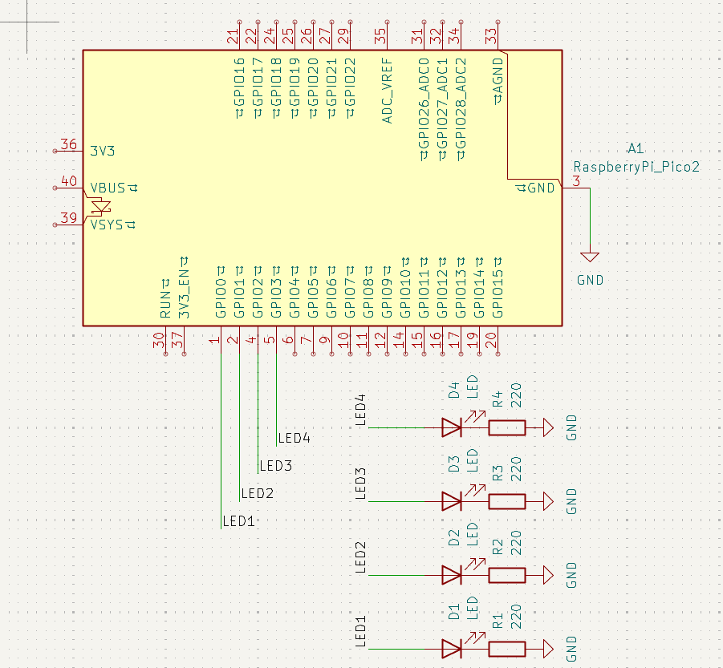
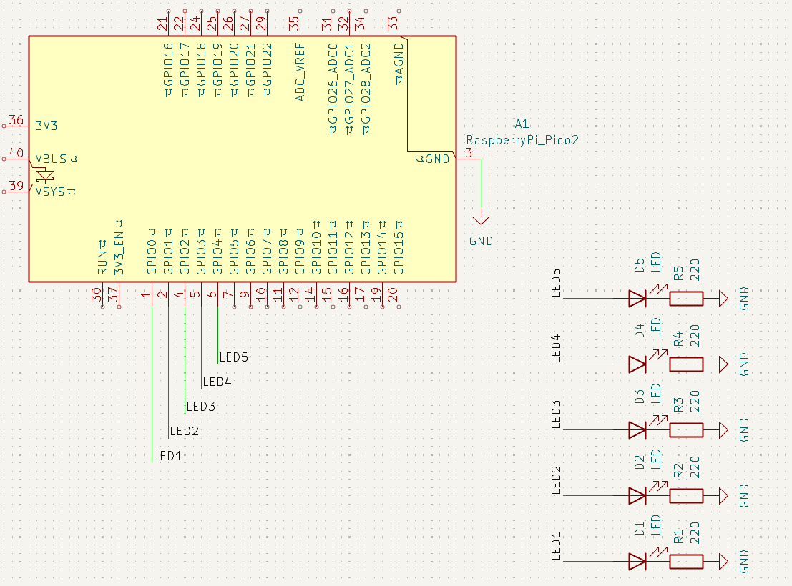
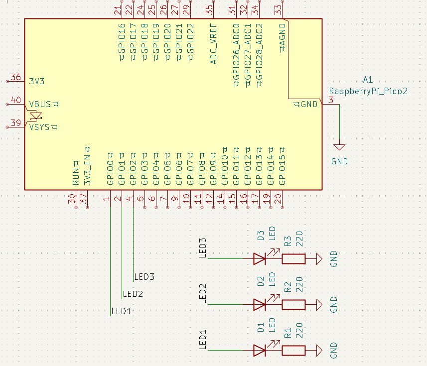

# Outpus básicos

## 1) Resumen

- **Nombre del proyecto:** _Outputs básicos_  
- **Equipo:** _Carlos Ernesto Camacho Gonzalez y David López Ramírez_  
- **Curso:** _Sistemas Embebidos I_  
- **Fecha:** _29/08/2025_  
- **Descripción breve:** _Introducción a la programación de salidas para el microcontrolador Raspberry Pi Pico 2 RP2350. Se presentan tres códigos básicos para mejorar la comprensión de las sálidas, las cuales son representadas por los LEDs._

---

## 2) Objetivos

- **General:** _Comprender la programación básica para la configuración de sálidas._
- **Específicos:**
  - _Entender las funciones de básicas de programación en C para establecer sálidas_

## 4) Requisitos

**Software**
- _Visual Studio Code (Lenguaje de programación C)_

**Hardware**
- _Raspberry Pi Pico 2 RP2350_

**Conocimientos previos**
- _Programación básica en C_
- _Electrónica básica_
---

## 5) Desarrollo

### 1)  Contador binario 4 bits

#### Función
El contador binario de 4 bits aprovecha la lectura del Visual Studio Code al ingresar números decimales y convertirlos automáticamente a binario, de manera que existen cuatro salidas representadas con un LED cada una. 
El código logra que enciendan los LEDs correspondientes al número decimal para representarlo en binario.

#### Código
```bash

#include "pico/stdlib.h"
#include "hardware/gpio.h"

//Define los pines.

#define A   0 
#define B   1
#define C   2
#define D   3

int main() {
    //Crea la máscara con un valor inicial 1.
    const uint32_t MASK = (1u<<A) | (1u<<B) | (1u<<C) | (1u<<D); 

    gpio_init_mask(MASK); //Inicializa los pines de la máscara.
    gpio_set_dir_masked(MASK, MASK); //Establece los pines como salida.

    while (true) {
        for (uint8_t i = 0; i < 16; i++) {
            gpio_put_masked(MASK, i << A); //Envia la salida a "MASK" representando el valor "i" a la posición "A".
            sleep_ms(500);                 
        }
    }
}

```
#### Esquemático de conexión



#### Vídeo

<video style="width:30%" muted="" controls="" alt="type:video">
   <source src="../recursos/archivos/Tarea_2/Contador_binario.mp4" type="video/mp4">
   </video>

### 2) Barrido de LEDs

#### Función
El barrido de LEDs se realiza mediante una máscara, la cuál se limpia con cada iteración del bucle "for" y se establece un valor "1" en la posición deseada, yendo desde la posición "0" hasta la posición "4".

```bash

#include "pico/stdli-b.h"
#include "hardware/gpio.h"

//Declaración de pines.

#define A 0   
#define B 1   
#define C 2   
#define D 3 
#define E 4  

int main() {
    //Construcción de la máscara.
    const uint32_t MASK = (1u<<A) | (1u<<B) | (1u<<C) | (1u<<D) | (1u<<E);

    gpio_init_mask(MASK); //Inicializa los pines de la máscara.
    gpio_set_dir_out_masked(MASK); //Establece los pines de la máscara como salida.
    gpio_clr_mask(MASK); //Limpia la máscara.

    while (true) {
       
        for (uint8_t i = 0; i < 5; ++i) {
            gpio_clr_mask(MASK); // Limpia la máscara.
            gpio_set_mask(1 << i); //Establece un valor "1" en la posición del bit "i".
            sleep_ms(300);
        }
        
        for (uint8_t i = 3; i > 0; --i) {
            gpio_clr_mask(MASK); // Limpia la máscara.
            gpio_set_mask(1 << i); //Establece un valor "1" en la posición del bit "i".
            sleep_ms(300);
        }
    }
}}

```
!!! note "Nota"
    Para optimizar el uso de la memoria se establece i = 3, debido a que el bucle anterior se finaliza con la posición "4" con el LED encendido, de la misma manera se evito poner "i >= 0" por el mismo motivo.
    
    ```
    for (int i = 3; i > 0; --i)
    ```


#### Esquemático de conexión



#### Vídeo

<video style="width:30%" muted="" controls="" alt="type:video">
   <source src="../recursos/archivos/Tarea_2/Barrido_LEDs.mp4" type="video/mp4">
   </video>

### 3) Secuencia en código Gray

#### Función
El siguiente código simula la Secuencia de Gray mediante el uso de una función que se encarga de convertir los números. De tal manera que, dicha secuencia se mostrará en la sálida de tres LEDs que simulan cada bit.


```bash
#include "pico/stdlib.h"
#include "hardware/gpio.h"

//Declara los pines.

#define A 0
#define B 1
#define C 2

//Establece la función para convertir de binario a secuencia de Gray.

uint8_t bin_gray(uint8_t num_dec) {
    return num_dec ^ (num_dec >> 1); //Recibe un número decimal y regresa la operación XOR de "num_dec" con "num_dec" en binario desplazado hacia la derecha una posición. 
}

int main() {
    //Crea la máscara.
    const uint8_t MASK = (1u << A) | (1u << B) | (1u << C);

    gpio_init_mask(MASK); //Inicializa los pines de la máscara.
    gpio_set_dir_masked(MASK, MASK); //Establece los pines como salida.

    while (true) {
        for (uint8_t i = 0; i < 8; i++) {
            uint8_t gray = bin_gray(i); //Toma el valor de la función "bin_gray(i)", donde "i" reemplaza el lugar de "num_dec".
            gpio_put_masked(MASK, gray); //Coloca los valores de "gray" en "MASK".
            sleep_ms(500);
        }
    }
}
```

#### Esquemático de conexión



#### Vídeo

<video style="width:30%" muted="" controls="" alt="type:video">
   <source src="../recursos/archivos/Tarea_2/Secuencia_De_Gray.mp4" type="video/mp4">
   </video>