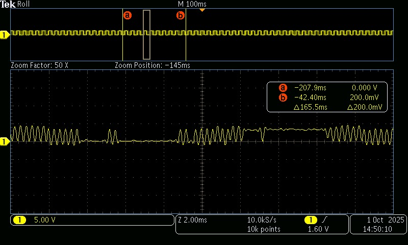

# Modulación por ancho de pulso - PWM

## 1) Resumen

- **Nombre del proyecto:** _Modulación por ancho de pulso - PWM_  
- **Equipo:** _Carlos Ernesto Camacho Gonzalez y David López Ramírez_  
- **Curso:** _Sistemas Embebidos I_  
- **Fecha:** _30/09/2025_  
- **Descripción breve:** _Estas prácticas muestran aplicaciones prácticas de la generación de frecuencias: control de velocidad de un motor mediante el PWM, generación de notas con un buzzer variando la frecuencia, y síntesis de una señal senoidal de 60 Hz mediante PWM más un filtro RC._

---

## 2) Objetivos

- **General:** _Aplicar la modulación por ancho de pulso (PWM) en diferentes contextos de control y generación de señales, integrando componentes electrónicos y de programación._
- **Específicos:**
  - _Implementar circuitos y programas que regulen velocidad de motores DC y generen tonos musicales con un buzzer mediante variación de duty cycle y frecuencia._

## 3) Requisitos

**Software**
- _Visual Studio Code (Lenguaje de programación C)_

**Hardware**
- _Raspberry Pi Pico 2 RP2350_

**Conocimientos previos**
- _Programación básica en C_
- _Electrónica básica_
---

## 4) Desarrollo

### 1)  Control de Duty Cycle — Motor DC

#### Función
Se configura un pin PWM para controlar un motor DC y utiliza dos botones para cambiar entre tres valores de duty cycle (baja, media y alta velocidad). Con cada pulsación se actualiza la velocidad seleccionada.

#### Código
```bash

#include "pico/stdlib.h"
#include "hardware/pwm.h"

// PWM 
#define MOTOR_PWM_PIN   0
// Botón para subir velocidad
#define BTN_UP          1
// Botón para bajar velocidad
#define BTN_DOWN        2
// Dirección del motor
#define MOTOR_DIR_PIN   3

//Configuración de PWM 
#define F_PWM_HZ 2000   // 2 kHz
#define TOP 1023        // 10 bits de resolución (0-1023)

int main() {
    stdio_init_all();

    // Habilitar la función PWM
    gpio_set_function(MOTOR_PWM_PIN, GPIO_FUNC_PWM);
    
    
    gpio_init(MOTOR_DIR_PIN);
    gpio_set_dir(MOTOR_DIR_PIN, GPIO_OUT);
    gpio_put(MOTOR_DIR_PIN, 1); 

    gpio_init(BTN_UP);
    gpio_set_dir(BTN_UP, GPIO_IN);
    gpio_pull_up(BTN_UP);

    gpio_init(BTN_DOWN);
    gpio_set_dir(BTN_DOWN, GPIO_IN);
    gpio_pull_up(BTN_DOWN);

    // Configuración de hardware PWM 
    uint slice = pwm_gpio_to_slice_num(MOTOR_PWM_PIN);
    uint chan  = pwm_gpio_to_channel(MOTOR_PWM_PIN);

    // Calcular divisor de reloj para la frecuencia deseada
    float f_clk = 125000000.0f; // Reloj del sistema es 125 MHz
    float div = f_clk / (F_PWM_HZ * (TOP + 1));
    pwm_set_clkdiv(slice, div);
    
    // Establecer el valor máximo del contador O SEA resolucion
    pwm_set_wrap(slice, TOP);

    // Iniciar PWM con el motor apagado
    pwm_set_chan_level(slice, chan, 0);
    pwm_set_enabled(slice, true);

    
    int speed_level = 0;
    // Duty cycles 
    const uint16_t duty_levels[] = {0, 307, 665, 972}; 

    while (true) {
        
        if (!gpio_get(BTN_UP)) {
            if (speed_level < 3) { 
                speed_level++;
            }
            pwm_set_chan_level(slice, chan, duty_levels[speed_level]);
            sleep_ms(200);
        }

        if (!gpio_get(BTN_DOWN)) {
            if (speed_level > 0) { 
                speed_level--;
            }
            pwm_set_chan_level(slice, chan, duty_levels[speed_level]);
            sleep_ms(200);
        }
    }
}

```
#### Esquemático de conexión


#### Vídeo

<div style="display:flex; justify-content:center;">
  <video style="width:100%; max-width:300px;" muted controls>
    <source src="../recursos/archivos/Tarea_7/Motor_DC.mp4" type="video/mp4">
  </video>
</div>


### 2) Control de Frecuencia — Canción con Buzzer

#### Función
Genera una melodía en un buzzer variando la frecuencia del PWM mientras mantiene un duty fijo de 50 %. Para ello recorre una tabla de notas con frecuencias y duraciones, reproduciendo cada una con pausas definidas para hacer la melodía clara.

```bash

#include "pico/stdlib.h"
#include "hardware/pwm.h"
 
#define BUZZER_PIN 0
 
#define TOP 1023        // Resolución
#define TEMPO 190       // Tempo muy rápido
 
//Duraciones de Nota
#define NEGRA (60000 / TEMPO)
#define CORCHEA (NEGRA / 2)
#define SEMICORCHEA (NEGRA / 4)
 
int main() {
    stdio_init_all();
    gpio_set_function(BUZZER_PIN, GPIO_FUNC_PWM);
    
    uint slice = pwm_gpio_to_slice_num(BUZZER_PIN);
    uint chan  = pwm_gpio_to_channel(BUZZER_PIN);
    
    pwm_set_wrap(slice, TOP);
    pwm_set_chan_level(slice, chan, 0); // Empezar en silencio
    pwm_set_enabled(slice, true);
 
    // Pac-Man
    const float frecuencias[] = {
        //Intro Original
        987.77, 1479.98, 1244.51, 987.77, 1479.98, 1244.51, 0,
        1046.50, 1567.98, 1318.51, 1046.50, 1567.98, 1318.51, 0,
        987.77, 880.00, 783.99, 698.46, 622.25, 587.33, 0,
 
        //Intermisión
        783.99, 0, 880.00, 0, 987.77, 0, 783.99,
        987.77, 0, 1046.50, 0, 1174.66, 0, 987.77,
        1174.66, 0, 1244.51, 0, 1318.51, 0, 1174.66
    };
    
    const int duraciones[] = {
        // Duraciones Intro
        CORCHEA, CORCHEA, CORCHEA, CORCHEA, CORCHEA, CORCHEA, CORCHEA,
        CORCHEA, CORCHEA, CORCHEA, CORCHEA, CORCHEA, CORCHEA, CORCHEA,
        SEMICORCHEA, SEMICORCHEA, SEMICORCHEA, SEMICORCHEA, SEMICORCHEA, NEGRA, NEGRA,
 
        // Duraciones Intermisión
        CORCHEA, SEMICORCHEA, CORCHEA, SEMICORCHEA, CORCHEA, SEMICORCHEA, NEGRA,
        CORCHEA, SEMICORCHEA, CORCHEA, SEMICORCHEA, CORCHEA, SEMICORCHEA, NEGRA,
        CORCHEA, SEMICORCHEA, CORCHEA, SEMICORCHEA, CORCHEA, SEMICORCHEA, NEGRA
    };
    
    int num_notas = sizeof(frecuencias) / sizeof(frecuencias[0]);
 
    while(true) {
        // Tocar la melodía completa
        for (int i = 0; i < num_notas; i++) {
            if (frecuencias[i] > 0) {
                float f_clk = 125000000.0f;
                float div = f_clk / (frecuencias[i] * (TOP + 1));
                pwm_set_clkdiv(slice, div);
                pwm_set_chan_level(slice, chan, TOP / 2);
            } else {
                pwm_set_chan_level(slice, chan, 0);
            }
            sleep_ms(duraciones[i]);
        }
        pwm_set_chan_level(slice, chan, 0);
        sleep_ms(2000); // Pausa de 2 segundos
    }
}

```

#### Esquemático de conexión

<div style="display:flex; justify-content:center;">
    
</div>

#### Vídeo

<div style="display:flex; justify-content:center;">
  <video style="width:100%; max-width:300px;" muted controls>
    <source src="../recursos/archivos/Tarea_7/Buzzer.mp4" type="video/mp4">
  </video>
</div>

### 3) Generación de Señales — Senoidal de 60 Hz con PWM + Filtro RC

#### Función
Produce una señal senoidal aproximada de 60 Hz modulando el duty cycle del PWM de acuerdo con una función seno, donde la salida se pasa por un filtro RC. Comparando la señal generada antes y después de la aplicación del filtro RC con ayuda de un osciloscopio.


```bash

#include <stdio.h>
#include <math.h>
#include "pico/stdlib.h"
#include "hardware/pwm.h"

#define SENAL 0          // Pin GPIO de salida
#define TOP 1023         // Resolución del PWM (10 bits)
#define FREQ 60          // Frecuencia de la señal senoidal deseada (Hz)
#define TAMANO_SENO 100     // Número de puntos de la tabla seno

// Tabla seno (se llenará en tiempo de ejecución)
uint16_t TABLA_SENO[TAMANO_SENO];

int main() {
    stdio_init_all();

    // Llenar tabla seno con VALores escalados a [0, TOP]
    for (uint8_t i = 0; i < TAMANO_SENO; i++) {
        double RAD = (2 * M_PI * i) / TAMANO_SENO;
        double VAL = (sin(RAD) + 1.0) / 2.0;
        TABLA_SENO[i] = (uint16_t)(VAL * TOP);
    }

    // Configurar pin PWM
    gpio_set_function(SENAL, GPIO_FUNC_PWM);
    uint slice = pwm_gpio_to_slice_num(SENAL);
    uint chan = pwm_gpio_to_channel(SENAL);

    pwm_set_wrap(slice, TOP);
    pwm_set_chan_level(slice, chan, 0);
    pwm_set_enabled(slice, true);

    // Calcular la frecuencia de actualización de la LUT
    // Se necesita actualizar TAMANO_SENO veces por cada ciclo de 60 Hz
    double RATE = FREQ * TAMANO_SENO;  // Hz
    uint32_t delay_us = 1000000.0 / RATE;

    int INDEX = 0;
    while (true) {
        pwm_set_chan_level(slice, chan, TABLA_SENO[INDEX]);

        INDEX++;
        if (INDEX >= TAMANO_SENO) INDEX = 0;

        sleep_us(delay_us);  // Espera para ajustar la frecuencia
    }
}

```

#### Esquemático de conexión

<div style="display:flex; justify-content:center;">
    
</div>

#### Señal PWM sin filtro RC

<div style="display:flex; justify-content:center;">
    
</div>

#### Señal PWM con filtro RC

<div style="display:flex; justify-content:center;">
    
</div>
