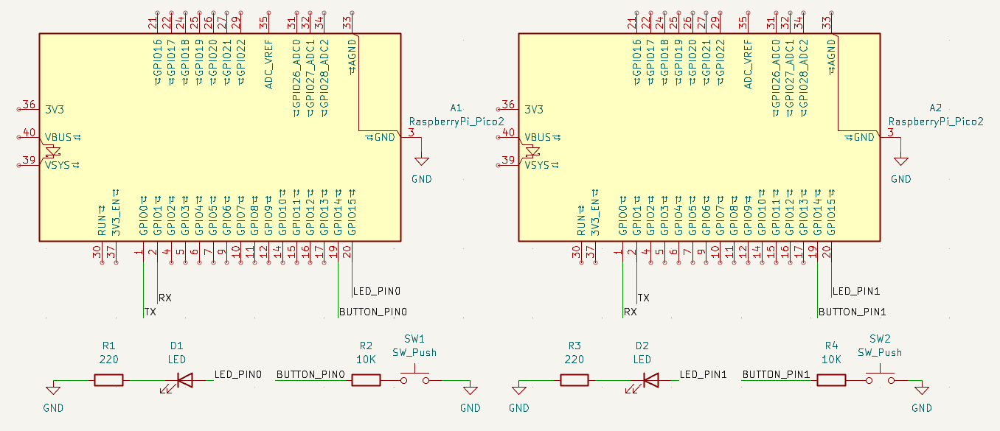
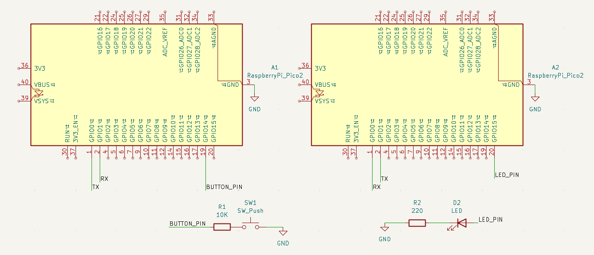

# Outpus básicos

## 1) Resumen

- **Nombre del proyecto:** _Comunicación Serial - UART_  
- **Equipo:** _Carlos Ernesto Camacho Gonzalez, David López Ramírez, Rodrigo Miranda Flores y Luis Javier Vega Tello_  
- **Curso:** _Sistemas Embebidos I_  
- **Fecha:** _12/10/2025_  
- **Descripción breve:** _Introducción a la comunicación serial UART._

---

## 2) Objetivos

- **General:** _Comprender la programación básica para la comunicación serial UART._

## 3) Requisitos

**Software**
- _Visual Studio Code (Lenguaje de programación C)_

**Hardware**
- _Raspberry Pi Pico 2 RP2350_

**Conocimientos previos**
- _Programación básica en C_
- _Electrónica básica_
---

## 4) Desarrollo

### 1)  Comunicación Serial UART

#### Función

 Con un boton conectado a una RP2350 se controla el encendido y apagado de un led conectada a otra RP2350 y viceversa.

#### Código
```bash

#include "pico/stdlib.h"
#include "hardware/uart.h"
 
#define UART_ID uart0
#define BAUD_RATE 9600
 
#define UART_TX_PIN 0
#define UART_RX_PIN 1
 
#define LED_PIN 15
#define BUTTON_PIN 14
 
int main() {
    stdio_init_all();
    uart_init(UART_ID, BAUD_RATE);
    gpio_set_function(UART_TX_PIN, GPIO_FUNC_UART);
    gpio_set_function(UART_RX_PIN, GPIO_FUNC_UART);
 
    gpio_init(LED_PIN);
    gpio_set_dir(LED_PIN, GPIO_OUT);
 
    gpio_init(BUTTON_PIN);
    gpio_set_dir(BUTTON_PIN, GPIO_IN);
    gpio_pull_up(BUTTON_PIN);
 
    bool last_button_state = true;
    bool led_state = false;
 
    while (true) {
        bool button_state = gpio_get(BUTTON_PIN);
 
        // Si se detecta una pulsación (de HIGH a LOW)
        if (last_button_state && !button_state) {
            uart_putc(UART_ID, 'T'); // Enviamos el carácter 'T' al otro Pico
            sleep_ms(200); // anti rebote
        }
        last_button_state = button_state;
 
        // Si se recibe un byte por UART
        if (uart_is_readable(UART_ID)) {
            char c = uart_getc(UART_ID);
            if (c == 'T') {
                led_state = !led_state; // Cambiar estado del LED
                gpio_put(LED_PIN, led_state);
            }
        }
 
        sleep_ms(10);
    }
}

```

#### Esquemático de conexión

<div style="display:flex; justify-content:center;">
    
</div>
#### Vídeo

<div style="display:flex; justify-content:center;">
  <video style="width:100%; max-width:300px;" muted controls>
    <source src="../recursos/archivos/Tarea_8/UART_1.mp4" type="video/mp4">
  </video>
</div>

### 2)  Comunicación Serial UART - Comandos

#### Función

 Con un boton conectado a una RP2350 se controla el encendido y apagado de un led conectada a otra RP2350, el RP2350 emisor manda una cadena de caracteres que recibe el RP2350 receptor. Además, se configuró el envió de comandos mediante la comunicación serial de la computadora.

#### Código
```bash

#include "pico/stdlib.h"
#include "hardware/uart.h"
#include <stdio.h>
#include <string>
 
#define UART_ID uart0
#define BAUD_RATE 115200
#define TX_PIN 0
#define RX_PIN 1
#define BUTTON_PIN 14
#define LED_PIN 15
using namespace std;
 
int main() {
    stdio_init_all();
 
    gpio_set_function(TX_PIN, GPIO_FUNC_UART);
    gpio_set_function(RX_PIN, GPIO_FUNC_UART);
 
    uart_init(UART_ID, BAUD_RATE);
    uart_set_format(UART_ID, 8, 1, UART_PARITY_NONE);
 
    gpio_init(BUTTON_PIN);
    gpio_set_dir(BUTTON_PIN, GPIO_IN);
    gpio_pull_up(BUTTON_PIN);
    gpio_init(LED_PIN);
    gpio_set_dir(LED_PIN, GPIO_OUT);
 
    string c = "";
    string p="";
    while (true){
 
        int ch = getchar_timeout_us(0);
        if (ch != PICO_ERROR_TIMEOUT) {
            printf("Eco: %c\n", (char)ch);
            p+= (char)ch;
            if(ch=='.' || ch=='\n'){
                uart_puts(UART_ID, p.c_str());
                p="";
            }
        }
        int a;
        if (gpio_get(BUTTON_PIN) == 0 && a == 1) {
            printf("Button pressed!\n");
            uart_puts(UART_ID, "LEDON\n");
            sleep_ms(200); 
        }
         a= gpio_get(BUTTON_PIN);
 
        if (uart_is_readable(uart0)) {
            char character = uart_getc(uart0);
            printf(character+"\n");
            if(character=='\n' || character=='.'){
                if (c == "LEDON"){
                    gpio_put(LED_PIN, 1);
                    printf("LED is ON\n");
                }
                else if (c == "LEDOFF"){
                    gpio_put(LED_PIN, 0);
                    printf("LED is OFF\n");
                } else if(c=="Invalid Command"){
                    printf("Invalid Command\n");
                }
                else{
                    uart_puts(UART_ID, "Invalid Command\n");
                }
                c = "";
                continue;
            }
            else{
                c += character;
            }
        }
    }
}

```

#### Esquemático de conexión

<div style="display:flex; justify-content:center;">
    
</div>

#### Vídeo

<div style="display:flex; justify-content:center;">
  <video style="width:100%; max-width:300px;" muted controls>
    <source src="../recursos/archivos/Tarea_8/UART_2.mp4" type="video/mp4">
  </video>
</div>
    